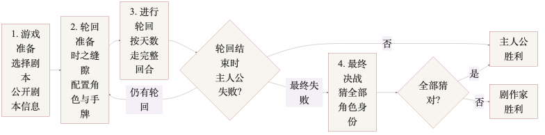
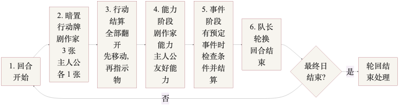

<!-- _class: cover -->

# 惨剧轮回

## OCR 审阅与新手教学结构稿

这份 deck 将结构化整理稿和 raw OCR 原文全部放入 Marp，供逐页校对。

来源：基础教学.pdf、新手剧本.pdf，经已部署 PDF2MD 服务生成 OCR。

---

<!-- _class: agenda -->

## 如何审阅这份 Slides

<h3>前半：结构化整理稿</h3>

用于检查我对原文的归纳是否准确，包括术语、流程、剧透边界、表格含义。

<h3>后半：Raw OCR 原文</h3>

用于检查原始提取错误。错字、乱码、重复段和识别失败的表格都会尽量原样保留。

带红色顶边或红框的页面包含新手剧本非公开信息，请不要在主人公开局前展示。

---

<!-- _class: agenda -->

## 资料与输出路径

<h3>PDF 归档</h3>
<code>facts/source_material/reference/*/*.pdf</code>

<h3>逐页图片</h3>
<code>facts/source_material/reference/*/pages/</code>

<h3>OCR 原文</h3>
<code>facts/source_material/reference/*/pdf2md/*.md</code>

---

<!-- _class: flow -->

## 整局流程（LR）

LR 单页图：从准备、轮回、失败判断到最终决战。

---

<!-- _class: flow -->

## 每日回合流程（LR）

LR 单页图：把一天内的行动、能力、事件和换天完整放在一页。

---

<!-- _class: divider -->

# First Steps / Basic Tragedy X 速查表

来自 fs|btx.pdf；规则、身份、事件已结构化为表格，等待人工校对。

---

<!-- _class: module-ref -->

## 说明

# First Steps / Basic Tragedy X - 模组核心速查表

状态：待人工审阅  
来源：`fs-btx.pdf`，原始上传文件为 `fs/fs|btx.pdf`。  
逐页图片：`pages/page-01.png`、`pages/page-02.png`。

---

<!-- _class: module-ref -->

## 审阅说明

- 每个模组只记录三类核心表格：规则、身份、事件。
- 规则表预留“额外剧作家手牌”列；若某条规则会引入额外手牌，在这里记录。
- 模组说明页右侧的主要登场角色描述不在本文件记录，后续由角色卡数据库维护。
- 本文件根据 `fs|btx` 两页速查 PDF 目视整理，并参考 `基础教学.pdf` 的 OCR 正文互相校对。

---

<!-- _class: module-ref -->

## First Steps：规则

| 分类 | 规则名 | 引入身份 | 规则效果 / 失败条件 | 额外剧作家手牌 |
| --- | --- | --- | --- | --- |
| Rule Y | 谋杀计划 | 关键人物、主谋、杀手 | 无额外失败条件。 | 无 |
| Rule Y | 复仇的火种 | 主谋 | 轮回结束时，主谋初始区域有 2 枚或以上密谋，主人公失败。 | 无 |
| Rule Y | 守护此地 | 关键人物、邪教徒 | 轮回结束时，学校有 2 枚或以上密谋，主人公失败。 | 无 |
| Rule X | 开膛者的魔影 | 传谣人、杀人狂 | 无额外失败条件。 | 无 |
| Rule X | 流言四起 | 传谣人 | 剧作家能力阶段，可往任意 1 块版图放置 1 枚密谋，每轮限 1 次。 | 无 |
| Rule X | 最黑暗的剧本 | 传谣人、暴徒、暴徒、亲友 | 剧本制作时，暴徒人数可以为 0-2 人。 | 无 |

fs|btx.pdf / structured-tables.md

---

<!-- _class: module-ref -->

## First Steps：身份

| 身份名 | 上限 / 特性 | 能力 | 来源规则 |
| --- | --- | --- | --- |
| 关键人物 | 无 | 强制：该角色死亡时，主人公失败，当前轮回立即结束。 | 谋杀计划、守护此地 |
| 杀手 | 无；无视友好 | 任意：回合结束阶段，同一区域中 1 名关键人物身上有 2 枚或以上密谋，则那名关键人物死亡。另可在该角色身上有 4 枚或以上密谋时杀害主人公。 | 谋杀计划 |
| 主谋 | 无；无视友好 | 任意：剧作家能力阶段，往同一区域任意 1 名角色身上，或该角色所在版图上，放置 1 枚密谋。 | 谋杀计划、复仇的火种 |
| 邪教徒 | 无；必定无视友好 | 任意：行动结算阶段，可以无效化同一区域中任意角色身上和该角色所在版图上放置的禁止密谋。 | 守护此地 |
| 传谣人 | 1 | 任意：剧作家能力阶段，往同一区域中任意 1 名角色身上放置 1 枚不安。 | 开膛者的魔影、流言四起、最黑暗的剧本 |
| 杀人狂 | 无 | 强制：回合结束阶段，仅有 1 名角色与该角色位于同一区域时，那名角色死亡。 | 开膛者的魔影 |
| 暴徒 | 无；无视友好 | 无。 | 最黑暗的剧本 |
| 亲友 | 2 | 失败条件：轮回结束时，若该卡牌为死亡状态，需要告知主人公该卡牌身份。强制：轮回开始时，若该身份曾被公开，往该角色身上放置 1 枚友好。 | 最黑暗的剧本 |

fs|btx.pdf / structured-tables.md

---

<!-- _class: module-ref -->

## First Steps：事件

| 事件名 | 事件效果 |
| --- | --- |
| 谋杀 | 与当事人位于同一区域的另外 1 名角色死亡。 |
| 不安扩散 | 往任意 1 名角色身上放置 2 枚不安，随后往另外 1 名角色身上放置 1 枚密谋。 |
| 自杀 | 当事人死亡。 |
| 医院事故 | 医院有 1 枚或以上密谋时，医院中的所有角色死亡；医院有 2 枚或以上密谋时，主人公死亡。 |
| 远距离杀人 | 任意 1 名身上有 2 枚或以上密谋的角色死亡。 |
| 失踪 | 将当事人移动至任意版图，随后往当事人所在版图放置 1 枚密谋。 |
| 散播 | 从任意 1 名角色身上移除 2 枚友好，随后往另外 1 名角色身上放置 2 枚友好。 |

fs|btx.pdf / structured-tables.md

---

<!-- _class: module-ref -->

## Basic Tragedy X：规则

| 分类 | 规则名 | 引入身份 | 规则效果 / 失败条件 | 额外剧作家手牌 |
| --- | --- | --- | --- | --- |
| Rule Y | 谋杀计划 | 关键人物、主谋、杀手 | 无额外失败条件。 | 无 |
| Rule Y | 被封印的邪灵 | 主谋、邪教徒 | 轮回结束时，神社有 2 枚或以上密谋，主人公失败。 | 无 |
| Rule Y | 和我签订契约吧！ | 关键人物 | 轮回结束时，关键人物有 2 枚或以上密谋，主人公失败。剧本中的关键人物必须有少女属性。 | 无 |
| Rule Y | 改变未来 | 邪教徒、时间旅者 | 轮回结束时，本轮曾引发过蝴蝶效应事件，主人公失败。 | 无 |
| Rule Y | 巨大定时炸弹 X | 魔女 | 轮回结束时，魔女初始区域有 2 枚或以上密谋，主人公失败。 | 无 |
| Rule X | 好友圈 | 亲友、亲友、传谣人 | 无额外失败条件。 | 无 |
| Rule X | 恋爱风景线 | 心上人、求爱者 | 无额外失败条件。 | 无 |
| Rule X | 潜伏的杀人狂 | 亲友、杀人狂 | 无额外失败条件。 | 无 |
| Rule X | 流言四起 | 传谣人 | 剧作家能力阶段，可往任意 1 块版图放置 1 枚密谋，每轮限 1 次。 | 无 |
| Rule X | 妄想扩大病毒 | 传谣人 | 常驻：某 1 名平民角色有 3 枚或以上不安时，那名平民身份变为杀人狂。 | 无 |
| Rule X | 因果线 | 无 | 轮回开始时，上一轮轮回结束时所有带有友好的角色，全部放置 2 枚不安。 | 无 |
| Rule X | 未知因子 X | 不安定因子 | 无额外失败条件。 | 无 |

fs|btx.pdf / structured-tables.md

---

<!-- _class: module-ref -->

## Basic Tragedy X：身份

| 身份名 | 上限 / 特性 | 能力 | 来源规则 |
| --- | --- | --- | --- |
| 关键人物 | 无 | 强制：该角色死亡时，主人公失败，当前轮回立即结束。 | 谋杀计划、和我签订契约吧！ |
| 杀手 | 无；无视友好 | 任意：回合结束阶段，同一区域中 1 名关键人物身上有 2 枚或以上密谋，则那名关键人物死亡。另可在该角色身上有 4 枚或以上密谋时杀害主人公。 | 谋杀计划 |
| 主谋 | 无；无视友好 | 任意：剧作家能力阶段，往同一区域任意 1 名角色身上，或该角色所在版图上，放置 1 枚密谋。 | 谋杀计划、被封印的邪灵 |
| 邪教徒 | 无；必定无视友好 | 任意：行动结算阶段，可以无效化同一区域中任意角色身上和该角色所在版图上放置的禁止密谋。 | 被封印的邪灵、改变未来 |
| 时间旅者 | 无；不死 | 强制：行动结算阶段，无视该角色身上放置的禁止友好。任意：最终日回合结束时，若该角色身上友好为 2 枚或以下，主人公失败，当前轮回立即结束。 | 改变未来 |
| 魔女 | 无；必定无视友好 | 无。 | 巨大定时炸弹 X |
| 亲友 | 2 | 失败条件：轮回结束时，若该卡牌为死亡状态，需要告知主人公该卡牌身份。强制：轮回开始时，若该身份曾被公开，往该角色身上放置 1 枚友好。 | 好友圈、潜伏的杀人狂 |
| 传谣人 | 1 | 任意：剧作家能力阶段，往同一区域中任意 1 名角色身上放置 1 枚不安。 | 好友圈、流言四起、妄想扩大病毒 |
| 心上人 | 无 | 强制：求爱者死亡时，往该角色身上放置 6 枚不安。 | 恋爱风景线 |
| 求爱者 | 无 | 强制：心上人死亡时，往该角色身上放置 6 枚不安。任意：回合结束阶段，若该角色身上有 3 枚或以上不安且 1 枚或以上密谋，主人公死亡。 | 恋爱风景线 |
| 杀人狂 | 无 | 强制：回合结束阶段，仅有 1 名角色与该角色位于同一区域时，那名角色死亡。 | 潜伏的杀人狂、妄想扩大病毒 |
| 不安定因子 | 无；无视友好 | 强制：学校有 2 枚或以上密谋时，该角色获得传谣人的能力；都市有 2 枚或以上密谋时，该角色获得关键人物的能力。身份依然为不安定因子。 | 未知因子 X |

fs|btx.pdf / structured-tables.md

---

<!-- _class: module-ref -->

## Basic Tragedy X：事件

| 事件名 | 事件效果 |
| --- | --- |
| 谋杀 | 与当事人位于同一区域的另外 1 名角色死亡。 |
| 不安扩散 | 往任意 1 名角色身上放置 2 枚不安，随后往另外 1 名角色身上放置 1 枚密谋。 |
| 邪气污染 | 往神社放置 2 枚密谋。 |
| 自杀 | 当事人死亡。 |
| 医院事故 | 医院有 1 枚或以上密谋时，医院中的所有角色死亡；医院有 2 枚或以上密谋时，主人公死亡。 |
| 远距离杀人 | 任意 1 名身上有 2 枚或以上密谋的角色死亡。 |
| 失踪 | 将当事人移动至任意版图，随后往当事人所在版图放置 1 枚密谋。 |
| 散播 | 从任意 1 名角色身上移除 2 枚友好，随后往另外 1 名角色身上放置 2 枚友好。 |
| 蝴蝶效应 | 从友好、不安、密谋中任选一种；在与当事人同一区域的角色中任选 1 名角色，往其身上放置 1 枚所选指示物。 |

fs|btx.pdf / structured-tables.md

---

<!-- _class: divider -->

# Midnight Zone 速查表

来自 mz|mc.pdf 第 1 页；本局不使用 10 周年扩展，仅保留规则、身份、事件三表。

---

<!-- _class: module-ref mz -->

## Midnight Zone：规则

| 分类 | 规则名 | 引入身份 | 规则效果 / 失败条件 | 额外剧作家手牌 / 组件 |
| --- | --- | --- | --- | --- |
| Rule Y | 被封印的邪灵 | 主谋、邪教徒 | 失败条件：轮回结束时，神社有 2 枚或以上「密谋」，主人公失败。 | 无 |
| Rule Y | 绝密报告 | 关键人物、主谋、传谣人（待校对） | 失败条件：轮回结束时，本轮轮回中公开过主谋、不安定因子或魔术师中任一身份的名称，主人公失败。 | 无 |
| Rule Y | 男子汉的战争 | 忍者 | 强制：剧本制作时，忍者必须有男性属性，不可以是少年。 | 无 |
| Rule Y | 魔爪靠近 | 关键人物、邪教徒、忍者 | 失败条件：轮回结束时，忍者或其尸体有 2 枚或以上「密谋」，主人公失败。 | 无 |
| Rule Y | 因果之绊 | 亲友、杀人狂、传谣人 | 强制：轮回开始时，选择 1 名上轮轮回结束时处于死亡状态的角色，放置 1 张 Ex 牌；不可与「诸神之殿」重复发动。强制：常驻，放置了 Ex 牌的角色身份变为关键人物，该角色失去原本身份。 | 使用 Ex 牌 |
| Rule X | 爱与恨的螺旋 | 亲友、强迫症（待校对） | 原表未列额外规则文字。 | 无 |
| Rule X | 魔女的茶会 | 亲友、传谣人、魔女 x2（待校对） | 原表未列额外规则文字。 | 无 |
| Rule X | 诸神之殿 | 杀人狂、强迫症（待校对） | 强制：轮回开始时，选择 1 名上一轮轮回结束时处于死亡状态的角色，放置 1 张 Ex 牌；不可与「因果之绊」重复发动。 | 使用 Ex 牌 |
| Rule X | X 异因子 | 不安定因子 | 任意能力：剧作家能力阶段，往存活的不安定因子所在版图放置 1 枚「密谋」；每轮限 1 次。 | 无 |
| Rule X | 死亡真人秀 | 魔术师、永生者（待校对） | 失败条件：轮回结束时，生存角色数量为 6 名或以下，主人公失败。 | 无 |
| Rule X | 心无灵犀 | 传谣人、魔术师 | 强制：行动结算阶段，禁止友好同时具备禁止移动的效果。 | 无 |
| Rule X | 灭亡诅咒 | 预言家 | 强制：剧本制作时，必须引入 1 个或以上的自杀事件。强制：事件阶段，当事人的身份为平民的事件在判定是否发生时，如果预言家存活，该当事人的不安限度 -1。 | 无 |

mz|mc.pdf page-01 / structured-tables.md

---

<!-- _class: module-ref mz -->

## Midnight Zone：身份

| 身份名 | 上限 / 特性 | 能力 | 来源规则 |
| --- | --- | --- | --- |
| 关键人物 | 无 | 强制：该角色死亡时，主人公失败，当前轮回立即结束。 | 绝密报告（待校对）、魔爪靠近、因果之绊 |
| 主谋 | 无视友好 | 任意能力：剧作家能力阶段，往同一区域中任意 1 名角色身上，或者该角色所在的版图上放置 1 枚「密谋」。 | 被封印的邪灵、绝密报告 |
| 邪教徒 | 必定无视友好 | 任意能力：行动结算阶段，可以无效化同一区域中任意角色身上和该角色所在版图上放置的禁止密谋。 | 被封印的邪灵、魔爪靠近 |
| 忍者 | 无视友好 | 任意能力：回合结束阶段，同一区域的 1 名角色身上有 2 枚或以上「密谋」时，那名角色死亡。任意能力：常驻，需公开该角色身份时，可以宣称本局游戏非公开信息表中的任意非平民身份名。 | 男子汉的战争、魔爪靠近 |
| 亲友 | 上限 2 | 失败条件：轮回结束时，若该卡牌为死亡状态，需要告知主人公该卡牌的身份。强制：轮回开始时，若该角色身份曾被公开，往该角色身上放置 1 枚「友好」。 | 因果之绊、爱与恨的螺旋、魔女的茶会 |
| 杀人狂 | 无 | 强制：回合结束阶段，仅有 1 名角色与该角色位于同一区域时，那名角色死亡。 | 因果之绊、诸神之殿 |
| 传谣人 | 上限 1 | 任意能力：剧作家能力阶段，往同一区域中任意 1 名角色身上放置 1 枚「不安」。 | 因果之绊、魔女的茶会、心无灵犀 |
| 强迫症 | 必定无视友好 | 强制：剧本制作时，该角色必须成为某 1 个事件的当事人。强制：事件阶段，当事人为该角色的事件必定会发生。 | 爱与恨的螺旋、诸神之殿 |
| 魔术师 | 无 | 任意能力：剧作家能力阶段，使同一区域中 1 名放置了 1 枚或以上不安指示物的角色移动至相邻版图；所有魔术师合计，每轮限 1 次。强制：该角色死亡时，移除该角色身上的所有「不安」。 | 死亡真人秀、心无灵犀 |
| 不安定因子 | 无视友好 | 强制：常驻，学校有 2 枚或以上「密谋」时，该角色获得传谣人的能力；都市有 2 枚或以上「密谋」时，该角色获得关键人物的能力。身份依然为「不安定因子」。 | X 异因子 |
| 魔女 | 必定无视友好 | 原表未列能力。 | 魔女的茶会 |
| 永生者 | 不死 | 原表未列能力。 | 死亡真人秀 |
| 预言家 | 无 | 强制：常驻，剧作家不可以往该角色身上设置任何行动牌。强制：事件阶段，与该角色位于同一区域的其他角色不会触发事件。 | 灭亡诅咒 |

mz|mc.pdf page-01 / structured-tables.md

---

<!-- _class: module-ref mz -->

## Midnight Zone：事件

| 事件名 | 事件效果 |
| --- | --- |
| 连续杀人 | 与当事人位于同一区域的另外 1 名角色死亡。1 名角色可以同时担任多个连续杀人事件的当事人。 |
| 自杀 | 当事人死亡。 |
| 不安扩散 | 往任意 1 名角色身上放置 2 枚「不安」，随后往另外 1 名角色身上放置 1 枚「密谋」。 |
| 失踪 | 将当事人移动至任意版图。随后，往当事人所在版图放置 1 枚「密谋」。 |
| 阴谋活动 | 通过密谋指示物数量判定是否发生，结算连续杀人或失踪事件的效果。 |
| 医院事故 | 医院有 1 枚或以上「密谋」时，位于医院的所有角色死亡。医院有 2 枚或以上「密谋」时，主人公死亡。 |
| 暴乱 | 学校有 1 枚或以上「密谋」时，位于学校的所有角色死亡。都市有 1 枚或以上「密谋」时，位于都市的所有角色死亡。 |
| 自白 | 当事人公开自己的身份。 |
| 破局 | 由队长选择 1 名角色或 1 块版图，移除其 2 枚「密谋」。 |
| 伪装自杀 | 往当事人身上放置 1 张 Ex 牌。本轮轮回剩余时间，主人公无法往放置了 Ex 牌的角色身上放置行动牌。 |
| 伪造事件 | 当事人初始区域有 2 枚或以上「密谋」时，主人公死亡。将伪造事件记入公开信息表时，可以自由命名事件名称；非公开信息表和游戏中依然视为伪造事件。 |

mz|mc.pdf page-01 / structured-tables.md

---

<!-- _class: divider -->

# 结构化整理稿

这部分是用于教学和校对的整理视图。

---

<!-- _class: divider -->

# 基础教学 / 结构化整理稿

含剧透内容会以红色样式标记。

---

<!-- _class: structured -->

## 基础教学 - 结构化文本草稿

<h3>审阅提示</h3>
这里是整理后的结构稿。请检查术语、遗漏、剧透边界和表格含义。

来源行：1-7

# 基础教学 - 结构化文本草稿

状态：待人工审阅  
来源：`基础教学.pdf` 纯图扫描件，经已部署 `pdf2md` 服务 OCR 生成初稿。  
原始 OCR：`pdf2md/基础教学.md`  
逐页图片：`pages/page-01.png` 至 `pages/page-34.png`

基础教学 / 结构化整理稿 | 001

---

<!-- _class: structured -->

## 审阅说明

<h3>审阅提示</h3>
这里是整理后的结构稿。请检查术语、遗漏、剧透边界和表格含义。

来源行：8-13

## 审阅说明

- 本文是面向新人教学的整理稿，不是规则书逐字转写。
- OCR 存在繁简混杂、错字、重复片段和表格识别错误。
- 用于 slides 的内容只取“足以支撑新手剧本”的规则；完整角色能力、完整行动牌细则等放在补充部分。

基础教学 / 结构化整理稿 | 002

---

<!-- _class: structured -->

## 第一部分：支撑新手剧本的必要信息

<h3>审阅提示</h3>
这里是整理后的结构稿。请检查术语、遗漏、剧透边界和表格含义。

来源行：14-21

## 第一部分：支撑新手剧本的必要信息

### 游戏定位

- `惨剧轮回` 是 2-4 人非对称剧本推理桌游。
- 1 名玩家担任 `剧作家`，掌握剧本真相并推动惨剧发生。
- 1-3 名玩家担任 `主人公`，通过多次轮回积累线索，阻止惨剧或在最终决战中识破真相。

基础教学 / 结构化整理稿 | 003

---

<!-- _class: structured -->

## 胜利条件

<h3>审阅提示</h3>
这里是整理后的结构稿。请检查术语、遗漏、剧透边界和表格含义。

来源行：22-28

### 胜利条件

- 主人公在任意一轮轮回结束时，若没有达成失败条件且主人公没有死亡，则主人公获胜。
- 若所有轮回都失败，主人公进入最终决战。
- 最终决战中，主人公需要逐一猜出所有角色身份；猜错 1 个或以上则剧作家获胜，全部正确则主人公获胜。
- 剧作家需要让主人公在每一轮都失败，并避免最终决战被完全识破。

基础教学 / 结构化整理稿 | 004

---

<!-- _class: structured -->

## 舞台与角色

<h3>审阅提示</h3>
这里是整理后的结构稿。请检查术语、遗漏、剧透边界和表格含义。

来源行：29-35

### 舞台与角色

- 常用区域：医院、神社、都市、学校。
- 每名角色以角色牌表示，放在某个区域上。
- 角色生存时竖置，死亡时横置。
- 死亡角色视为尸体，不能再使用友好能力或角色特性，但其身上的指示物不清空。

基础教学 / 结构化整理稿 | 005

---

<!-- _class: structured -->

## 角色牌需要读懂的项目

<h3>审阅提示</h3>
这里是整理后的结构稿。请检查术语、遗漏、剧透边界和表格含义。

来源行：36-43

### 角色牌需要读懂的项目

- 卡牌名：角色名称。
- 不安限度：不安指示物达到或超过该值时，该角色可能触发事件。
- 初始区域/禁行区域：轮回开始时的位置，以及不能前往的位置。
- 属性：角色类型，按规则或剧本需要参考。
- 友好能力/角色特性：主人公通过放置友好指示物达到门槛后，可以声明使用友好能力。

基础教学 / 结构化整理稿 | 006

---

<!-- _class: structured -->

## 三类核心指示物

<h3>审阅提示</h3>
这里是整理后的结构稿。请检查术语、遗漏、剧透边界和表格含义。

来源行：44-49

### 三类核心指示物

- 友好指示物：代表角色与主人公的关系。主人公通过行动牌放置，达到门槛后可使用友好能力。
- 不安指示物：代表角色心理状态。主人公和剧作家都可能放置；事件通常需要当事人的不安达到门槛才会发生。
- 密谋指示物：代表剧作家的阴谋。通常由剧作家放置在角色或版图上；可能导致失败条件、身份能力或角色死亡。

基础教学 / 结构化整理稿 | 007

---

<!-- _class: structured -->

## 轮回准备

<h3>审阅提示</h3>
这里是整理后的结构稿。请检查术语、遗漏、剧透边界和表格含义。

来源行：50-58

### 轮回准备

每轮轮回开始前按顺序处理：

1. 时之缝隙：主人公讨论；若全员达成共识，可选择直接进入最终决战。
2. 配置角色：剧作家把登场角色放到初始区域。
3. 移除及配置指示物：移除卡牌和版图上的指示物，再配置轮回开始时需要的指示物。
4. 分发手牌：按初始手牌给每位玩家发行动牌。

基础教学 / 结构化整理稿 | 008

---

<!-- _class: hand-layout -->

## 初始手牌

初始手牌分为主人公手牌与剧作家手牌；此页为版式化审阅稿。

<h3>主人公手牌</h3>

8 张

<ul>
<li>移动上下</li>
<li>移动左右</li>
<li>禁止移动</li>
<li>友好 +1</li>
<li>友好 +2</li>
<li>不安 +1</li>
<li>不安 -1</li>
<li>禁止密谋</li>
</ul>

<h3>剧作家手牌</h3>

10 张

<ul>
<li>移动上下</li>
<li>移动左右</li>
<li>斜向移动</li>
<li>禁止友好</li>
<li>不安 +1</li>
<li>不安 +1</li>
<li>不安 -1</li>
<li>禁止不安</li>
<li>密谋 +1</li>
<li>密谋 +2</li>
</ul>

基础教学 / 结构化整理稿 | 009 | 来源行：59-84

---

<!-- _class: structured -->

## 每天/每回合流程

<h3>审阅提示</h3>
这里是整理后的结构稿。请检查术语、遗漏、剧透边界和表格含义。

来源行：85-106

### 每天/每回合流程

每一天按 9 个阶段进行：

1. 回合开始阶段
2. 剧作家行动阶段
3. 主人公行动阶段
4. 行动结算阶段
5. 剧作家能力阶段
6. 主人公能力阶段
7. 事件阶段
8. 队长轮换阶段
9. 回合结束阶段

新人先记住：

- 剧作家每回合暗置 3 张行动牌。
- 主人公从队长开始，每位暗置 1 张行动牌。
- 同一名角色或同一块版图不能被同一阵营重复放置。
- 行动牌同时翻开，先处理移动，再处理其它效果。
- `每轮限 1 次` 的牌用过后本轮不能再用。

基础教学 / 结构化整理稿 | 010

---

<!-- _class: structured -->

## 事件如何发生

<h3>审阅提示</h3>
这里是整理后的结构稿。请检查术语、遗漏、剧透边界和表格含义。

来源行：107-118

### 事件如何发生

事件阶段中，如果当天有预定事件，剧作家判断事件是否发生。

事件通常需要同时满足：

- 事件当事人存活。
- 当事人身上的不安指示物达到或超过不安限度。
- 剧本或事件本身要求的其它条件满足。

剧作家只需要公开事件是否发生以及结果，不需要说明背后的完整原因。

基础教学 / 结构化整理稿 | 011

---

<!-- _class: structured -->

## 剧作家如何表达结算

<h3>审阅提示</h3>
这里是整理后的结构稿。请检查术语、遗漏、剧透边界和表格含义。

来源行：119-128

### 剧作家如何表达结算

剧作家不需要公开隐藏身份、规则或能力的真实来源。示例表达：

- “1 枚密谋指示物出现在巫女身上。”
- “你们死了。”
- “轮回结束时，你们失败了。”

主人公需要从这些结果中反推原因。

基础教学 / 结构化整理稿 | 012

---

<!-- _class: structured -->

## 轮回结束

<h3>审阅提示</h3>
这里是整理后的结构稿。请检查术语、遗漏、剧透边界和表格含义。

来源行：129-142

### 轮回结束

轮回结束条件：

- 最终日回合结束。
- 某些效果导致轮回结束。
- 主人公死亡。

轮回结束后：

- 若没有达成失败条件，主人公胜利。
- 若达成失败条件且不是最终轮回，进入下一轮。
- 若达成失败条件且已经是最终轮回，进入最终决战。

基础教学 / 结构化整理稿 | 013

---

<!-- _class: structured -->

## 最终决战

<h3>审阅提示</h3>
这里是整理后的结构稿。请检查术语、遗漏、剧透边界和表格含义。

来源行：143-150

### 最终决战

1. 复原盘面到轮回开始状态。
2. 主人公选择角色并声明其身份。
3. 剧作家逐一判定。
4. 猜错任意 1 个：剧作家获胜。
5. 全部猜对：主人公获胜。

基础教学 / 结构化整理稿 | 014

---

<!-- _class: structured -->

## 第二部分：补充资料，非开局必讲

<h3>审阅提示</h3>
这里是整理后的结构稿。请检查术语、遗漏、剧透边界和表格含义。

来源行：151-163

## 第二部分：补充资料，非开局必讲

### 完整角色友好能力清单

基础教学后半部分列出了基础包角色的友好能力和特性。它适合查阅，不适合在新手开局前全部讲解。

Slides 中只保留：

- 友好能力的使用条件。
- 能力由队长声明使用。
- 剧作家只能在角色具备“无视友好”或“必定无视友好”时拒绝。
- 每个可用能力每轮通常只能使用一次；标注“每轮限 1 次”的能力用后不可再用。

基础教学 / 结构化整理稿 | 015

---

<!-- _class: structured -->

## 行动牌细则

<h3>审阅提示</h3>
这里是整理后的结构稿。请检查术语、遗漏、剧透边界和表格含义。

来源行：164-173

### 行动牌细则

基础教学中列出了主人公和剧作家的行动牌细则。新手剧本只需要重点理解：

- 移动上下/移动左右/斜向移动。
- 禁止移动。
- 友好 +1 / 友好 +2 / 禁止友好。
- 不安 +1 / 不安 -1 / 禁止不安。
- 密谋 +1 / 密谋 +2 / 禁止密谋。

基础教学 / 结构化整理稿 | 016

---

<!-- _class: structured -->

## 剧本与惨剧模块

<h3>审阅提示</h3>
这里是整理后的结构稿。请检查术语、遗漏、剧透边界和表格含义。

来源行：174-179

### 剧本与惨剧模块

- 公开信息表：主人公开局就能看到，包括惨剧模块、轮回次数、每轮天数、是否允许讨论、特殊规则、预定事件。
- 非公开信息表：只有剧作家掌握，包括规则、角色身份、事件当事人等真相。
- 惨剧模块：剧本可用规则、身份和事件的素材库，也是主人公推理的边界。

基础教学 / 结构化整理稿 | 017

---

<!-- _class: structured -->

## 待校对项

<h3>审阅提示</h3>
这里是整理后的结构稿。请检查术语、遗漏、剧透边界和表格含义。

来源行：180-186

## 待校对项

- OCR 将部分标题识别为英文或乱码，例如开头 `THE THE`。
- `轮回` 在 OCR 中多次误识别为 `轮轴迴` 等。
- `友好 +1`、`不安 +1`、`密谋 +1` 中的加号有时被识别为 `十`。
- 流程图与脚本表格已用人工目视方式重构，仍需与纸质版逐项核对。

基础教学 / 结构化整理稿 | 018

---

<!-- _class: divider spoiler -->

# 新手剧本 / 结构化整理稿

含剧透内容会以红色样式标记。

---

<!-- _class: structured spoiler -->

## 新手剧本 - 结构化文本草稿

<h3>审阅提示</h3>
这里是整理后的结构稿。请检查术语、遗漏、剧透边界和表格含义。

来源行：1-7

# 新手剧本 - 结构化文本草稿

状态：待人工审阅  
来源：`新手剧本.pdf` 纯图扫描件，经已部署 `pdf2md` 服务 OCR 生成初稿，并参考逐页图片人工核对关键表格。  
原始 OCR：`pdf2md/新手剧本.md`  
逐页图片：`pages/page-01.png` 至 `pages/page-04.png`

新手剧本 / 结构化整理稿 | 001

---

<!-- _class: structured spoiler -->

## 剧透警告

<h3>审阅提示</h3>
这里是整理后的结构稿。请检查术语、遗漏、剧透边界和表格含义。

来源行：8-13

## 剧透警告

本文包含非公开信息表、角色身份、剧作家行动指南和坏结局清单。不要在主人公开局前展示完整文本。

## 公开信息

新手剧本 / 结构化整理稿 | 002

---

<!-- _class: structured spoiler -->

## 剧本概况

<h3>审阅提示</h3>
这里是整理后的结构稿。请检查术语、遗漏、剧透边界和表格含义。

来源行：14-25

### 剧本概况

- 剧本名：初学者剧本
- 作者：BakaFire
- 难度：练习
- 轮回次数：3
- 每轮天数：3
- 是否允许讨论：可
- 惨剧模块：First Steps
- 特殊规则：无或留空
- 预定事件：第 3 天 `自杀`

新手剧本 / 结构化整理稿 | 003

---

<!-- _class: structured spoiler -->

## 剧本特征

<h3>审阅提示</h3>
这里是整理后的结构稿。请检查术语、遗漏、剧透边界和表格含义。

来源行：26-31

### 剧本特征

- 面向刚完成规则导入、准备第一次正式游玩的玩家。
- 难度较低，目标是帮助双方熟悉核心机制。
- 适合先让主人公理解：行动牌、不安、密谋、友好能力、事件触发、轮回失败后的信息积累。

新手剧本 / 结构化整理稿 | 004

---

<!-- _class: structured spoiler -->

## 故事摘要

<h3>审阅提示</h3>
这里是整理后的结构稿。请检查术语、遗漏、剧透边界和表格含义。

来源行：32-37

### 故事摘要

一位少女无意间获知秘密。组织派出暗杀者准备灭口，城市里还有杀人狂游荡，少女的偶像朋友也可能让情况变得更混乱。主人公需要保护这位少女。

## 非公开信息

新手剧本 / 结构化整理稿 | 005

---

<!-- _class: structured spoiler -->

## 规则

<h3>审阅提示</h3>
这里是整理后的结构稿。请检查术语、遗漏、剧透边界和表格含义。

来源行：38-43

### 规则

- Rule Y：谋杀计划
- Rule X1：开膛者的魔影
- Rule X2：空白或未使用

新手剧本 / 结构化整理稿 | 006

---

<!-- _class: structured spoiler -->

## 登场人物与身份

<h3>审阅提示</h3>
这里是整理后的结构稿。请检查术语、遗漏、剧透边界和表格含义。

来源行：44-54

### 登场人物与身份

| 人物 | 身份 | 备注 |
| --- | --- | --- |
| 男学生 | 平民 |  |
| 女学生 | 关键人物 | 剧作家的主要目标 |
| 巫女 | 杀人狂 |  |
| 职员 | 杀手 | 无法进入学校 |
| 偶像 | 传谣人 |  |
| 医生 | 主谋 |  |

新手剧本 / 结构化整理稿 | 007

---

<!-- _class: structured spoiler -->

## 事件

<h3>审阅提示</h3>
这里是整理后的结构稿。请检查术语、遗漏、剧透边界和表格含义。

来源行：55-60

### 事件

| 日期 | 事件 | 当事人 |
| --- | --- | --- |
| 第 3 天 | 自杀 | 女学生 |

新手剧本 / 结构化整理稿 | 008

---

<!-- _class: structured spoiler -->

## 剧作家胜利条件

<h3>审阅提示</h3>
这里是整理后的结构稿。请检查术语、遗漏、剧透边界和表格含义。

来源行：61-71

## 剧作家胜利条件

剧作家可以通过以下方式达成目标：

1. 杀害关键人物。
   - 杀手的能力
   - 杀人狂的能力
   - 自杀
2. 杀害主人公。
   - 杀手的能力

新手剧本 / 结构化整理稿 | 009

---

<!-- _class: structured spoiler -->

## 剧作家指南

<h3>审阅提示</h3>
这里是整理后的结构稿。请检查术语、遗漏、剧透边界和表格含义。

来源行：72-78

## 剧作家指南

### 总目标

- 目标是杀死女学生，或利用杀手杀死主人公。
- 每天都建议在女学生身上放置行动牌，以制造线索和误导。

新手剧本 / 结构化整理稿 | 010

---

<!-- _class: structured spoiler -->

## 第 1 轮思路

<h3>审阅提示</h3>
这里是整理后的结构稿。请检查术语、遗漏、剧透边界和表格含义。

来源行：79-91

### 第 1 轮思路

- 主人公还不知道会发生什么。
- 通过移动卡牌让巫女与女学生独处，满足杀人狂杀害条件。

第 1 天剧作家行动阶段推荐：

- 女学生：移动上下
- 职员：密谋 +1
- 医生：不安 +1

若巫女和女学生独处于同一区域，直接进入 BE1。否则进入后续判断。

新手剧本 / 结构化整理稿 | 011

---

<!-- _class: structured spoiler -->

## 第 1-3 天共同检查

<h3>审阅提示</h3>
这里是整理后的结构稿。请检查术语、遗漏、剧透边界和表格含义。

来源行：92-99

### 第 1-3 天共同检查

- 若偶像和女学生在同一区域，给女学生放置 1 枚不安指示物。
- 若医生和职员在同一区域，给职员放置 1 枚密谋指示物。
- 若上一条不满足，且医生和女学生在同一区域，给女学生放置 1 枚密谋指示物。
- 检查坏结局清单；若满足某个条件，进入对应 BE。
- 若第 3 天没有事情发生，主人公胜利。

新手剧本 / 结构化整理稿 | 012

---

<!-- _class: structured spoiler -->

## 第 2-3 天可选方针

<h3>审阅提示</h3>
这里是整理后的结构稿。请检查术语、遗漏、剧透边界和表格含义。

来源行：100-116

### 第 2-3 天可选方针

优先尝试靠前方针，能组合时尽量组合。

1. 让杀人狂杀害女学生。
   - 条件：杀人狂没有暴露。
   - 做法：让巫女和女学生两人独处。
2. 让女学生自杀。
   - 条件：第 2 天女学生有 1 枚或以上不安；第 3 天女学生有 2 枚或以上不安。
   - 推荐行动：女学生不安 +1；偶像往女学生所在区域移动；男学生禁止友好。
3. 让杀手杀死主人公。
   - 条件：第 3 天职员有 1 枚或以上密谋。
   - 推荐行动：职员密谋 +1 或密谋 +2；医生往职员所在区域移动。
4. 让杀手杀死女学生。
   - 推荐行动：女学生密谋 +1、密谋 +2、或往职员所在区域移动；职员往女学生所在区域移动；医生往女学生所在区域移动。
   - 注意：职员无法进入学校。

新手剧本 / 结构化整理稿 | 013

---

<!-- _class: structured spoiler -->

## 第 2 轮第 1 天

<h3>审阅提示</h3>
这里是整理后的结构稿。请检查术语、遗漏、剧透边界和表格含义。

来源行：117-124

### 第 2 轮第 1 天

- 如果杀人狂没有暴露，沿用第 1 轮思路。
- 如果杀人狂已经暴露：
  - 女学生：不安 +1
  - 偶像：移动左右
  - 医生：移动上下

新手剧本 / 结构化整理稿 | 014

---

<!-- _class: structured spoiler -->

## 第 3 轮第 1 天

<h3>审阅提示</h3>
这里是整理后的结构稿。请检查术语、遗漏、剧透边界和表格含义。

来源行：125-131

### 第 3 轮第 1 天

- 按剧作家判断推进。
- 困扰时参考第 2-3 天方针。

## BE 坏结局清单

新手剧本 / 结构化整理稿 | 015

---

<!-- _class: structured spoiler -->

## BE1：深夜的密会

<h3>审阅提示</h3>
这里是整理后的结构稿。请检查术语、遗漏、剧透边界和表格含义。

来源行：132-141

### BE1：深夜的密会

- 条件：巫女和女学生在某一区域独处。
- 处理：剧作家能力阶段不要使用能力。回合结束阶段女学生死亡，主人公失败，本轮结束。

### BE2：就是你们在偷偷打听吗

- 条件：职员有 4 枚或以上密谋指示物。
- 处理：若需要主谋能力助推，可以使用主谋能力。之后在回合结束阶段主人公死亡，主人公失败，本轮结束。

新手剧本 / 结构化整理稿 | 016

---

<!-- _class: structured spoiler -->

## BE3：暗杀者的真身是？

<h3>审阅提示</h3>
这里是整理后的结构稿。请检查术语、遗漏、剧透边界和表格含义。

来源行：142-151

### BE3：暗杀者的真身是？

- 条件：女学生有 2 枚或以上密谋指示物，且和职员位于同一区域。
- 处理：剧作家能力阶段不要使用能力。回合结束阶段女学生死亡，主人公失败，本轮结束。

### BE4：苦恼的结局

- 条件：第 3 天女学生有 3 枚或以上不安指示物。
- 处理：若需要传谣人能力助推，则使用传谣人能力。之后在事件阶段女学生死亡，主人公失败，本轮结束。

新手剧本 / 结构化整理稿 | 017

---

<!-- _class: structured spoiler -->

## BE 后续

<h3>审阅提示</h3>
这里是整理后的结构稿。请检查术语、遗漏、剧透边界和表格含义。

来源行：152-157

### BE 后续

- 若本轮是第 1 轮，进行轮回结束处理，进入第 2 轮。
- 若本轮是第 2 轮，进行轮回结束处理，进入第 3 轮。
- 若本轮是第 3 轮，剧作家胜利。

新手剧本 / 结构化整理稿 | 018

---

<!-- _class: structured spoiler -->

## 待校对项

<h3>审阅提示</h3>
这里是整理后的结构稿。请检查术语、遗漏、剧透边界和表格含义。

来源行：158-164

## 待校对项

- `Rule Y` 的中文名目视为“谋杀计划”，需与纸质版核对。
- `Rule X1` 目视为“开膛者的魔影”，需与纸质版核对。
- `Rule X2` 看起来为空白或未使用，需确认。
- `移动上下/移动左右` 的箭头方向已用中文表达，需统一为项目术语。

新手剧本 / 结构化整理稿 | 019

---

<!-- _class: divider -->

# Raw OCR 原文审阅

以下页面尽量保留 PDF2MD 输出的原始文字形态。

---

<!-- _class: divider -->

# 基础教学 / Raw OCR

请以这些页面为准检查 OCR 错误。

---

<!-- _class: ocr-review -->

## OCR 原文审阅 001｜THE THE

<h3>基础教学 / Raw OCR</h3>
块号：001

源文件行：1-6

未检测到页码锚点

此页保留 raw OCR 形态，用于直接找错字、乱码、重复段和表格识别问题。

<pre class="ocr-text"># THE THE

歡迎来到『慘劇輪迴』的世界!本作是一款供2至4名玩家遊玩的劇本型推理桌遊。其中1 名玩家需擔當「劇作家」,負責創造慘劇的舞台。剩下的1至3名玩家擔當「主人公」,向慘劇 發起挑戰。

關於世界觀,相信各位已經通過剛才的短漫了解了其中一部分:利用回溯時間的能力来對抗毫無破綻的慘劇。沒錯,這款遊戲能夠讓你親身體驗「時間輪迴」的概念。現在的你腦海中浮現了誰呢?就是這樣哦,如今,你也能夠像你想像中的他或她那樣,開啟這扇時空之門,害寫只屬於自己的篇章!</pre>

---

<!-- _class: ocr-review -->

## OCR 原文审阅 002｜寫給初次遊玩的玩家

<h3>基础教学 / Raw OCR</h3>
块号：002

源文件行：7-14

未检测到页码锚点

此页保留 raw OCR 形态，用于直接找错字、乱码、重复段和表格识别问题。

<pre class="ocr-text"># 寫給初次遊玩的玩家

首先從你們當中選出一位擔任劇作家的玩家吧。如果某位玩家曾有過遊玩本遊戲的經驗,那就由他擔任劇作家來引領遊戲吧。如果大家都是初次體驗,那便讓最熟悉桌遊或者 TRPG 的玩家來擔任劇作家吧。

擔任劇作家的玩家從『劇作家之書』的第 2 頁開始閱讀,按照所寫的對劇作家的要求, 進行遊戲並引導主人公吧。

其餘成為主人公的玩家,首先請閱讀下文「主人公玩家的目的」。接著,請隨著劇作家的引導進行遊戲。</pre>

---

<!-- _class: ocr-review -->

## OCR 原文审阅 003｜主人公玩家的目的

<h3>基础教学 / Raw OCR</h3>
块号：003

源文件行：15-20

未检测到页码锚点

此页保留 raw OCR 形态，用于直接找错字、乱码、重复段和表格识别问题。

<pre class="ocr-text">### 主人公玩家的目的

- Period

你們的目的是打破這場慘劇,抓住幸福的未來。但是,對於慘劇的內際們不知情:無論是角色的身份,隱不知情:無論是角色的身份,隱是勝利的條件。不過是勝利的條件。不經不過是勝利的條件。可以重複 1 次、2 次、甚至 3 次。甚至 3 次、甚至 3 次、甚至 3 次、甚至 3 次、改改则,应则则,遂慰的规则或不会改为,而你們的經驗卻會逐漸積累。並且,不能夠不可以能夠獲得勝利。如果,你們就是挑戰者,將其徹底打破吧!</pre>

---

<!-- _class: ocr-review -->

## OCR 原文审阅 004｜已經完成了第一場遊戲?

<h3>基础教学 / Raw OCR</h3>
块号：004

源文件行：21-30

推定页码：1

此页保留 raw OCR 形态，用于直接找错字、乱码、重复段和表格识别问题。

<pre class="ocr-text">#### 已經完成了第一場遊戲?

讓我們來挑戰 更高難度的劇本吧!

『劇作家之書』中一共收錄了10份劇本。

無論這些劇本多麼兇險, 我們絕不會屈服!

[图片占位: _page_0_Picture_15.jpeg]</pre>

---

<!-- _class: ocr-review -->

## OCR 原文审阅 005｜遊戲組件

<h3>基础教学 / Raw OCR</h3>
块号：005

源文件行：31-50

推定页码：2

此页保留 raw OCR 形态，用于直接找错字、乱码、重复段和表格识别问题。

<pre class="ocr-text"># 遊戲組件

现在,我們先来觀摩一下慘劇的舞台吧。 讓我們首先對遊戲做一個概述,介紹一下遊戲中出現的組件。

### 版-圖-(5-塊-)

[图片占位: _page_1_Picture_5.jpeg]

整個故事以醫院、神社、都市、學校這 4處為中心展開。4塊版圖分別對應上述4 個位置。每塊版圖對應的地方稱為一個區域。

主人公也將在這個舞台上登場。然而, 作為故事主角的你們並不會在這些版圖上以 卡牌或者棋子的形式出現。

左側的版圖是數據記錄板。用於管理各種數據,例如當前的輪迴次數等。

[图片占位: _page_1_Figure_9.jpeg]

通過將角色卡牌放置在某一塊版圖上,來表示他正位於那個區域。如圖示的情況表示男學生正位於都市。

當然,只憑你們無法搭建出慘劇的舞台。在這些故事中,還會有別的登場角色。劇作家會從諸如男學生、女學生、巫女、職員等各種特色鮮明的人物中,選出其中幾名加入這個舞台。每名角色由一張對應的角色牌來表示,下面來具體介紹該如何識別角色牌。</pre>

---

<!-- _class: ocr-review -->

## OCR 原文审阅 006｜角色牌(24-張)

<h3>基础教学 / Raw OCR</h3>
块号：006

源文件行：51-62

推定页码：3

此页保留 raw OCR 形态，用于直接找错字、乱码、重复段和表格识别问题。

<pre class="ocr-text">### 角色牌(24-張)

[图片占位: _page_2_Picture_3.jpeg]

這些角色就是所謂的 NPC (Non-Player Character)。他/她們各自擁有重要的能力,如果能和他/她們構築起友好關係,則能夠給予你們幫助。比如情報商能夠通過能力,告知你們尚未了解的隱藏情報。

而且,他/她們的任務遠不僅限於此。 除了卡面上明文描述的能力之外,這些 角色還可能各有一個隱藏的身份。也許 面前的女孩,是一旦死亡就會成為破 導人物,看似純真的男孩, 卻有可能是謀劃慘劇的主謀;那個 裡不太起眼的傢伙,竟然是遏制不住殺 人衝動的殺人狂。這些情報在遊戲開始 時,你們一無所知。但是,只要不 經歷輪迴,你們就能夠逐步解開這一個 又一個的謎题。

[图片占位: _page_2_Picture_6.jpeg]

[图片占位: _page_2_Picture_7.jpeg]</pre>

---

<!-- _class: ocr-review -->

## OCR 原文审阅 007｜(1)卡牌名

<h3>基础教学 / Raw OCR</h3>
块号：007

源文件行：63-68

未检测到页码锚点

此页保留 raw OCR 形态，用于直接找错字、乱码、重复段和表格识别问题。

<pre class="ocr-text">### (1)卡牌名

#### ②不安限度

如果角色身上的不安指示物等同或超過該值,遣名 角色就有可能引發事件。</pre>

---

<!-- _class: ocr-review -->

## OCR 原文审阅 008｜(3)區域

<h3>基础教学 / Raw OCR</h3>
块号：008

源文件行：69-74

推定页码：3

此页保留 raw OCR 形态，用于直接找错字、乱码、重复段和表格识别问题。

<pre class="ocr-text">#### (3)區域

本欄記載了輪迴開始時角色所處的版圖——初始區域;以及角色無法前往的版圖——禁行區域。

[图片占位: _page_2_Picture_13.jpeg]</pre>

---

<!-- _class: ocr-review -->

## OCR 原文审阅 009｜④属性

<h3>基础教学 / Raw OCR</h3>
块号：009

源文件行：75-84

未检测到页码锚点

此页保留 raw OCR 形态，用于直接找错字、乱码、重复段和表格识别问题。

<pre class="ocr-text">#### ④属性

代表角色的類型。可以根據實際需要進行參考。

#### ⑤友好能力/角色特性

可以通過角色的友好能力來幫助主人公玩家推進遊戲。當角色身上的友好指示物數量等同或超過某能力標記的數量,主人公玩家就可以使用這項能力。 使用能力後不會導致友好指示物減少。註明「每輸限1次」的能力,在1輪軸迴中只能使用1次。

角色特性則體現了部分角色與眾不同的特色。劇作 家會按照實際需要進行處理。</pre>

---

<!-- _class: ocr-review -->

## OCR 原文审阅 010｜· · · · · · · · · · · · · · · · · · ·

<h3>基础教学 / Raw OCR</h3>
块号：010

源文件行：85-90

未检测到页码锚点

此页保留 raw OCR 形态，用于直接找错字、乱码、重复段和表格识别问题。

<pre class="ocr-text"># · · · · · · · · · · · · · · · · · · ·

遊戲時,通過擺放在版圖上的朝向來表示角色的生死。角色生存時在版圖上豎置,死亡則橫置。

死亡的角色牌不再視作某名角色,而是視作 屍體。因此無法繼續使用其友好能力或者角色特 性。另一方面,角色死亡並不會清空其當前帶有 的各類指示物。 有了版圖和角色,整個盤面就湊齊了。那麼,你們在這個舞台上要做些什麼?接下來要介紹的就是行動牌。你們通過它,可以對角色和版圖加以干涉。</pre>

---

<!-- _class: ocr-review -->

## OCR 原文审阅 011｜行動牌(34-張)

<h3>基础教学 / Raw OCR</h3>
块号：011

源文件行：91-116

推定页码：4

此页保留 raw OCR 形态，用于直接找错字、乱码、重复段和表格识别问题。

<pre class="ocr-text"># 行動牌(34-張)

[图片占位: _page_3_Picture_6.jpeg]

在遊戲中,你們絕大多數的行為 是對角色和版圖打出行動牌。所有人 需要背面朝上打出行動牌,然後一起 翻面結算效果。

請注意,能打出行動牌的人不只有你們。劇作家也有一套獨特的行動牌,並且會通過那些牌將你們卷入慘劇的深淵。

行動牌舉例

移動系

為了更容易判斷是誰出的牌, 遊戲共設計了4種不同的卡背。 請玩家們分別使用不同卡背的行動牌。

密謀系

讓場上角色移動至其它區域的 卡牌,也有阻止其移動的卡牌。

通過增加友好指示物來和角色結 下友誼的卡牌,也有阻止主人公 與角色結下友誼的卡牌。

不安系

[图片占位: _page_3_Picture_16.jpeg]

※ 詳細效果請參閱第 42、43 頁的手牌清單。</pre>

---

<!-- _class: ocr-review -->

## OCR 原文审阅 012｜指示物 (94 枚)

<h3>基础教学 / Raw OCR</h3>
块号：012

源文件行：117-128

推定页码：5

此页保留 raw OCR 形态，用于直接找错字、乱码、重复段和表格识别问题。

<pre class="ocr-text">通過增加密謀指示物,在角色或各個版圖籌劃陰謀的卡牌,也有阻止 劇作家籌劃陰謀的卡牌。 通過使用這些行動牌,可以改變場上角色的狀態。

角色狀態的改變會通過其卡牌上指示物的增減來表現。接下來介紹這些指示物。

# 指示物 (94 枚)

每位角色都有多種狀態。可能對你們主人公一行抱有善意,也有可能正在被負面的情緒所困擾。為了表現這些狀態,遊戲準備了3種不同的指示物。此外還有一些其它的指示物,那些特殊的指示物能夠讓遊戲的進行狀況更加一目了然。

[图片占位: _page_4_Picture_6.jpeg]

[图片占位: _page_4_Picture_7.jpeg]</pre>

---

<!-- _class: ocr-review -->

## OCR 原文审阅 013｜友好指示物

<h3>基础教学 / Raw OCR</h3>
块号：013

源文件行：129-142

推定页码：5

此页保留 raw OCR 形态，用于直接找错字、乱码、重复段和表格识别问题。

<pre class="ocr-text">#### 友好指示物

用來表現角色與主人公友情的程度。只有主人公玩家能夠給角色放置友好指示物,達到一定數量之後,就可以使用角色的友好能力。

[图片占位: _page_4_Picture_10.jpeg]

[图片占位: _page_4_Picture_11.jpeg]

用來表現角色的心理崩潰程度。主人公和劇作家都能夠給角色放置不安指示物,達到一定數量之後,這名角色就有可能會引發事件。

[图片占位: _page_4_Picture_13.jpeg]

[图片占位: _page_4_Picture_14.jpeg]</pre>

---

<!-- _class: ocr-review -->

## OCR 原文审阅 014｜密謀指示物

<h3>基础教学 / Raw OCR</h3>
块号：014

源文件行：143-148

推定页码：5

此页保留 raw OCR 形态，用于直接找错字、乱码、重复段和表格识别问题。

<pre class="ocr-text">#### 密謀指示物

用來表現正有人對當前角色或者版圖籌劃着某些陰謀。只有劇作家能在角色或者版圖上放置密謀指示物,積累密謀指示物可能會導致主人公遊戲失敗。

[图片占位: _page_4_Picture_17.jpeg]</pre>

---

<!-- _class: ocr-review -->

## OCR 原文审阅 015｜輪迴指示物

<h3>基础教学 / Raw OCR</h3>
块号：015

源文件行：149-154

推定页码：5

此页保留 raw OCR 形态，用于直接找错字、乱码、重复段和表格识别问题。

<pre class="ocr-text">#### 輪迴指示物

用來表示當前為第幾輪輪迴, 放置在數據記錄板的特定位置。

[图片占位: _page_4_Picture_20.jpeg]</pre>

---

<!-- _class: ocr-review -->

## OCR 原文审阅 016｜事件指示物

<h3>基础教学 / Raw OCR</h3>
块号：016

源文件行：155-160

推定页码：5

此页保留 raw OCR 形态，用于直接找错字、乱码、重复段和表格识别问题。

<pre class="ocr-text">#### 事件指示物

用來表示哪幾天將會發生事件,放置在數 據記錄板的特定位置。

[图片占位: _page_4_Picture_23.jpeg]</pre>

---

<!-- _class: ocr-review -->

## OCR 原文审阅 017｜天数指示物

<h3>基础教学 / Raw OCR</h3>
块号：017

源文件行：161-166

推定页码：5

此页保留 raw OCR 形态，用于直接找错字、乱码、重复段和表格识别问题。

<pre class="ocr-text">#### 天数指示物

用來表示當前為第幾回合, 放置在數據記錄板的特定位置。

[图片占位: _page_4_Picture_26.jpeg]</pre>

---

<!-- _class: ocr-review -->

## OCR 原文审阅 018｜Ex 槽指示物

<h3>基础教学 / Raw OCR</h3>
块号：018

源文件行：167-172

推定页码：5

此页保留 raw OCR 形态，用于直接找错字、乱码、重复段和表格识别问题。

<pre class="ocr-text">#### Ex 槽指示物

用於增加遊戲要素的指示物。 在擴展規則中使用。

[图片占位: _page_4_Picture_29.jpeg]</pre>

---

<!-- _class: ocr-review -->

## OCR 原文审阅 019｜領地標誌

<h3>基础教学 / Raw OCR</h3>
块号：019

源文件行：173-178

推定页码：5

此页保留 raw OCR 形态，用于直接找错字、乱码、重复段和表格识别问题。

<pre class="ocr-text">#### 領地標誌

用來表示大人物角色特性的指示物,放置在版圖的指定位置。

[图片占位: _page_4_Picture_32.jpeg]</pre>

---

<!-- _class: ocr-review -->

## OCR 原文审阅 020｜護衛指示物

<h3>基础教学 / Raw OCR</h3>
块号：020

源文件行：179-190

推定页码：5

此页保留 raw OCR 形态，用于直接找错字、乱码、重复段和表格识别问题。

<pre class="ocr-text">#### 護衛指示物

用來表示刑警友好能力使用對象的指示物。 放置在某名角色身上,表示其正受到保護。

# 隊長牌(1張)

[图片占位: _page_4_Picture_36.jpeg]

用來表示誰是 當前主人公領隊的 卡牌。

放置在主人公面前,每回合需轉 交給左手邊的主人 公玩家。</pre>

---

<!-- _class: ocr-review -->

## OCR 原文审阅 021｜Ex 牌 (4 張)

<h3>基础教学 / Raw OCR</h3>
块号：021

源文件行：191-198

推定页码：5

此页保留 raw OCR 形态，用于直接找错字、乱码、重复段和表格识别问题。

<pre class="ocr-text"># Ex 牌 (4 張)

[图片占位: _page_4_Figure_40.jpeg]

# 遊戲規則

在這裡,我們將詳細說明遊戲的規則。</pre>

---

<!-- _class: ocr-review -->

## OCR 原文审阅 022｜§1 勝利条件

<h3>基础教学 / Raw OCR</h3>
块号：022

源文件行：199-209

未检测到页码锚点

此页保留 raw OCR 形态，用于直接找错字、乱码、重复段和表格识别问题。

<pre class="ocr-text">## §1 勝利条件

本節將說明主人公和劇作家雙方的勝利條件。

### 主人公的勝利條件

- •在某一輪輪迴結束時,未滿足以下條件。
  - 達成失敗條件。
  - 自己(主人公)死亡。
- ·在最終決戰(參照§6)中勝出。</pre>

---

<!-- _class: ocr-review -->

## OCR 原文审阅 023｜劇作家的勝利條件

<h3>基础教学 / Raw OCR</h3>
块号：023

源文件行：210-215

未检测到页码锚点

此页保留 raw OCR 形态，用于直接找错字、乱码、重复段和表格识别问题。

<pre class="ocr-text">### 劇作家的勝利條件

·在所有的輪迴中均取得勝利(導致主人 公達成失敗條件或者殺害主人公),並 且未在最終決戰(參照§6)中失敗。

這裡所說的失敗條件,由劇本使用的規則 以及加入遊戲的各種身份所決定。比如規則 Y 是被封印的邪靈,在輪迴結束時,若神社放置 了 2 枚或以上的密謀指示物,則主人公失敗。</pre>

---

<!-- _class: ocr-review -->

## OCR 原文审阅 024｜殺害主人公

<h3>基础教学 / Raw OCR</h3>
块号：024

源文件行：216-223

未检测到页码锚点

此页保留 raw OCR 形态，用于直接找错字、乱码、重复段和表格识别问题。

<pre class="ocr-text">## 殺害主人公

通過某些身份能力或者規則,可能會 導致主人公死亡。例如,殺手能夠使用其 能力殺害主人公。若主人公死亡,劇作家 需將此信息傳達給主人公玩家,本輪迴主 人公失敗並且輪迴立即結束。

## § 2 遊戲準備

本節將說明開始遊戲前所需的準備。完成 準備後即可進入第一輪輸迴開始遊戲。隨後請 繼續參考§3。</pre>

---

<!-- _class: ocr-review -->

## OCR 原文审阅 025｜2-1 準備劇本

<h3>基础教学 / Raw OCR</h3>
块号：025

源文件行：224-233

未检测到页码锚点

此页保留 raw OCR 形态，用于直接找错字、乱码、重复段和表格识别问题。

<pre class="ocr-text">#### 2-1 準備劇本

劇作家需準備本局遊戲所使用的劇本。『劇作家之書』中一共收錄了10份劇本,如有必要, 劇作家也可以自製劇本。

#### 2-2 公佈劇本

劇作家向主人公玩家公示當前所選劇本的 「公開信息表」。

每份劇本都由「公開信息表」和「非公開信息表」組成。「非公開信息表」寫明了劇本的全部真相,而「公開信息表」僅提供主人公在遊戲開始時可以知曉的部分信息。詳情參考第 26 頁。</pre>

---

<!-- _class: ocr-review -->

## OCR 原文审阅 026｜2-3 搭建舞台

<h3>基础教学 / Raw OCR</h3>
块号：026

源文件行：234-241

未检测到页码锚点

此页保留 raw OCR 形态，用于直接找错字、乱码、重复段和表格识别问题。

<pre class="ocr-text">#### 2-3 搭建舞台

請按照下列順序搭建遊戲版圖。

#### i: 配置版圖

按照下圖所示把版圖擺好。隨後,按照劇本規定的輪迴次數,將輪迴指示物放置在初始位置。事件指示物放置在將會發生事件的那些 日期的對應位置。</pre>

---

<!-- _class: ocr-review -->

## OCR 原文审阅 027｜ii: 決定隊長

<h3>基础教学 / Raw OCR</h3>
块号：027

源文件行：242-247

推定页码：6

此页保留 raw OCR 形态，用于直接找错字、乱码、重复段和表格识别问题。

<pre class="ocr-text">#### ii: 決定隊長

回溯時間次數最多的玩家作為最初的隊長。 請收好隊長牌。

[图片占位: _page_5_Picture_31.jpeg]</pre>

---

<!-- _class: ocr-review -->

## OCR 原文审阅 028｜§3 輪迴準備

<h3>基础教学 / Raw OCR</h3>
块号：028

源文件行：248-260

未检测到页码锚点

此页保留 raw OCR 形态，用于直接找错字、乱码、重复段和表格识别问题。

<pre class="ocr-text">### §3 輪迴準備

本節將說明每一輪輪迴開始前所需的準備。 隨後,我們將在§4說明輪迴的推進方式,§5 說明輪迴結束時的處理方式。通過這三節,能 夠理解遊戲整體如何推進。

在整場遊戲中,輪迴會重複多次,而其具體次數根據劇本來決定。如果劇本共計會進行3輪迴,則玩家從第1輪軸迴開始,本輪迴失敗則進入第2輪輪迴,繼續失敗則進入最終輪迴。但是,一旦途中某輪輪迴主人公玩家取得了勝利,則不再進入後續的輪迴,主人公玩家獲得遊戲的勝利並且結束遊戲。

在輪迴開始前,按照下列順序進行準備。

- 1時之縫隙
- 2配置角色
- 3 移除及配置指示物
- 4 分發手牌</pre>

---

<!-- _class: ocr-review -->

## OCR 原文审阅 029｜3-1 時之縫隙

<h3>基础教学 / Raw OCR</h3>
块号：029

源文件行：261-268

未检测到页码锚点

此页保留 raw OCR 形态，用于直接找错字、乱码、重复段和表格识别问题。

<pre class="ocr-text">#### 3-1 時之縫隙

主人公可以在這段時間中進行討論。如果 劇本規定了不准討論,那麼主人公玩家只允許 在這段時間中自由發言。討論時間由劇作家決 定,一般推薦留出 10 分鐘左右的時間。

此時,主人公亦可以選擇跳過之後所有輪

迴,直接進入最終決戰環節(後 文詳述)。進入最終決戰會自動 失去繼續輪迴的權利,因此這一 行動對主人公不利。當主人公已 經有了十足的把握,無需進行後 續輪迴也能夠揭開事實的真相時, 就採取這一行動吧。</pre>

---

<!-- _class: ocr-review -->

## OCR 原文审阅 030｜3-2 配置角色

<h3>基础教学 / Raw OCR</h3>
块号：030

源文件行：269-276

未检测到页码锚点

此页保留 raw OCR 形态，用于直接找错字、乱码、重复段和表格识别问题。

<pre class="ocr-text">#### 3-2 配置角色

劇作家將登場角色以生存狀態配置在版圖 上。具體設置在哪塊版圖由角色牌上所記載的 初始區域決定。

#### 3-3 移除及配置指示物

移除所有卡牌和版圖上的指示物。隨後,如果需要在輪迴開始時放置指示物,則在此階段放置相應的指示物。最後,將天數指示物放回第1天的位置。</pre>

---

<!-- _class: ocr-review -->

## OCR 原文审阅 031｜3-4 分發手牌

<h3>基础教学 / Raw OCR</h3>
块号：031

源文件行：277-282

未检测到页码锚点

此页保留 raw OCR 形态，用于直接找错字、乱码、重复段和表格识别问题。

<pre class="ocr-text">#### 3-4 分發手牌

給每位玩家分發行動牌作為手牌。行動牌具體清單如下。

(3位主人公玩家的手牌完全一致)</pre>

---

<!-- _class: ocr-review -->

## OCR 原文审阅 032｜輪迴開始時主人公的手牌

<h3>基础教学 / Raw OCR</h3>
块号：032

源文件行：283-290

未检测到页码锚点

此页保留 raw OCR 形态，用于直接找错字、乱码、重复段和表格识别问题。

<pre class="ocr-text">#### 輪迴開始時主人公的手牌

『移動↑↓』『移動←→』『禁止移動』

『友好十1』『友好+2』『不安+1』

『不安-1』『禁止密謀』</pre>

---

<!-- _class: ocr-review -->

## OCR 原文审阅 033｜輪迴開始時劇作家的手牌

<h3>基础教学 / Raw OCR</h3>
块号：033

源文件行：291-302

推定页码：7

此页保留 raw OCR 形态，用于直接找错字、乱码、重复段和表格识别问题。

<pre class="ocr-text">#### 輪迴開始時劇作家的手牌

『移動↑↓』『移動←→』『斜向移動』

『禁止友好』『不安+1』『不安+1』

『不安-1』『禁止不安』『密謀+1』

『密謀十2』

[图片占位: _page_6_Picture_30.jpeg]</pre>

---

<!-- _class: ocr-review -->

## OCR 原文审阅 034｜§ 4 進行輪迴

<h3>基础教学 / Raw OCR</h3>
块号：034

源文件行：303-321

未检测到页码锚点

此页保留 raw OCR 形态，用于直接找错字、乱码、重复段和表格识别问题。

<pre class="ocr-text">## § 4 進行輪迴

本節將說明各輪迴該如何推進。每輪輪迴都包括數個回合,回合數即為天數,由各個劇本事先確定。從第1天、第2天……直至最終日。另外,每回合均可以細分為9個階段。階段順序如下所示。

(1) [10] (1) (1) (1)

- 1回合開始階段[劇作家]
- 2 劇作家行動階段 [劇作家]
- 3 主人公行動階段 [主人公]
- 4 行動結算階段[劇作家]
- 5 劇作家能力階段[劇作家]
- 6 主人公能力階段 [主/劇]
- 7事件階段[劇作家]
- 8 隊長輪換階段[主人公]
- 9 回合結束階段 [劇作家]
- ※ 在第45頁的回合推進一節中, 我們將更加詳細地進行講解。

雖然乍看十分複雜,但主人公玩家要做的事情其實非常簡單:打出1張行動牌,以及使用角色的友好能力。接下來將對每個階段可採取的行動進行說明。注意:括號中標明的是該階段可以行動或結算的玩家。</pre>

---

<!-- _class: ocr-review -->

## OCR 原文审阅 035｜4-1 回合開始階段

<h3>基础教学 / Raw OCR</h3>
块号：035

源文件行：322-327

未检测到页码锚点

此页保留 raw OCR 形态，用于直接找错字、乱码、重复段和表格识别问题。

<pre class="ocr-text">#### 4-1 回合開始階段

#### [劇作家]

如果某些效果需要在此階段進行處理,則 劇作家在此時進行處理。</pre>

---

<!-- _class: ocr-review -->

## OCR 原文审阅 036｜=9/1999 在版圖上放置行動牌

<h3>基础教学 / Raw OCR</h3>
块号：036

源文件行：328-333

未检测到页码锚点

此页保留 raw OCR 形态，用于直接找错字、乱码、重复段和表格识别问题。

<pre class="ocr-text">#### =9/1999 在版圖上放置行動牌

除了角色之外,還可以在4塊版圖上放置行動牌。但是,版圖上只能添加密謀指示物,而且版圖本身也無法移動。因此,實際能夠處理的只有主人公的『禁止密謀』、劇作家的『密謀+1』『密謀+2』這些卡牌。不過,劇作家依然可以虛張聲勢,將其它卡牌放置在版圖上,用以干擾主人公的判斷。

#### 4-2 劇作家行動階段</pre>

---

<!-- _class: ocr-review -->

## OCR 原文审阅 037｜[劇作家]

<h3>基础教学 / Raw OCR</h3>
块号：037

源文件行：334-343

推定页码：8

此页保留 raw OCR 形态，用于直接找错字、乱码、重复段和表格识别问题。

<pre class="ocr-text">#### [劇作家]

一一、原籍和

從手牌中挑選3張行動牌,背面朝上放置在任意的角色或者版圖上(屍體不視作角色,無法放置)。注意,不能在同一名角色或同一版圖上放置2張或以上的卡牌。

dia la

[图片占位: _page_7_Figure_21.jpeg]</pre>

---

<!-- _class: ocr-review -->

## OCR 原文审阅 038｜4-3 主人公行動階段

<h3>基础教学 / Raw OCR</h3>
块号：038

源文件行：344-353

推定页码：9

此页保留 raw OCR 形态，用于直接找错字、乱码、重复段和表格识别问题。

<pre class="ocr-text">### 4-3 主人公行動階段

#### [主人公]

從隊長開始,主人公玩家按順時針順序依次打出手牌裡的行動牌。和劇作家行動階段一樣,卡牌需要背面朝上放置在任意的角色或者版圖上。每位玩家放置1張卡牌,主人公方面總共放置3張卡牌。

放置卡牌時,主人公不可以將自己的卡牌 豐放於別的主人公玩家已放置卡牌的位置。不 過,可以將自己的卡牌疊放於劇作家已放置卡 牌的位置。

[图片占位: _page_8_Figure_3.jpeg]</pre>

---

<!-- _class: ocr-review -->

## OCR 原文审阅 039｜4-4 行動結算階段

<h3>基础教学 / Raw OCR</h3>
块号：039

源文件行：354-363

推定页码：9

此页保留 raw OCR 形态，用于直接找错字、乱码、重复段和表格识别问题。

<pre class="ocr-text">#### 4-4 行動結算階段

#### 「劇作家]

將 4-2 和 4-3 兩個階段中放置的卡牌全部 翻面,隨後處理其效果。首先處理角色的移動 效果,然後處理其它效果。

處理完畢後,所有卡牌回到原持有人的手中。不過,如果卡牌上帶有「每輪限1次」的描述, 則需正面朝上,放置在持有人的面前,代表該 卡牌已經使用完畢。在這一輪輪迴中,該持有 人無法再次使用本卡牌。

[图片占位: _page_8_Figure_8.jpeg]</pre>

---

<!-- _class: ocr-review -->

## OCR 原文审阅 040｜4-5 劇作家能力階段

<h3>基础教学 / Raw OCR</h3>
块号：040

源文件行：364-375

推定页码：10

此页保留 raw OCR 形态，用于直接找错字、乱码、重复段和表格识别问题。

<pre class="ocr-text">#### 4-5 劇作家能力階段

b 5 11

#### 「劇作家」

在這個階段, 劇作家可以使用角色能力以 及規則賦予的能力。如果這個階段有多個能力 可供使用,則所有可供使用的能力均能使用一 次。另外, 也可以同時使用同一名角色擁有的 多個能力。在本時點使用的能力,基本上屬於 诵调角色身份賦予的「隱藏能力」。

(1) 是一个

[图片占位: _page_9_Figure_6.jpeg]</pre>

---

<!-- _class: ocr-review -->

## OCR 原文审阅 041｜4-6 主人公能力階段 [主人公]

<h3>基础教学 / Raw OCR</h3>
块号：041

源文件行：376-389

推定页码：10

此页保留 raw OCR 形态，用于直接找错字、乱码、重复段和表格识别问题。

<pre class="ocr-text">#### 4-6 主人公能力階段 [主人公]

在這個階段,擔任隊長的主人公可以聲明要 使用角色的友好能力,此時需要指定對象和效果。

#### [劇作家]

根據主人公聲明的每一個角色能力。劇作 家都需要分別進行處理或者拒絕。此時,劇作 家僅能拒絕具有「無視友好」或「必定無視友好」 特性角色的友好能力。另外,即使遭到拒絕, 那些寫明「每輪限1次」的能力依然視作使用 完畢,主人公一行無法再次聲明使用這類能力。

如果能夠使用多個角色的能力,主人公可 以按照自己希望的順序來使用(每個能力可以 使用 1 次)。當然,也可以使用同 1 名角色擁 有的多個能力。每次主人公聲明使用某1個能 力時,雙方交替進行「聲明使用能力」和「處 理或者拒絕」這兩個步驟。

※ 關於各能力的處理細節,可以參考第37頁 到第41頁的友好能力清單。

[图片占位: _page_9_Figure_13.jpeg]</pre>

---

<!-- _class: ocr-review -->

## OCR 原文审阅 042｜遊戲結算的表達方式

<h3>基础教学 / Raw OCR</h3>
块号：042

源文件行：390-413

推定页码：10

此页保留 raw OCR 形态，用于直接找错字、乱码、重复段和表格识别问题。

<pre class="ocr-text">### 遊戲結算的表達方式

當在遊戲中處理各種效果時,劇作家不需要,也不會老老實實地把來龍去脈都詳細地告 訴你們,你們必須自己進行推理。下面是劇作家會用的幾種表達方式。

[图片占位: _page_9_Picture_16.jpeg]

『醫生』通過『主謀』 這一身份的能力效果, 給『巫女』放置了密 謀指示物。

[图片占位: _page_9_Picture_18.jpeg]

1枚密謀指示物悄然 出現在『巫女』身上。

由於『大小姐』『求 愛者』身份帶來的能 力效果,你們死了。

[图片占位: _page_9_Picture_21.jpeg]

你們死了。

E輪迴結束時, 由於神社的 密謀指示物已經多於2個, 根據『被封印的邪靈』這一 規則,判定你們失敗了。

輪迴結束時,進行本輪的

勝負判定。你們失敗了。</pre>

---

<!-- _class: ocr-review -->

## OCR 原文审阅 043｜4-7 事件階段

<h3>基础教学 / Raw OCR</h3>
块号：043

源文件行：414-428

推定页码：11

此页保留 raw OCR 形态，用于直接找错字、乱码、重复段和表格识别问题。

<pre class="ocr-text">#### 4-7 事件階段

#### [剧作家]

在這個階段,可能會發生劇本設定好的事件。如果這一天沒有預定任何事件,什麼都不做,本階段結束。

一旦事先預定過事件,則劇作家需要判定 事件是否發生,並將判定結果告知主人公玩家 (此時無需特別描述事件將如何處理)。當確 認事件發生後,開始處理其效果。

滿足下列所有條件時,事件發生。另外,如果某個事件需要指定對象,原則上均由劇作家指定。

- ・事件當事人對應的角色當前存活。
- ·事件當事人對應的角色,身上帶有等同 或超過其不安限度的不安指示物。

[图片占位: _page_10_Figure_7.jpeg]</pre>

---

<!-- _class: ocr-review -->

## OCR 原文审阅 044｜§5 輪迴結束

<h3>基础教学 / Raw OCR</h3>
块号：044

源文件行：429-444

未检测到页码锚点

此页保留 raw OCR 形态，用于直接找错字、乱码、重复段和表格识别问题。

<pre class="ocr-text"># §5 輪迴結束

本節將說明各輪迴結束時需要進行的處理以及遊戲勝負的判定方法。

首先,當滿足下列任意1個條件時,輸迴 結束。

- 最終日的回合結束階段已結束。
- 由於某些效果導致輪迴結束。
- 主人公死亡。

在輪迴結束後,將進行勝負判定。此時, 劇作家需確認是否達成了主人公的失敗條件。 如果沒有達成任何失敗條件,則遊戲結束,主 人公取得遊戲的勝利。你們成功抓住了幸福的 未來,祝賀你們。

一旦達成某個失敗條件,那麼需要判斷當前輪迴是否已經是最後一輪輪迴。如果不是,那麼將輪迴指示物向下移動一格。接著參考,§3,重新開始新的一輪輪迴。嗚嗚嗚嗚嗚,這次又失敗了。

如果達成了失敗條件,並且當前已經是最後 一輪輪迴,那麼就會進入最終決戰。請參考§6。</pre>

---

<!-- _class: ocr-review -->

## OCR 原文审阅 045｜4-8 隊長輪換階段

<h3>基础教学 / Raw OCR</h3>
块号：045

源文件行：445-450

未检测到页码锚点

此页保留 raw OCR 形态，用于直接找错字、乱码、重复段和表格识别问题。

<pre class="ocr-text">#### 4-8 隊長輪換階段

#### [主人公]

隊長身份需轉移給左手邊的主人公玩家。 請把隊長牌交給那位玩家。</pre>

---

<!-- _class: ocr-review -->

## OCR 原文审阅 046｜4-9 回合結束階段

<h3>基础教学 / Raw OCR</h3>
块号：046

源文件行：451-462

推定页码：11

此页保留 raw OCR 形态，用于直接找错字、乱码、重复段和表格识别问题。

<pre class="ocr-text">#### 4-9 回合結束階段

#### [劇作家]

如果某些效果需要在此階段進行處理,則劇作家在此時進行處理。

如果本回合並非某一輪輪迴的最終日,則 將天數指示物往下移動一格,隨後進入下一天 的回合開始階段。

如果本回合是最終日,那麼在本階段結束後,開始進行輪迴結束時的結算,詳細請參考§5。

[图片占位: _page_10_Figure_25.jpeg]</pre>

---

<!-- _class: ocr-review -->

## OCR 原文审阅 047｜§ 6 最終決戰

<h3>基础教学 / Raw OCR</h3>
块号：047

源文件行：463-470

未检测到页码锚点

此页保留 raw OCR 形态，用于直接找错字、乱码、重复段和表格识别问题。

<pre class="ocr-text">### § 6 最終決戰

本節將對最終決戰進行說明。即使你們在 所有輪迴中均未取得勝利也不要灰心,最終決 戰給了你們逆轉的可能。在之前所有輪迴中, 通過種種事實和推理,你們肯定逐步建立起了 某些假設,而最終決戰就是讓你們揭開故事真 相的 Show Time! 向這個邪惡的劇本揮出你 最後的一拳吧。

一起 医多种性

最終決戰將按照下述順序進行。</pre>

---

<!-- _class: ocr-review -->

## OCR 原文审阅 048｜i: 重新配置版圖

<h3>基础教学 / Raw OCR</h3>
块号：048

源文件行：471-478

未检测到页码锚点

此页保留 raw OCR 形态，用于直接找错字、乱码、重复段和表格识别问题。

<pre class="ocr-text">#### i: 重新配置版圖

完成下列所有處理,將當前的盤面復原至輪迴開始時的狀態。這是為了還原輪迴中發生的各種變化。

- ・移除所有角色和版圖上的所有指示物。
- · 將所有角色以生存狀態放回他們的初始 區域。
- ·如果遊戲中曾使用過Ex槽,則將其清零。</pre>

---

<!-- _class: ocr-review -->

## OCR 原文审阅 049｜ii: 解答角色身份

<h3>基础教学 / Raw OCR</h3>
块号：049

源文件行：479-484

未检测到页码锚点

此页保留 raw OCR 形态，用于直接找错字、乱码、重复段和表格识别问题。

<pre class="ocr-text">#### ii: 解答角色身份

主人公任選一名角色,推理其身份並聲明。 劇作家將判定這個結論是否準確。如果結論準 確,主人公可以選擇下一名尚未聲明的角色, 並繼續進行推理。一旦推理錯誤,則最終決戰 立即結束,遊戲的勝利將屬於劇作家。

不斷重複上述操作,只要能夠準確推理出 所有角色的身份,則遊戲的勝利屬於主人公。 這場慘劇的真相,最終水落石出!</pre>

---

<!-- _class: ocr-review -->

## OCR 原文审阅 050｜2或3名玩家遊玩本作時

<h3>基础教学 / Raw OCR</h3>
块号：050

源文件行：485-492

推定页码：12

此页保留 raw OCR 形态，用于直接找错字、乱码、重复段和表格识别问题。

<pre class="ocr-text"># 2或3名玩家遊玩本作時

如果只有一位主人公玩家,這位主人公將擁有3套手牌,操作所有3位主人公的行動。 為了便於處理,可以僅保留「每輪限1次」的 手牌,其它的各種結算通過口頭交流來進行。

如果有兩位主人公玩家,則先由隊長行動, 接著另一位玩家通過兩套手牌行動兩次。和通 常遊戲一樣,隊長每回合都會輪換。

[图片占位: _page_11_Figure_14.jpeg]</pre>

---

<!-- _class: ocr-review -->

## OCR 原文审阅 051｜什麼是劇本?

<h3>基础教学 / Raw OCR</h3>
块号：051

源文件行：493-502

未检测到页码锚点

此页保留 raw OCR 形态，用于直接找错字、乱码、重复段和表格识别问题。

<pre class="ocr-text"># 什麼是劇本?

這一章將通過主人公的視角來解說什麼 是劇本。劇本記載了你們面對的這場慘劇的真 相。透過剛才的講解,相信你們一定有了初步 的認識。現在我們再來看一看,作為遊戲時的 主要規則,劇本到底起到了何種作用。

劇本中囊括了只有劇作家才了解的信息,保證了整場遊戲的準確性。在這款遊戲中,許多信息在遊戲開始時只有劇作家才了解。打個比方,版圖上的巫女其實是關鍵人物,她一死會導致整個村莊陷入滅頂之災……諸如此類的信息只有劇作家才知道。而主人公僅會在該條情報公開後才會得知這個真相。(往往是在巫女死亡導致遊戲失敗後)。

在這種信息不對稱的情況下,如果沒有任何保證措施,劇作家就可能說謊(或者臨場發揮),導致遊戲變得不公且無趣。因此,在劇本中寫明「巫女:關鍵人物」的話,遊戲結束時將其展示給主人公看,就能證明其準確性,雙方玩家建立起互相的信賴,能夠更容易一起享受遊戲的樂趣。

為了便於理解劇本中會記錄的內容,這裡向大家展示一份公開信息表和非公開信息表的示例(如果需要更大的圖片,請參閱第 46 到第 47 頁)。</pre>

---

<!-- _class: ocr-review -->

## OCR 原文审阅 052｜劇本示例

<h3>基础教学 / Raw OCR</h3>
块号：052

源文件行：503-510

推定页码：13

此页保留 raw OCR 形态，用于直接找错字、乱码、重复段和表格识别问题。

<pre class="ocr-text">#### 劇本示例

[图片占位: _page_12_Figure_8.jpeg]

#### **建**公開信息表

寫明了所使用的慘劇模組、輪迴次數以及每輪輪迴持續的天數、是否准許討論、劇作家規定的特殊規則和預定事件。主人公在遊戲開始時便掌握這些信息。</pre>

---

<!-- _class: ocr-review -->

## OCR 原文审阅 053｜什麼是慘劇模組?

<h3>基础教学 / Raw OCR</h3>
块号：053

源文件行：511-520

未检测到页码锚点

此页保留 raw OCR 形态，用于直接找错字、乱码、重复段和表格识别问题。

<pre class="ocr-text"># 什麼是慘劇模組?

慘劇模組相當於劇本的素材庫。規則Y、規 則X、身份、事件組成一個模組,而劇作家通 過這個模組來製作劇本。說得具體一些,「選 擇規則」「追加身份,並分配給每名角色」「選 擇事件,並決定發生日和當事人」這些內容均 不得超過模組給定的範圍。

而主人公也將基於慘劇模組進行推理。慘 劇模組的所有內容均對所有玩家公開。主人公

需要將遊戲中自己的各種經歷和體驗與模組的 內容進行比對,從而逐步推理劇本用的是哪條 規則,每名角色被分配到了哪種身份。

一套標準的慘劇模組會包括 5 條規則 Y. 7 條規則 X, 大約 12 種身份和 9 種事件。慘劇模 組的內容將對遊戲的內容產生十分巨大的影響。 當逐步熟悉遊戲內容後,不妨再去挑戰一下擴 展集裡新的慘劇模組吧。</pre>

---

<!-- _class: ocr-review -->

## OCR 原文审阅 054｜解讀規則

<h3>基础教学 / Raw OCR</h3>
块号：054

源文件行：521-530

推定页码：14

此页保留 raw OCR 形态，用于直接找错字、乱码、重复段和表格识别问题。

<pre class="ocr-text">### 解讀規則

[图片占位: _page_13_Picture_10.jpeg]

# ② 規則名

追加身份 ③

追加規則</pre>

---

<!-- _class: ocr-review -->

## OCR 原文审阅 055｜①規則分類

<h3>基础教学 / Raw OCR</h3>
块号：055

源文件行：531-538

未检测到页码锚点

此页保留 raw OCR 形态，用于直接找错字、乱码、重复段和表格识别问题。

<pre class="ocr-text">#### ①規則分類

此處表明本條規則屬於規則Y還是規則X。

#### ②規則名

本條規則的名稱。</pre>

---

<!-- _class: ocr-review -->

## OCR 原文审阅 056｜③追加身份

<h3>基础教学 / Raw OCR</h3>
块号：056

源文件行：539-546

未检测到页码锚点

此页保留 raw OCR 形态，用于直接找错字、乱码、重复段和表格识别问题。

<pre class="ocr-text">#### ③追加身份

選中本條規則後,這一部分記載的身份將加入 遊戲,並且悉數分配給遊戲中的角色。

#### ④追加規則

選中本條規則後,這一部分記載的規則將適用 於整場遊戲。如果此處記載的是某種能力,則 劇作家將獲得此能力。</pre>

---

<!-- _class: ocr-review -->

## OCR 原文审阅 057｜解讀身份

<h3>基础教学 / Raw OCR</h3>
块号：057

源文件行：547-560

推定页码：14

此页保留 raw OCR 形态，用于直接找错字、乱码、重复段和表格识别问题。

<pre class="ocr-text">## 解讀身份

[图片占位: _page_13_Picture_23.jpeg]

#### 身份名

人数上限 無

包無視友好

追加能力の

來自規則 ⑤</pre>

---

<!-- _class: ocr-review -->

## OCR 原文审阅 058｜①身份名

<h3>基础教学 / Raw OCR</h3>
块号：058

源文件行：561-568

未检测到页码锚点

此页保留 raw OCR 形态，用于直接找错字、乱码、重复段和表格识别问题。

<pre class="ocr-text">#### ①身份名

該身份的名稱。

#### ②人数上限

所有規則組合後, 該身份的合計人數不得超過 此上限。</pre>

---

<!-- _class: ocr-review -->

## OCR 原文审阅 059｜③身份特性

<h3>基础教学 / Raw OCR</h3>
块号：059

源文件行：569-576

未检测到页码锚点

此页保留 raw OCR 形态，用于直接找错字、乱码、重复段和表格识别问题。

<pre class="ocr-text">#### ③身份特性

有多種身份會擁有同樣的某些效果或特性,為 圖簡便而將其簡化顯示。

#### ④追加能力

擔任此身份的角色將額外擁有的能力。</pre>

---

<!-- _class: ocr-review -->

## OCR 原文审阅 060｜⑤來自規則

<h3>基础教学 / Raw OCR</h3>
块号：060

源文件行：577-582

未检测到页码锚点

此页保留 raw OCR 形态，用于直接找错字、乱码、重复段和表格识别问题。

<pre class="ocr-text">#### ⑤來自規則

此處羅列了哪些規則將會追加此身份。

生作名</pre>

---

<!-- _class: ocr-review -->

## OCR 原文审阅 061｜解讀事件

<h3>基础教学 / Raw OCR</h3>
块号：061

源文件行：583-594

未检测到页码锚点

此页保留 raw OCR 形态，用于直接找错字、乱码、重复段和表格识别问题。

<pre class="ocr-text">### 解讀事件

。 事们效果&lt;sup&gt;©&lt;/sup&gt;

①事件名

本事件的名稱。

②事件效果

本事件發生時需處理的效果。</pre>

---

<!-- _class: ocr-review -->

## OCR 原文审阅 062｜慘劇模組及卡牌等內容中特定詞彙的說明

<h3>基础教学 / Raw OCR</h3>
块号：062

源文件行：595-620

未检测到页码锚点

此页保留 raw OCR 形态，用于直接找错字、乱码、重复段和表格识别问题。

<pre class="ocr-text"># 慘劇模組及卡牌等內容中特定詞彙的說明

角色

指代處於生存狀態的角色牌。

屍體

指代處於死亡狀態的角色牌。

卡牌

無關生死,結合上下文指代某張角色牌。

學生、少女等等

指代擁有此類屬性,且處於生存狀態的角 色牌。但在製作劇本時,單純指代角色牌。

~ 死亡

指代角色牌從生存狀態轉變為死亡狀態。 當主人公死亡時,根據遊戲規則,以主人公失 敗結束本輪輪迴。此時需告知主人公死亡的這 一事實。

~ 復活

指代角色牌從死亡狀態轉變為生存狀態。</pre>

---

<!-- _class: ocr-review -->

## OCR 原文审阅 063｜無視友好

<h3>基础教学 / Raw OCR</h3>
块号：063

源文件行：621-644

未检测到页码锚点

此页保留 raw OCR 形态，用于直接找错字、乱码、重复段和表格识别问题。

<pre class="ocr-text">無視友好

這是一種身份特性。擁有該特性的角色可 以拒絕主人公使用友好能力的要求。

&lt;u&gt;必定無視友好&lt;/u&gt;

這是一種身份特性。擁有該能力的角色必 須拒絕主人公使用友好能力的要求。必定無視 友好屬於無視友好的一種。 不死

這是一種身份特性。擁有該能力的角色不會死亡。

【強制】

在此關鍵字之後所描述的能力,一旦滿足條件必須進行結算。當有多個【強制】能力需在同一時點結算,則必須優先同時結算完所有的【強制】能力,隨後才能結算【任意】能力。

【任意】

在此關鍵字之後所描述的能力,如果滿足條件,劇作家就能夠自行決定是否結算該能力。 注意,只有在結算完所有【強制】能力後,才 允許結算【任意】能力。

如果多個【任意】能力可以同時結算時, 劇作家可按照自己決定的順序依次結算。

例1: 當某一區域中僅有被放置 4 枚密謀 指示物的殺手和殺人狂時,由於必須優先結算 殺人狂的能力,因此無法使用殺手的能力(因 為殺手已經死亡)。

例 2: 當關鍵人物和心上人同時死亡時, 由於輪迴結束和放置不安指示物兩個【強制】 能力同時結算,因此主人公可以目睹求愛者被 放置不安指示物。</pre>

---

<!-- _class: ocr-review -->

## OCR 原文审阅 064｜慘劇模組 First Steps

<h3>基础教学 / Raw OCR</h3>
块号：064

源文件行：645-652

未检测到页码锚点

此页保留 raw OCR 形态，用于直接找错字、乱码、重复段和表格识别问题。

<pre class="ocr-text"># 慘劇模組 First Steps

First Steps 是為了讓初學者們適應整個游 戲而設計的慘劇模組。如果主人公和劇作家均 為初次遊戲、或者缺乏足夠遊戲經驗的時候, 就用這套模組吧。

建議版圖上設置 6-7 位角色, 每輪輪迴時 長設為 3-6 天。

本模組中有兩條規則會有變化。這些變化 的目的是下調遊戲難度,更易於新玩家適應。</pre>

---

<!-- _class: ocr-review -->

## OCR 原文审阅 065｜通用變更規則

<h3>基础教学 / Raw OCR</h3>
块号：065

源文件行：653-658

未检测到页码锚点

此页保留 raw OCR 形态，用于直接找错字、乱码、重复段和表格识别问题。

<pre class="ocr-text">### 通用變更規則

#### ① 取消最終決戰

本模組中沒有最終決戰。若主人公在所有 輪迴中悉數落敗,則立即判定為劇作家勝利。</pre>

---

<!-- _class: ocr-review -->

## OCR 原文审阅 066｜② 減少規則數量

<h3>基础教学 / Raw OCR</h3>
块号：066

源文件行：659-668

推定页码：16

此页保留 raw OCR 形态，用于直接找错字、乱码、重复段和表格识别问题。

<pre class="ocr-text">#### ② 減少規則數量

使用本模組的劇本不存在第2條規則 X, 僅使用1條規則Y與1條規則X。角色身份也 僅會從被選中的2條規則中產生。

# 規則

故事的主線、慘劇的核心。 主要用於決定勝利條件。

[图片占位: _page_15_Picture_15.jpeg]</pre>

---

<!-- _class: ocr-review -->

## OCR 原文审阅 067｜謀殺計劃

<h3>基础教学 / Raw OCR</h3>
块号：067

源文件行：669-674

未检测到页码锚点

此页保留 raw OCR 形态，用于直接找错字、乱码、重复段和表格识别问题。

<pre class="ocr-text">#### 謀殺計劃

#### 追加身份

關鍵人物、主謀、殺手</pre>

---

<!-- _class: ocr-review -->

## OCR 原文审阅 068｜追加規則

<h3>基础教学 / Raw OCR</h3>
块号：068

源文件行：675-680

推定页码：16

此页保留 raw OCR 形态，用于直接找错字、乱码、重复段和表格识别问题。

<pre class="ocr-text">#### 追加規則

無

[图片占位: _page_15_Picture_21.jpeg]</pre>

---

<!-- _class: ocr-review -->

## OCR 原文审阅 069｜復仇的火種

<h3>基础教学 / Raw OCR</h3>
块号：069

源文件行：681-686

未检测到页码锚点

此页保留 raw OCR 形态，用于直接找错字、乱码、重复段和表格识别问题。

<pre class="ocr-text">### 復仇的火種

#### 追加身份

主謀</pre>

---

<!-- _class: ocr-review -->

## OCR 原文审阅 070｜追加規則

<h3>基础教学 / Raw OCR</h3>
块号：070

源文件行：687-692

推定页码：16

此页保留 raw OCR 形态，用于直接找错字、乱码、重复段和表格识别问题。

<pre class="ocr-text">#### 追加規則

輪迴結束時,版圖 X 上放置了 2 枚或以上的 密謀指示物,則主人公失敗。X為主謀的初始 區域。

[图片占位: _page_15_Picture_27.jpeg]</pre>

---

<!-- _class: ocr-review -->

## OCR 原文审阅 071｜守護此地

<h3>基础教学 / Raw OCR</h3>
块号：071

源文件行：693-698

未检测到页码锚点

此页保留 raw OCR 形态，用于直接找错字、乱码、重复段和表格识别问题。

<pre class="ocr-text">#### 守護此地

#### 追加身份。

關鍵人物、邪教徒</pre>

---

<!-- _class: ocr-review -->

## OCR 原文审阅 072｜追加規則

<h3>基础教学 / Raw OCR</h3>
块号：072

源文件行：699-708

推定页码：16

此页保留 raw OCR 形态，用于直接找错字、乱码、重复段和表格识别问题。

<pre class="ocr-text">#### 追加規則

輪迴結束時,若學校放置了2枚或以上的密 謀指示物,則主人公失敗。

[图片占位: _page_15_Picture_33.jpeg]

這些支線在豐滿舞台背景的同時, 也為遊戲增加了勝利條件和額外規則。

[图片占位: _page_15_Picture_35.jpeg]</pre>

---

<!-- _class: ocr-review -->

## OCR 原文审阅 073｜開膛者的魔影

<h3>基础教学 / Raw OCR</h3>
块号：073

源文件行：709-714

未检测到页码锚点

此页保留 raw OCR 形态，用于直接找错字、乱码、重复段和表格识别问题。

<pre class="ocr-text">### 開膛者的魔影

#### 追加身份

傳謠人、殺人狂</pre>

---

<!-- _class: ocr-review -->

## OCR 原文审阅 074｜追加規則

<h3>基础教学 / Raw OCR</h3>
块号：074

源文件行：715-720

推定页码：17

此页保留 raw OCR 形态，用于直接找错字、乱码、重复段和表格识别问题。

<pre class="ocr-text">#### 追加規則

無

[图片占位: _page_16_Picture_0.jpeg]</pre>

---

<!-- _class: ocr-review -->

## OCR 原文审阅 075｜流言四記

<h3>基础教学 / Raw OCR</h3>
块号：075

源文件行：721-726

未检测到页码锚点

此页保留 raw OCR 形态，用于直接找错字、乱码、重复段和表格识别问题。

<pre class="ocr-text">#### 流言四記

#### 追加身份

傳謠人</pre>

---

<!-- _class: ocr-review -->

## OCR 原文审阅 076｜追加規則

<h3>基础教学 / Raw OCR</h3>
块号：076

源文件行：727-732

推定页码：17

此页保留 raw OCR 形态，用于直接找错字、乱码、重复段和表格识别问题。

<pre class="ocr-text">#### 追加規則

【任意】在劇作家能力階段,可以往任意 1 塊版圖上放置 1 枚密謀指示物(每輪限 1 次)。

[图片占位: _page_16_Picture_6.jpeg]</pre>

---

<!-- _class: ocr-review -->

## OCR 原文审阅 077｜最黑暗的劇本

<h3>基础教学 / Raw OCR</h3>
块号：077

源文件行：733-738

未检测到页码锚点

此页保留 raw OCR 形态，用于直接找错字、乱码、重复段和表格识别问题。

<pre class="ocr-text">#### 最黑暗的劇本

#### 追加身份。

傳謠人、暴徒、暴徒、親友(可以只追加1 名暴徒身份,甚至完全不追加)</pre>

---

<!-- _class: ocr-review -->

## OCR 原文审阅 078｜追加規則

<h3>基础教学 / Raw OCR</h3>
块号：078

源文件行：739-744

推定页码：17

此页保留 raw OCR 形态，用于直接找错字、乱码、重复段和表格识别问题。

<pre class="ocr-text">#### 追加規則

無

[图片占位: _page_16_Picture_12.jpeg]</pre>

---

<!-- _class: ocr-review -->

## OCR 原文审阅 079｜分

<h3>基础教学 / Raw OCR</h3>
块号：079

源文件行：745-750

推定页码：17

此页保留 raw OCR 形态，用于直接找错字、乱码、重复段和表格识别问题。

<pre class="ocr-text"># 分

賦予遊戲盤面上的棋子們身份。

[图片占位: _page_16_Picture_15.jpeg]</pre>

---

<!-- _class: ocr-review -->

## OCR 原文审阅 080｜關鍵人物

<h3>基础教学 / Raw OCR</h3>
块号：080

源文件行：751-758

未检测到页码锚点

此页保留 raw OCR 形态，用于直接找错字、乱码、重复段和表格识别问题。

<pre class="ocr-text">#### 關鍵人物

#### 人數上限/無

#### 追加能力

【強制】該角色死亡時,主人公失敗並立即 結束本輪輪迴。</pre>

---

<!-- _class: ocr-review -->

## OCR 原文审阅 081｜來自規則

<h3>基础教学 / Raw OCR</h3>
块号：081

源文件行：759-764

推定页码：17

此页保留 raw OCR 形态，用于直接找错字、乱码、重复段和表格识别问题。

<pre class="ocr-text">#### 來自規則

謀殺計劃(Y)、守護此地(Y)

[图片占位: _page_16_Picture_22.jpeg]</pre>

---

<!-- _class: ocr-review -->

## OCR 原文审阅 082｜殺手

<h3>基础教学 / Raw OCR</h3>
块号：082

源文件行：765-770

未检测到页码锚点

此页保留 raw OCR 形态，用于直接找错字、乱码、重复段和表格识别问题。

<pre class="ocr-text">#### 殺手

#### 人數上限無

無視友好</pre>

---

<!-- _class: ocr-review -->

## OCR 原文审阅 083｜追加能力

<h3>基础教学 / Raw OCR</h3>
块号：083

源文件行：771-776

未检测到页码锚点

此页保留 raw OCR 形态，用于直接找错字、乱码、重复段和表格识别问题。

<pre class="ocr-text">#### 追加能力

【任意】回合结束阶段時,若關鍵人物身上有 2枚或以上密謀指示物,且與該角色位於同一 區域,可以讓那名關鍵人物死亡。

【任意】回合结束阶段時,若該角色身上有 4枚或以上密謀指示物,可以讓主人公死亡。</pre>

---

<!-- _class: ocr-review -->

## OCR 原文审阅 084｜來自規則

<h3>基础教学 / Raw OCR</h3>
块号：084

源文件行：777-782

推定页码：17

此页保留 raw OCR 形态，用于直接找错字、乱码、重复段和表格识别问题。

<pre class="ocr-text">#### 來自規則

謀殺計劃 (Y)

[图片占位: _page_16_Picture_31.jpeg]</pre>

---

<!-- _class: ocr-review -->

## OCR 原文审阅 085｜主謀

<h3>基础教学 / Raw OCR</h3>
块号：085

源文件行：783-788

未检测到页码锚点

此页保留 raw OCR 形态，用于直接找错字、乱码、重复段和表格识别问题。

<pre class="ocr-text">#### 主謀

#### 人數上限/無

無視友好</pre>

---

<!-- _class: ocr-review -->

## OCR 原文审阅 086｜追加能力

<h3>基础教学 / Raw OCR</h3>
块号：086

源文件行：789-798

推定页码：17

此页保留 raw OCR 形态，用于直接找错字、乱码、重复段和表格识别问题。

<pre class="ocr-text">#### 追加能力

【任意】在每個回合的劇作家能力階段,可以往同一區域中任意1名角色身上,或者該角色所在的版圖上放置1枚密謀指示物。

#### 來自規則

謀殺計劃(Y)、復仇的火種(Y)

[图片占位: _page_16_Picture_39.jpeg]</pre>

---

<!-- _class: ocr-review -->

## OCR 原文审阅 087｜邪教徒

<h3>基础教学 / Raw OCR</h3>
块号：087

源文件行：799-804

未检测到页码锚点

此页保留 raw OCR 形态，用于直接找错字、乱码、重复段和表格识别问题。

<pre class="ocr-text">#### 邪教徒

#### 人數上限/無

必定無視友好</pre>

---

<!-- _class: ocr-review -->

## OCR 原文审阅 088｜追加能力

<h3>基础教学 / Raw OCR</h3>
块号：088

源文件行：805-814

推定页码：17

此页保留 raw OCR 形态，用于直接找错字、乱码、重复段和表格识别问题。

<pre class="ocr-text">#### 追加能力

【任意】在每個回合的行動結算階段,可以 無視與該角色處於同一區域的任意角色身上 和該角色所在版圖上放置的禁止密謀卡牌。

#### 來自規則

守護此地 (Y)

[图片占位: _page_16_Picture_47.jpeg]</pre>

---

<!-- _class: ocr-review -->

## OCR 原文审阅 089｜親友

<h3>基础教学 / Raw OCR</h3>
块号：089

源文件行：815-824

未检测到页码锚点

此页保留 raw OCR 形态，用于直接找错字、乱码、重复段和表格识别问题。

<pre class="ocr-text">#### 親友

#### 人數上限/2人

#### 追加能力

【強制】輪迴結束時,如果該卡牌處於死亡 狀態,則需公開該卡牌的身份,隨後主人公 失敗。

【強制】輪迴開始時,若該角色身份曾被公開, 往該角色身上放置1枚友好指示物。</pre>

---

<!-- _class: ocr-review -->

## OCR 原文审阅 090｜來自規則

<h3>基础教学 / Raw OCR</h3>
块号：090

源文件行：825-830

推定页码：18

此页保留 raw OCR 形态，用于直接找错字、乱码、重复段和表格识别问题。

<pre class="ocr-text">#### 來自規則

最黑暗的劇本(X)

[图片占位: _page_17_Picture_3.jpeg]</pre>

---

<!-- _class: ocr-review -->

## OCR 原文审阅 091｜傳謠人

<h3>基础教学 / Raw OCR</h3>
块号：091

源文件行：831-838

未检测到页码锚点

此页保留 raw OCR 形态，用于直接找错字、乱码、重复段和表格识别问题。

<pre class="ocr-text">#### 傳謠人

#### 人數上限 1人

#### 追加能力

【任意】在每個回合的劇作家能力階段,可 以往與該角色位於同一區域的1名角色身上 放置1枚不安指示物。</pre>

---

<!-- _class: ocr-review -->

## OCR 原文审阅 092｜來自規則

<h3>基础教学 / Raw OCR</h3>
块号：092

源文件行：839-844

推定页码：18

此页保留 raw OCR 形态，用于直接找错字、乱码、重复段和表格识别问题。

<pre class="ocr-text">#### 來自規則

開膛者的魔影(X)、流言四起(X)、 最黑暗的劇本 (X)

[图片占位: _page_17_Picture_10.jpeg]</pre>

---

<!-- _class: ocr-review -->

## OCR 原文审阅 093｜暴徒

<h3>基础教学 / Raw OCR</h3>
块号：093

源文件行：845-854

未检测到页码锚点

此页保留 raw OCR 形态，用于直接找错字、乱码、重复段和表格识别问题。

<pre class="ocr-text">#### 暴徒

人數上限無

無視友好

追加能力

無</pre>

---

<!-- _class: ocr-review -->

## OCR 原文审阅 094｜來自規則

<h3>基础教学 / Raw OCR</h3>
块号：094

源文件行：855-864

推定页码：18

此页保留 raw OCR 形态，用于直接找错字、乱码、重复段和表格识别问题。

<pre class="ocr-text">#### 來自規則

最黑暗的劇本(X:0-2人)

[图片占位: _page_17_Picture_18.jpeg]

慘劇的美味調料。

究竟是人為設計,還是單純的意外呢?</pre>

---

<!-- _class: ocr-review -->

## OCR 原文审阅 095｜不安擴散

<h3>基础教学 / Raw OCR</h3>
块号：095

源文件行：865-872

推定页码：18

此页保留 raw OCR 形态，用于直接找错字、乱码、重复段和表格识别问题。

<pre class="ocr-text">#### 不安擴散

#### 事件效果

往任意1名角色身上放置2枚不安指示物, 隋後再往另外任意1名角色身上放置1枚密 謀指示物。

[图片占位: _page_17_Picture_26.jpeg]</pre>

---

<!-- _class: ocr-review -->

## OCR 原文审阅 096｜醫院事故

<h3>基础教学 / Raw OCR</h3>
块号：096

源文件行：873-880

推定页码：18

此页保留 raw OCR 形态，用于直接找错字、乱码、重复段和表格识别问题。

<pre class="ocr-text">#### 醫院事故

#### 事件效果

如果醫院放置了1枚或以上的密謀指示物, 則醫院中的所有角色死亡。並且如果醫院放 置了2枚或以上的密謀指示物,則主人公死 亡。

[图片占位: _page_17_Picture_30.jpeg]</pre>

---

<!-- _class: ocr-review -->

## OCR 原文审阅 097｜事件效果

<h3>基础教学 / Raw OCR</h3>
块号：097

源文件行：881-886

推定页码：18

此页保留 raw OCR 形态，用于直接找错字、乱码、重复段和表格识别问题。

<pre class="ocr-text">#### 事件效果

將當事人移動至任意1塊版圖。隨後,往當 事人所在的版圖上放置1枚密謀指示物。

[图片占位: _page_17_Picture_34.jpeg]</pre>

---

<!-- _class: ocr-review -->

## OCR 原文审阅 098｜殺人狂

<h3>基础教学 / Raw OCR</h3>
块号：098

源文件行：887-894

未检测到页码锚点

此页保留 raw OCR 形态，用于直接找错字、乱码、重复段和表格识别问题。

<pre class="ocr-text">#### 殺人狂

#### 人數上限無

#### 追加能力

【強制】回合結束階段時,若僅有1名角色 與該角色位於同一區域, 那名角色死亡。</pre>

---

<!-- _class: ocr-review -->

## OCR 原文审阅 099｜來自規則

<h3>基础教学 / Raw OCR</h3>
块号：099

源文件行：895-900

推定页码：18

此页保留 raw OCR 形态，用于直接找错字、乱码、重复段和表格识别问题。

<pre class="ocr-text">#### 來自規則

開膛者的魔影(X)

[图片占位: _page_17_Picture_41.jpeg]</pre>

---

<!-- _class: ocr-review -->

## OCR 原文审阅 100｜謀殺

<h3>基础教学 / Raw OCR</h3>
块号：100

源文件行：901-908

推定页码：18

此页保留 raw OCR 形态，用于直接找错字、乱码、重复段和表格识别问题。

<pre class="ocr-text">#### 謀殺

#### 事件效果

如果可能,則與當事人在同一區域的另外 1名角色死亡。

[图片占位: _page_17_Picture_45.jpeg]</pre>

---

<!-- _class: ocr-review -->

## OCR 原文审阅 101｜自殺

<h3>基础教学 / Raw OCR</h3>
块号：101

源文件行：909-914

未检测到页码锚点

此页保留 raw OCR 形态，用于直接找错字、乱码、重复段和表格识别问题。

<pre class="ocr-text">#### 自殺

#### 事件效果

當事人死亡。</pre>

---

<!-- _class: ocr-review -->

## OCR 原文审阅 102｜遠距離殺人

<h3>基础教学 / Raw OCR</h3>
块号：102

源文件行：915-922

推定页码：18

此页保留 raw OCR 形态，用于直接找错字、乱码、重复段和表格识别问题。

<pre class="ocr-text">### 遠距離殺人

#### 事件效果

如果存在身上放置了2枚或以上密謀指示物 的角色, 則從滿足條件的角色中任意選出1 名使其死亡。

[图片占位: _page_17_Picture_52.jpeg]</pre>

---

<!-- _class: ocr-review -->

## OCR 原文审阅 103｜事件效果

<h3>基础教学 / Raw OCR</h3>
块号：103

源文件行：923-928

未检测到页码锚点

此页保留 raw OCR 形态，用于直接找错字、乱码、重复段和表格识别问题。

<pre class="ocr-text">#### 事件效果

#### 從任意1名角色身上移除2枚友好指示物, 隨後, 往另外任意1名角色身上放置2枚友 好指示物。

散播</pre>

---

<!-- _class: ocr-review -->

## OCR 原文审阅 104｜惨劇模組 Basic Tragedy X

<h3>基础教学 / Raw OCR</h3>
块号：104

源文件行：929-934

未检测到页码锚点

此页保留 raw OCR 形态，用于直接找错字、乱码、重复段和表格识别问题。

<pre class="ocr-text"># 惨劇模組 Basic Tragedy X

Basic Tragedy X 是最基礎的慘劇模組,從初學者到老玩家都可以從中找到樂趣。

通過 First Steps 熟悉規則之後,使用這個模組來進一步享受遊戲的樂趣吧。</pre>

---

<!-- _class: ocr-review -->

## OCR 原文审阅 105｜規則

<h3>基础教学 / Raw OCR</h3>
块号：105

源文件行：935-942

推定页码：19

此页保留 raw OCR 形态，用于直接找错字、乱码、重复段和表格识别问题。

<pre class="ocr-text"># 規則

[图片占位: _page_18_Picture_6.jpeg]

故事的主線,慘劇的核心。 主要用於決定勝利條件。

[图片占位: _page_18_Picture_8.jpeg]</pre>

---

<!-- _class: ocr-review -->

## OCR 原文审阅 106｜被封印的邪靈

<h3>基础教学 / Raw OCR</h3>
块号：106

源文件行：943-948

未检测到页码锚点

此页保留 raw OCR 形态，用于直接找错字、乱码、重复段和表格识别问题。

<pre class="ocr-text">### 被封印的邪靈

#### 追加身份。

主謀、邪教徒</pre>

---

<!-- _class: ocr-review -->

## OCR 原文审阅 107｜追加規則

<h3>基础教学 / Raw OCR</h3>
块号：107

源文件行：949-954

推定页码：19

此页保留 raw OCR 形态，用于直接找错字、乱码、重复段和表格识别问题。

<pre class="ocr-text">#### 追加規則

輪迴結束時,若神社放置了 2 枚或以上的密 謀指示物,則主人公失敗。

[图片占位: _page_18_Picture_14.jpeg]</pre>

---

<!-- _class: ocr-review -->

## OCR 原文审阅 108｜改變未來

<h3>基础教学 / Raw OCR</h3>
块号：108

源文件行：955-960

未检测到页码锚点

此页保留 raw OCR 形态，用于直接找错字、乱码、重复段和表格识别问题。

<pre class="ocr-text">#### 改變未來

#### 追加身份

邪教徒、時間旅者</pre>

---

<!-- _class: ocr-review -->

## OCR 原文审阅 109｜追加規則

<h3>基础教学 / Raw OCR</h3>
块号：109

源文件行：961-966

推定页码：19

此页保留 raw OCR 形态，用于直接找错字、乱码、重复段和表格识别问题。

<pre class="ocr-text">#### 追加規則

如果本輪輪迴中曾引發過蝴蝶效應這一事件, 則輪迴結束時,主人公失敗。

[图片占位: _page_18_Picture_20.jpeg]</pre>

---

<!-- _class: ocr-review -->

## OCR 原文审阅 110｜謀殺計劃

<h3>基础教学 / Raw OCR</h3>
块号：110

源文件行：967-972

未检测到页码锚点

此页保留 raw OCR 形态，用于直接找错字、乱码、重复段和表格识别问题。

<pre class="ocr-text">#### 謀殺計劃

#### 追加身份

關鍵人物、主謀、殺手</pre>

---

<!-- _class: ocr-review -->

## OCR 原文审阅 111｜追加規則

<h3>基础教学 / Raw OCR</h3>
块号：111

源文件行：973-978

推定页码：19

此页保留 raw OCR 形态，用于直接找错字、乱码、重复段和表格识别问题。

<pre class="ocr-text">#### 追加規則

無

[图片占位: _page_18_Picture_26.jpeg]</pre>

---

<!-- _class: ocr-review -->

## OCR 原文审阅 112｜和我簽訂契約吧!

<h3>基础教学 / Raw OCR</h3>
块号：112

源文件行：979-984

未检测到页码锚点

此页保留 raw OCR 形态，用于直接找错字、乱码、重复段和表格识别问题。

<pre class="ocr-text">#### 和我簽訂契約吧!

#### 追加身份。

關鍵人物(注: 劇本中的關鍵人物必須有少女屬性)</pre>

---

<!-- _class: ocr-review -->

## OCR 原文审阅 113｜追加規則

<h3>基础教学 / Raw OCR</h3>
块号：113

源文件行：985-990

推定页码：19

此页保留 raw OCR 形态，用于直接找错字、乱码、重复段和表格识别问题。

<pre class="ocr-text">#### 追加規則

輪迴結束時,如果關鍵人物身上放置了 2 枚或以上的密謀指示物,則主人公失敗。

[图片占位: _page_18_Picture_32.jpeg]</pre>

---

<!-- _class: ocr-review -->

## OCR 原文审阅 114｜巨大定時炸彈X

<h3>基础教学 / Raw OCR</h3>
块号：114

源文件行：991-996

未检测到页码锚点

此页保留 raw OCR 形态，用于直接找错字、乱码、重复段和表格识别问题。

<pre class="ocr-text">#### 巨大定時炸彈X

#### 追加身份

魔女</pre>

---

<!-- _class: ocr-review -->

## OCR 原文审阅 115｜追加規則

<h3>基础教学 / Raw OCR</h3>
块号：115

源文件行：997-1006

未检测到页码锚点

此页保留 raw OCR 形态，用于直接找错字、乱码、重复段和表格识别问题。

<pre class="ocr-text">#### 追加規則

輪迴結束時,版圖 X 上放置了 2 枚或以上的密謀指示物,則主人公失敗。 X 為魔女的初始區域。

#### 規則Y的梗概

規則 Y 規定了主要的失敗條件。每一條規則 Y 均擁有非常強大的效力,選擇不同的規則 Y,能讓劇本發生極大的變化。「謀殺計劃」「和我簽訂契約吧!」的焦點在於角色的生死和密謀,而「被封印的邪靈」「巨大定時炸彈 X」的焦點在於對版圖的謀劃。「改變未來」是個例外,圍繞角色不安指示物和友好指示物的放置將成為劇本的主旋律。

規則 Y 的存在極為重要。劇作家會盡力創造懸念,留出不確定的空間。而主人公則需要對於這些懸念逐一排除,直達劇本的核心。</pre>

---

<!-- _class: ocr-review -->

## OCR 原文审阅 116｜規則X

<h3>基础教学 / Raw OCR</h3>
块号：116

源文件行：1007-1012

推定页码：20

此页保留 raw OCR 形态，用于直接找错字、乱码、重复段和表格识别问题。

<pre class="ocr-text"># 規則X

這些支線在豐滿舞台背景的同時, 也為遊戲增加了勝利條件和額外規則。

[图片占位: _page_19_Picture_5.jpeg]</pre>

---

<!-- _class: ocr-review -->

## OCR 原文审阅 117｜戀愛風景線

<h3>基础教学 / Raw OCR</h3>
块号：117

源文件行：1013-1018

未检测到页码锚点

此页保留 raw OCR 形态，用于直接找错字、乱码、重复段和表格识别问题。

<pre class="ocr-text">#### 戀愛風景線

#### 追加身份

心上人、求愛者</pre>

---

<!-- _class: ocr-review -->

## OCR 原文审阅 118｜追加規則

<h3>基础教学 / Raw OCR</h3>
块号：118

源文件行：1019-1024

推定页码：20

此页保留 raw OCR 形态，用于直接找错字、乱码、重复段和表格识别问题。

<pre class="ocr-text">#### 追加規則

無

[图片占位: _page_19_Picture_11.jpeg]</pre>

---

<!-- _class: ocr-review -->

## OCR 原文审阅 119｜流言四起

<h3>基础教学 / Raw OCR</h3>
块号：119

源文件行：1025-1030

未检测到页码锚点

此页保留 raw OCR 形态，用于直接找错字、乱码、重复段和表格识别问题。

<pre class="ocr-text">#### 流言四起

#### 追加身份

傳謠人</pre>

---

<!-- _class: ocr-review -->

## OCR 原文审阅 120｜追加規則

<h3>基础教学 / Raw OCR</h3>
块号：120

源文件行：1031-1036

推定页码：20

此页保留 raw OCR 形态，用于直接找错字、乱码、重复段和表格识别问题。

<pre class="ocr-text">#### 追加規則

【任意】在劇作家能力階段,可以往任意 1 塊版圖上放置 1 枚密謀指示物 (每輪限 1 次)。

[图片占位: _page_19_Picture_17.jpeg]</pre>

---

<!-- _class: ocr-review -->

## OCR 原文审阅 121｜因果線

<h3>基础教学 / Raw OCR</h3>
块号：121

源文件行：1037-1042

未检测到页码锚点

此页保留 raw OCR 形态，用于直接找错字、乱码、重复段和表格识别问题。

<pre class="ocr-text">#### 因果線

#### 追加身份

無</pre>

---

<!-- _class: ocr-review -->

## OCR 原文审阅 122｜追加規則

<h3>基础教学 / Raw OCR</h3>
块号：122

源文件行：1043-1048

推定页码：20

此页保留 raw OCR 形态，用于直接找错字、乱码、重复段和表格识别问题。

<pre class="ocr-text">#### 追加規則

在每一輪輪迴開始時,往上一輪輪迴結束時 所有身上有友好指示物的角色身上放置 2 枚 不安指示物。

[图片占位: _page_19_Picture_23.jpeg]</pre>

---

<!-- _class: ocr-review -->

## OCR 原文审阅 123｜好友圈

<h3>基础教学 / Raw OCR</h3>
块号：123

源文件行：1049-1054

未检测到页码锚点

此页保留 raw OCR 形态，用于直接找错字、乱码、重复段和表格识别问题。

<pre class="ocr-text">#### 好友圈

#### 追加身份

親友、親友、傳謠人</pre>

---

<!-- _class: ocr-review -->

## OCR 原文审阅 124｜追加規則

<h3>基础教学 / Raw OCR</h3>
块号：124

源文件行：1055-1060

推定页码：20

此页保留 raw OCR 形态，用于直接找错字、乱码、重复段和表格识别问题。

<pre class="ocr-text">#### 追加規則

無

[图片占位: _page_19_Picture_29.jpeg]</pre>

---

<!-- _class: ocr-review -->

## OCR 原文审阅 125｜潛伏的殺人狂

<h3>基础教学 / Raw OCR</h3>
块号：125

源文件行：1061-1066

未检测到页码锚点

此页保留 raw OCR 形态，用于直接找错字、乱码、重复段和表格识别问题。

<pre class="ocr-text">#### 潛伏的殺人狂

#### 追加身份

親友、殺人狂</pre>

---

<!-- _class: ocr-review -->

## OCR 原文审阅 126｜追加規則

<h3>基础教学 / Raw OCR</h3>
块号：126

源文件行：1067-1072

推定页码：20

此页保留 raw OCR 形态，用于直接找错字、乱码、重复段和表格识别问题。

<pre class="ocr-text">#### 追加規則

無

[图片占位: _page_19_Picture_35.jpeg]</pre>

---

<!-- _class: ocr-review -->

## OCR 原文审阅 127｜妄想擴大病毒

<h3>基础教学 / Raw OCR</h3>
块号：127

源文件行：1073-1078

未检测到页码锚点

此页保留 raw OCR 形态，用于直接找错字、乱码、重复段和表格识别问题。

<pre class="ocr-text">#### 妄想擴大病毒

#### 追加身份

傳謠人</pre>

---

<!-- _class: ocr-review -->

## OCR 原文审阅 128｜追加規則

<h3>基础教学 / Raw OCR</h3>
块号：128

源文件行：1079-1084

推定页码：20

此页保留 raw OCR 形态，用于直接找错字、乱码、重复段和表格识别问题。

<pre class="ocr-text">#### 追加規則

身份為平民的角色,如果身上放置了 3 枚或以上的不安指示物,則其身份變為殺人狂。

[图片占位: _page_19_Picture_41.jpeg]</pre>

---

<!-- _class: ocr-review -->

## OCR 原文审阅 129｜未知因子X

<h3>基础教学 / Raw OCR</h3>
块号：129

源文件行：1085-1090

未检测到页码锚点

此页保留 raw OCR 形态，用于直接找错字、乱码、重复段和表格识别问题。

<pre class="ocr-text">### 未知因子X

#### 追加身份。

不安定因子</pre>

---

<!-- _class: ocr-review -->

## OCR 原文审阅 130｜追加規則

<h3>基础教学 / Raw OCR</h3>
块号：130

源文件行：1091-1100

未检测到页码锚点

此页保留 raw OCR 形态，用于直接找错字、乱码、重复段和表格识别问题。

<pre class="ocr-text">#### 追加規則

無

#### 規則X的梗概

規則 X 用於設定舞台的背景。我們大致可以將其分為兩類:設定了一些次要失敗條件的規則,以及用於輔助其它規則的規則。「好友圈」「戀愛風景線」「潛伏的殺人狂」屬於前者,而「流言四起」「妄想擴大病毒」「因果線」則屬於後者。「未知因子 X」是可以同時勝任這兩個任務的萬能規則,但需要考驗劇作家在版圖上放置密謀指示物的手段。

規則 X 相對比較容易被推理出來。劇作家需要用到一些障眼法,盡可能地爭取輪迴數。 雖說推理難度不高,但規則 X 同樣會提供很重要的信息。主人公請積極地摸索吧。</pre>

---

<!-- _class: ocr-review -->

## OCR 原文审阅 131｜身份

<h3>基础教学 / Raw OCR</h3>
块号：131

源文件行：1101-1106

推定页码：21

此页保留 raw OCR 形态，用于直接找错字、乱码、重复段和表格识别问题。

<pre class="ocr-text"># 身份

賦予遊戲盤面上的棋子們身份。

[图片占位: _page_20_Picture_2.jpeg]</pre>

---

<!-- _class: ocr-review -->

## OCR 原文审阅 132｜關鍵人物

<h3>基础教学 / Raw OCR</h3>
块号：132

源文件行：1107-1114

未检测到页码锚点

此页保留 raw OCR 形态，用于直接找错字、乱码、重复段和表格识别问题。

<pre class="ocr-text">#### 關鍵人物

#### 人數上限無

#### 追加能力

【強制】該角色死亡時,主人公失敗並立即 結束本輪輪迴。</pre>

---

<!-- _class: ocr-review -->

## OCR 原文审阅 133｜來自規則

<h3>基础教学 / Raw OCR</h3>
块号：133

源文件行：1115-1120

推定页码：21

此页保留 raw OCR 形态，用于直接找错字、乱码、重复段和表格识别问题。

<pre class="ocr-text">#### 來自規則

謀殺計劃 (Y) 、和我簽訂契約吧! (Y)

[图片占位: _page_20_Picture_9.jpeg]</pre>

---

<!-- _class: ocr-review -->

## OCR 原文审阅 134｜殺手

<h3>基础教学 / Raw OCR</h3>
块号：134

源文件行：1121-1126

未检测到页码锚点

此页保留 raw OCR 形态，用于直接找错字、乱码、重复段和表格识别问题。

<pre class="ocr-text">#### 殺手

#### 人數上限/無

無視友好</pre>

---

<!-- _class: ocr-review -->

## OCR 原文审阅 135｜追加能力

<h3>基础教学 / Raw OCR</h3>
块号：135

源文件行：1127-1132

未检测到页码锚点

此页保留 raw OCR 形态，用于直接找错字、乱码、重复段和表格识别问题。

<pre class="ocr-text">#### 追加能力

【任意】回合结束阶段時,若關鍵人物身上有 2 枚或以上密謀指示物,且與該角色位於同一 區域,可以讓那名關鍵人物死亡。

【任意】回合结束阶段時,若該角色身上有4枚或以上密謀指示物,可以讓主人公死亡。</pre>

---

<!-- _class: ocr-review -->

## OCR 原文审阅 136｜來自規則

<h3>基础教学 / Raw OCR</h3>
块号：136

源文件行：1133-1140

未检测到页码锚点

此页保留 raw OCR 形态，用于直接找错字、乱码、重复段和表格识别问题。

<pre class="ocr-text">#### 來自規則

謀殺計劃 (Y)

### 757

当堂</pre>

---

<!-- _class: ocr-review -->

## OCR 原文审阅 137｜丰謀

<h3>基础教学 / Raw OCR</h3>
块号：137

源文件行：1141-1146

未检测到页码锚点

此页保留 raw OCR 形态，用于直接找错字、乱码、重复段和表格识别问题。

<pre class="ocr-text">#### 丰謀

#### 人數上限無

無視友好</pre>

---

<!-- _class: ocr-review -->

## OCR 原文审阅 138｜追加能力

<h3>基础教学 / Raw OCR</h3>
块号：138

源文件行：1147-1154

未检测到页码锚点

此页保留 raw OCR 形态，用于直接找错字、乱码、重复段和表格识别问题。

<pre class="ocr-text">#### 追加能力

【任意】在每個回合的劇作家能力階段,可以往同一區域中任意1名角色身上,或者該角色所在的版圖上放置1枚密謀指示物。

#### 來自規則

謀殺計劃 (Y) 、被封印的邪靈 (Y)</pre>

---

<!-- _class: ocr-review -->

## OCR 原文审阅 139｜身份

<h3>基础教学 / Raw OCR</h3>
块号：139

源文件行：1155-1162

未检测到页码锚点

此页保留 raw OCR 形态，用于直接找错字、乱码、重复段和表格识别问题。

<pre class="ocr-text"># 身份

#### 邪教徒

#### 人數上限/無

必定無視友好</pre>

---

<!-- _class: ocr-review -->

## OCR 原文审阅 140｜追加能力

<h3>基础教学 / Raw OCR</h3>
块号：140

源文件行：1163-1172

推定页码：21

此页保留 raw OCR 形态，用于直接找错字、乱码、重复段和表格识别问题。

<pre class="ocr-text">#### 追加能力

【任意】在每個回合的行動結算階段,可以 無視與該角色處於同一區域的角色身上和該 角色所在的版圖上放置的禁止密謀卡牌。

#### 來自規則

被封印的邪靈(Y)、改變未來(Y)

[图片占位: _page_20_Picture_34.jpeg]</pre>

---

<!-- _class: ocr-review -->

## OCR 原文审阅 141｜時間旅者

<h3>基础教学 / Raw OCR</h3>
块号：141

源文件行：1173-1178

未检测到页码锚点

此页保留 raw OCR 形态，用于直接找错字、乱码、重复段和表格识别问题。

<pre class="ocr-text">### 時間旅者

#### 人數上限/無

不死</pre>

---

<!-- _class: ocr-review -->

## OCR 原文审阅 142｜追加能力

<h3>基础教学 / Raw OCR</h3>
块号：142

源文件行：1179-1184

未检测到页码锚点

此页保留 raw OCR 形态，用于直接找错字、乱码、重复段和表格识别问题。

<pre class="ocr-text">#### 追加能力

【強制】忽略放置在該角色身上的禁止友好 效果。

【任意】在最終日的回合結束階段,如果該 角色身上僅有2枚或以下友好指示物,可以 讓主人公失敗,並立即結束本輪輪迴。</pre>

---

<!-- _class: ocr-review -->

## OCR 原文审阅 143｜來自規則

<h3>基础教学 / Raw OCR</h3>
块号：143

源文件行：1185-1190

推定页码：21

此页保留 raw OCR 形态，用于直接找错字、乱码、重复段和表格识别问题。

<pre class="ocr-text">#### 來自規則

改變未來 (Y)

[图片占位: _page_20_Picture_43.jpeg]</pre>

---

<!-- _class: ocr-review -->

## OCR 原文审阅 144｜魔女

<h3>基础教学 / Raw OCR</h3>
块号：144

源文件行：1191-1196

未检测到页码锚点

此页保留 raw OCR 形态，用于直接找错字、乱码、重复段和表格识别问题。

<pre class="ocr-text">#### 魔女

#### 人數上限無

必定無視友好</pre>

---

<!-- _class: ocr-review -->

## OCR 原文审阅 145｜追加能力

<h3>基础教学 / Raw OCR</h3>
块号：145

源文件行：1197-1206

推定页码：22

此页保留 raw OCR 形态，用于直接找错字、乱码、重复段和表格识别问题。

<pre class="ocr-text">#### 追加能力

無

#### 來自規則

巨大定時炸彈 X (Y)

[图片占位: _page_21_Picture_4.jpeg]</pre>

---

<!-- _class: ocr-review -->

## OCR 原文审阅 146｜親友

<h3>基础教学 / Raw OCR</h3>
块号：146

源文件行：1207-1216

未检测到页码锚点

此页保留 raw OCR 形态，用于直接找错字、乱码、重复段和表格识别问题。

<pre class="ocr-text">#### 親友

#### 人數上限/2人

#### 追加能力

【強制】 輪迴結束時,如果該卡牌處於死亡 狀態,則需公開該卡牌的身份,隨後主人公 失败。

【強制】輪迴開始時,若該角色身份曾被公開, 往該角色身上放置1枚友好指示物。</pre>

---

<!-- _class: ocr-review -->

## OCR 原文审阅 147｜來自規則

<h3>基础教学 / Raw OCR</h3>
块号：147

源文件行：1217-1222

推定页码：22

此页保留 raw OCR 形态，用于直接找错字、乱码、重复段和表格识别问题。

<pre class="ocr-text">#### 來自規則

好友圈 (X: 2人)、潛伏的殺人狂(X)

[图片占位: _page_21_Picture_12.jpeg]</pre>

---

<!-- _class: ocr-review -->

## OCR 原文审阅 148｜心上人

<h3>基础教学 / Raw OCR</h3>
块号：148

源文件行：1223-1230

未检测到页码锚点

此页保留 raw OCR 形态，用于直接找错字、乱码、重复段和表格识别问题。

<pre class="ocr-text">#### 心上人

#### 人數上限無

#### 追加能力

【強制】求愛者死亡時,往該角色身上放置 6枚不安指示物。</pre>

---

<!-- _class: ocr-review -->

## OCR 原文审阅 149｜來自規則

<h3>基础教学 / Raw OCR</h3>
块号：149

源文件行：1231-1236

推定页码：22

此页保留 raw OCR 形态，用于直接找错字、乱码、重复段和表格识别问题。

<pre class="ocr-text">#### 來自規則

戀愛風景線 (X)

[图片占位: _page_21_Picture_19.jpeg]</pre>

---

<!-- _class: ocr-review -->

## OCR 原文审阅 150｜殺人狂

<h3>基础教学 / Raw OCR</h3>
块号：150

源文件行：1237-1244

未检测到页码锚点

此页保留 raw OCR 形态，用于直接找错字、乱码、重复段和表格识别问题。

<pre class="ocr-text">#### 殺人狂

#### 人數上限無

#### 追加能力

【強制】回合結束階段時,若僅有1名角色 與該角色位於同一區域, 那名角色死亡。</pre>

---

<!-- _class: ocr-review -->

## OCR 原文审阅 151｜來自規則

<h3>基础教学 / Raw OCR</h3>
块号：151

源文件行：1245-1250

未检测到页码锚点

此页保留 raw OCR 形态，用于直接找错字、乱码、重复段和表格识别问题。

<pre class="ocr-text">#### 來自規則

潛伏的殺人狂(X)、

妄想擴大病毒(X: 特殊情況)</pre>

---

<!-- _class: ocr-review -->

## OCR 原文审阅 152｜傳謠人

<h3>基础教学 / Raw OCR</h3>
块号：152

源文件行：1251-1258

未检测到页码锚点

此页保留 raw OCR 形态，用于直接找错字、乱码、重复段和表格识别问题。

<pre class="ocr-text">#### 傳謠人

#### 人數上限 1人

#### 追加能力

【任意】在每個回合的劇作家能力階段。可 以往與該角色位於同一區域的1名角色身上 放置1枚不安指示物。</pre>

---

<!-- _class: ocr-review -->

## OCR 原文审阅 153｜來自規則

<h3>基础教学 / Raw OCR</h3>
块号：153

源文件行：1259-1264

未检测到页码锚点

此页保留 raw OCR 形态，用于直接找错字、乱码、重复段和表格识别问题。

<pre class="ocr-text">#### 來自規則

好友圈(X)、流言四起(X)、 妄想擴大病毒(X)

#### 求愛者</pre>

---

<!-- _class: ocr-review -->

## OCR 原文审阅 154｜人數上限/無

<h3>基础教学 / Raw OCR</h3>
块号：154

源文件行：1265-1272

未检测到页码锚点

此页保留 raw OCR 形态，用于直接找错字、乱码、重复段和表格识别问题。

<pre class="ocr-text">#### 人數上限/無

#### 追加能力

【強制】心上人死亡時,往該角色身上放置 6 枚不安指示物。

【任意】回合结束阶段時,若該角色身上有 3 枚或以上不安指示物以及 1 枚或以上密謀 指示物,可以讓主人公死亡。</pre>

---

<!-- _class: ocr-review -->

## OCR 原文审阅 155｜來自規則

<h3>基础教学 / Raw OCR</h3>
块号：155

源文件行：1273-1278

推定页码：22

此页保留 raw OCR 形态，用于直接找错字、乱码、重复段和表格识别问题。

<pre class="ocr-text">#### 來自規則

戀愛風景線 (X)

[图片占位: _page_21_Picture_42.jpeg]</pre>

---

<!-- _class: ocr-review -->

## OCR 原文审阅 156｜不安定因子

<h3>基础教学 / Raw OCR</h3>
块号：156

源文件行：1279-1284

未检测到页码锚点

此页保留 raw OCR 形态，用于直接找错字、乱码、重复段和表格识别问题。

<pre class="ocr-text">#### 不安定因子

#### 人數上限/無

無視友好</pre>

---

<!-- _class: ocr-review -->

## OCR 原文审阅 157｜追加能力

<h3>基础教学 / Raw OCR</h3>
块号：157

源文件行：1285-1290

未检测到页码锚点

此页保留 raw OCR 形态，用于直接找错字、乱码、重复段和表格识别问题。

<pre class="ocr-text">#### 追加能力

【強制】若學校放置了2枚或以上的密謀指 示物,該角色獲得傳謠人的追加能力。

【強制】若都市放置了2枚或以上的密謀指 示物,該角色獲得關鍵人物的追加能力。</pre>

---

<!-- _class: ocr-review -->

## OCR 原文审阅 158｜來自規則

<h3>基础教学 / Raw OCR</h3>
块号：158

源文件行：1291-1298

未检测到页码锚点

此页保留 raw OCR 形态，用于直接找错字、乱码、重复段和表格识别问题。

<pre class="ocr-text">#### 來自規則

未知因子x(X)

#### 推理身份時的要點

這裡總結一下主人公、劇作家在推理過程中都需要留意的要點。①死亡會帶來額外後果 的角色有多少(關鍵人物、親友、不安定因子、心上人和求愛者)②不安指示物來自何處(傳 謠人、不安定因子) ③角色是否會由於兩人獨處而死亡(殺人狂、時間旅者) ④你是否成功 地使用了角色的友好能力(邪教徒、魔女)⑤為了最終決戰而試圖隱藏的角色身份是什麼(殺 手、主謀、傳謠人等等)</pre>

---

<!-- _class: ocr-review -->

## OCR 原文审阅 159｜事

<h3>基础教学 / Raw OCR</h3>
块号：159

源文件行：1299-1306

推定页码：23

此页保留 raw OCR 形态，用于直接找错字、乱码、重复段和表格识别问题。

<pre class="ocr-text"># 事

件

慘劇的美味調料。 究竟是人為設計,還是單純的意外呢?

[图片占位: _page_22_Picture_3.jpeg]</pre>

---

<!-- _class: ocr-review -->

## OCR 原文审阅 160｜事件效果

<h3>基础教学 / Raw OCR</h3>
块号：160

源文件行：1307-1314

推定页码：23

此页保留 raw OCR 形态，用于直接找错字、乱码、重复段和表格识别问题。

<pre class="ocr-text">#### 事件效果

如果可能,則與當事人在同一區域的另外 1名角色死亡。

謀殺

[图片占位: _page_22_Picture_6.jpeg]</pre>

---

<!-- _class: ocr-review -->

## OCR 原文审阅 161｜不安擴散

<h3>基础教学 / Raw OCR</h3>
块号：161

源文件行：1315-1322

推定页码：23

此页保留 raw OCR 形态，用于直接找错字、乱码、重复段和表格识别问题。

<pre class="ocr-text">#### 不安擴散

#### 事件效果

往任意1名角色身上放置2枚不安指示物, 隨後再往另外任意1名角色身上放置1枚密 謀指示物。

[图片占位: _page_22_Picture_10.jpeg]</pre>

---

<!-- _class: ocr-review -->

## OCR 原文审阅 162｜邪氣污染

<h3>基础教学 / Raw OCR</h3>
块号：162

源文件行：1323-1330

推定页码：23

此页保留 raw OCR 形态，用于直接找错字、乱码、重复段和表格识别问题。

<pre class="ocr-text">#### 邪氣污染

#### 事件效果。

往神社放置2枚密謀指示物。

[图片占位: _page_22_Picture_14.jpeg]</pre>

---

<!-- _class: ocr-review -->

## OCR 原文审阅 163｜自殺

<h3>基础教学 / Raw OCR</h3>
块号：163

源文件行：1331-1338

推定页码：23

此页保留 raw OCR 形态，用于直接找错字、乱码、重复段和表格识别问题。

<pre class="ocr-text">#### 自殺

#### 事件效果人

當事人死亡。

[图片占位: _page_22_Picture_18.jpeg]</pre>

---

<!-- _class: ocr-review -->

## OCR 原文审阅 164｜醫院事故

<h3>基础教学 / Raw OCR</h3>
块号：164

源文件行：1339-1346

推定页码：23

此页保留 raw OCR 形态，用于直接找错字、乱码、重复段和表格识别问题。

<pre class="ocr-text">#### 醫院事故

#### 事件效果

如果醫院放置了1枚或以上的密謀指示物, 則醫院中的所有角色死亡。並且如果醫院放 置了2枚或以上的密謀指示物,則主人公死 亡。

[图片占位: _page_22_Picture_22.jpeg]</pre>

---

<!-- _class: ocr-review -->

## OCR 原文审阅 165｜遠距離殺人

<h3>基础教学 / Raw OCR</h3>
块号：165

源文件行：1347-1354

推定页码：23

此页保留 raw OCR 形态，用于直接找错字、乱码、重复段和表格识别问题。

<pre class="ocr-text">#### 遠距離殺人

#### 事件效果

如果存在身上放置了 2 枚或以上密謀指示物的角色,則從滿足條件的角色中任意選出 1 名使其死亡。

[图片占位: _page_22_Picture_26.jpeg]</pre>

---

<!-- _class: ocr-review -->

## OCR 原文审阅 166｜失蹤

<h3>基础教学 / Raw OCR</h3>
块号：166

源文件行：1355-1362

推定页码：23

此页保留 raw OCR 形态，用于直接找错字、乱码、重复段和表格识别问题。

<pre class="ocr-text">### 失蹤

#### 事件效果

將當事人移動至任意1塊版圖。隨後,往當 事人所在的版圖上放置1枚密謀指示物。

[图片占位: _page_22_Picture_30.jpeg]</pre>

---

<!-- _class: ocr-review -->

## OCR 原文审阅 167｜散播

<h3>基础教学 / Raw OCR</h3>
块号：167

源文件行：1363-1370

推定页码：23

此页保留 raw OCR 形态，用于直接找错字、乱码、重复段和表格识别问题。

<pre class="ocr-text">#### 散播

#### 事件效果

從任意1名角色身上移除2枚友好指示物, 隨後,往另外任意1名角色身上放置2枚友 好指示物。

[图片占位: _page_22_Picture_34.jpeg]</pre>

---

<!-- _class: ocr-review -->

## OCR 原文审阅 168｜蝴蝶效應

<h3>基础教学 / Raw OCR</h3>
块号：168

源文件行：1371-1376

未检测到页码锚点

此页保留 raw OCR 形态，用于直接找错字、乱码、重复段和表格识别问题。

<pre class="ocr-text">#### 蝴蝶效應

#### 事件效果

從友好指示物、不安指示物或密謀指示物中 任選一種。從與當事人在同一區域的角色中, 任選1名角色,在那名角色身上放置1枚所 選的指示物。</pre>

---

<!-- _class: ocr-review -->

## OCR 原文审阅 169｜友好能力清單

<h3>基础教学 / Raw OCR</h3>
块号：169

源文件行：1377-1382

推定页码：24

此页保留 raw OCR 形态，用于直接找错字、乱码、重复段和表格识别问题。

<pre class="ocr-text"># 友好能力清單

下面總結一下各友好能力的詳細效果。使用友好能力時,隊長需先對[主人公]後所描述的內容進行處理。一旦無法處理,就無法使用該能力。此後,劇作家可以拒絕行使此能力,或者按照[劇作家]後所描述的內容進行處理。

[图片占位: _page_23_Picture_2.jpeg]</pre>

---

<!-- _class: ocr-review -->

## OCR 原文审阅 170｜男學生/女學生

<h3>基础教学 / Raw OCR</h3>
块号：170

源文件行：1383-1390

推定页码：24

此页保留 raw OCR 形态，用于直接找错字、乱码、重复段和表格识别问题。

<pre class="ocr-text">### 男學生/女學生

[主人公]選擇和男學生/女學生位於同一區域的另外1名學生。如果所選中的學生身上並沒有不安指示物,依然能夠選擇。

[劇作家]如果所選角色身上有不安指示物,則移除1枚。

[图片占位: _page_23_Picture_6.jpeg]</pre>

---

<!-- _class: ocr-review -->

## OCR 原文审阅 171｜大小姐

<h3>基础教学 / Raw OCR</h3>
块号：171

源文件行：1391-1398

推定页码：24

此页保留 raw OCR 形态，用于直接找错字、乱码、重复段和表格识别问题。

<pre class="ocr-text">#### 大小姐

[主人公]如果大小姐不在學校或者都市則無法使用。選擇和大小姐位於同一 區域的1名角色。

[劇作家]往所選角色身上放置1枚友好指示物。

[图片占位: _page_23_Picture_10.jpeg]</pre>

---

<!-- _class: ocr-review -->

## OCR 原文审阅 172｜班長

<h3>基础教学 / Raw OCR</h3>
块号：172

源文件行：1399-1404

推定页码：24

此页保留 raw OCR 形态，用于直接找错字、乱码、重复段和表格识别问题。

<pre class="ocr-text">#### 班長

[主人公]從隊長的行動牌中選中1張「每輪限1次」且已經使用完畢的卡牌。 [劇作家]將該卡牌返還至隊長的手牌。

[图片占位: _page_23_Picture_13.jpeg]</pre>

---

<!-- _class: ocr-review -->

## OCR 原文审阅 173｜局外人

<h3>基础教学 / Raw OCR</h3>
块号：173

源文件行：1405-1412

推定页码：24

此页保留 raw OCR 形态，用于直接找错字、乱码、重复段和表格识别问题。

<pre class="ocr-text">#### 局外人

[主人公]只有第2輪輪迴及之後才可以使用。請聲明使用其能力。

[劇作家]請使用中二的描述方式將局外人的身份告知主人公。「吾乃在電子世界中獲得至誠之愛之人。沒錯,我就是——心上人!」(以上僅為拋磚引玉)。即使局外人具有無視友好或必定無視友好的身份特性,也不能拒絕該友好能力發動。

[图片占位: _page_23_Picture_17.jpeg]</pre>

---

<!-- _class: ocr-review -->

## OCR 原文审阅 174｜教師

<h3>基础教学 / Raw OCR</h3>
块号：174

源文件行：1413-1424

推定页码：25

此页保留 raw OCR 形态，用于直接找错字、乱码、重复段和表格识别问题。

<pre class="ocr-text">#### 教師

[主人公]選擇和教師在同一區域的1名學生,並聲明需要移除還是放置不安指示物。可以選擇1名身上沒有不安指示物的學生並聲明移除。

[劇作家]根據主人公所選的內容,如果所選角色身上有不安指示物,則移除 1 枚。或者往所選角色身上放置 1 枚不安指示物。

[主人公]選擇和教師在同一區域的1名學生。

[劇作家]將所選角色的身份告知主人公。

[图片占位: _page_24_Picture_2.jpeg]</pre>

---

<!-- _class: ocr-review -->

## OCR 原文审阅 175｜轉校生

<h3>基础教学 / Raw OCR</h3>
块号：175

源文件行：1425-1430

未检测到页码锚点

此页保留 raw OCR 形态，用于直接找错字、乱码、重复段和表格识别问题。

<pre class="ocr-text">#### 轉校生

[主人公]選擇和轉校生在同一區域的另外1名角色。即使那名角色身上並沒有放置密謀指示物,仍然可以進行選擇。

[劇作家]如果所選角色身上放置有密謀指示物,則移除1枚密謀指示物,並在所選角色身上放置1枚友好指示物。</pre>

---

<!-- _class: ocr-review -->

## OCR 原文审阅 176｜巫女

<h3>基础教学 / Raw OCR</h3>
块号：176

源文件行：1431-1450

推定页码：25

此页保留 raw OCR 形态，用于直接找错字、乱码、重复段和表格识别问题。

<pre class="ocr-text">#### 巫女

[图片占位: _page_24_Picture_7.jpeg]

[劇作家]如果神社放置了密謀指示物,則移除1枚密謀指示物。

[主人公]選擇和巫女位於同一區域的任意1名角色。

[劇作家]將所選角色的身份告知主人公。

[图片占位: _page_24_Picture_11.jpeg]

[主人公]選擇和異界人位於同一區域的另外1名角色。

「劇作家」讓所選角色死亡。

[主人公]選擇和異界人位於同一區域的1具屍體。

「劇作家〕讓所選屍體復活。</pre>

---

<!-- _class: ocr-review -->

## OCR 原文审阅 177｜神靈

<h3>基础教学 / Raw OCR</h3>
块号：177

源文件行：1451-1462

推定页码：25

此页保留 raw OCR 形态，用于直接找错字、乱码、重复段和表格识别问题。

<pre class="ocr-text">#### 神靈

[主人公]選擇公開信息表上所記載的1個事件。

[劇作家]將所選事件的當事人告知主人公。

[主人公]選擇和神靈位於同一區域的任意1名角色,或者選擇神靈所在的版圖。即使角色或版圖並沒有放置密謀指示物,仍然可以進行選擇。

[劇作家]如果所選角色或版圖放置了密謀指示物,則移除1枚密謀指示物。

[图片占位: _page_24_Picture_21.jpeg]</pre>

---

<!-- _class: ocr-review -->

## OCR 原文审阅 178｜刑警

<h3>基础教学 / Raw OCR</h3>
块号：178

源文件行：1463-1476

推定页码：25, 26

此页保留 raw OCR 形态，用于直接找错字、乱码、重复段和表格识别问题。

<pre class="ocr-text">#### 刑警

[主人公]從公開信息表上所記載的事件中,選擇1個本輪輪迴已經引發了的事件。無法選擇預定在未來發生或者並未發生的事件。

[劇作家]將所選事件的當事人告知主人公。

[主人公]選擇和刑警位於同一區域的任意1名角色。

[劇作家]往所選角色身上放置1枚護衛指示物。此後,如果放置了護衛指示物的角色死亡,則不進行死亡處理,並移除護衛指示物作為替代。如由於不死等原因,該角色不會死亡,則由於未發生需要替代的處理,無需移除護衛指示物。

[图片占位: _page_24_Picture_27.jpeg]

[图片占位: _page_25_Picture_1.jpeg]</pre>

---

<!-- _class: ocr-review -->

## OCR 原文审阅 179｜職員

<h3>基础教学 / Raw OCR</h3>
块号：179

源文件行：1477-1484

推定页码：26

此页保留 raw OCR 形态，用于直接找错字、乱码、重复段和表格识别问题。

<pre class="ocr-text">#### 職員

[主人公] 請聲明使用其能力。

[劇作家]將職員的身份告知主人公。用「我當然是平民!」這樣理所當然的語氣說吧!

[图片占位: _page_25_Picture_5.jpeg]</pre>

---

<!-- _class: ocr-review -->

## OCR 原文审阅 180｜情報商

<h3>基础教学 / Raw OCR</h3>
块号：180

源文件行：1485-1492

推定页码：26

此页保留 raw OCR 形态，用于直接找错字、乱码、重复段和表格识别问题。

<pre class="ocr-text">#### 情報商

[主人公]請聲明1條規則 X。此時聲明的規則 X 必須包含在這場遊戲使用的慘劇模組中。

[劇作家]將劇本所選的規則 X 中,主人公並未聲明的 1 條規則 X 告知主人公。如果劇本並未使用主人公聲明的規則 X,則劇作家可以任選 1 條劇本所選的規則 X 告知主人公。

[图片占位: _page_25_Picture_9.jpeg]</pre>

---

<!-- _class: ocr-review -->

## OCR 原文审阅 181｜偶像

<h3>基础教学 / Raw OCR</h3>
块号：181

源文件行：1493-1504

推定页码：26

此页保留 raw OCR 形态，用于直接找错字、乱码、重复段和表格识别问题。

<pre class="ocr-text">#### 偶像

[主人公]選擇和偶像位於同一區域的另外1名角色。即使那名角色身上並沒有放置不安指示物,仍然可以進行選擇。

[劇作家]如果所選角色身上放置有不安指示物,則移除1枚不安指示物。

[主人公]選擇和偶像位於同一區域的另外1名角色。

[劇作家]往所選角色身上放置1枚友好指示物。

[图片占位: _page_25_Picture_15.jpeg]</pre>

---

<!-- _class: ocr-review -->

## OCR 原文审阅 182｜媒體人

<h3>基础教学 / Raw OCR</h3>
块号：182

源文件行：1505-1516

推定页码：26

此页保留 raw OCR 形态，用于直接找错字、乱码、重复段和表格识别问题。

<pre class="ocr-text">#### 媒體人

[主人公]選擇除媒體人之外的另外1名角色。

[劇作家]往所選角色身上放置1枚不安指示物。

[主人公]選擇和媒體人位於同一區域的1名角色,或者媒體人當前所在版圖。

[劇作家]往所選角色或版圖上放置1枚密謀指示物。

[图片占位: _page_25_Picture_21.jpeg]</pre>

---

<!-- _class: ocr-review -->

## OCR 原文审阅 183｜大人物

<h3>基础教学 / Raw OCR</h3>
块号：183

源文件行：1517-1524

推定页码：27

此页保留 raw OCR 形态，用于直接找错字、乱码、重复段和表格识别问题。

<pre class="ocr-text">#### 大人物

[主人公]選擇位於大人物的領地內,大人物之外的1名角色。

[ 劇作家] 將所選角色的身份告知主人公。

[图片占位: _page_26_Picture_2.jpeg]</pre>

---

<!-- _class: ocr-review -->

## OCR 原文审阅 184｜鑑別員

<h3>基础教学 / Raw OCR</h3>
块号：184

源文件行：1525-1536

推定页码：27

此页保留 raw OCR 形态，用于直接找错字、乱码、重复段和表格识别问题。

<pre class="ocr-text">#### 鑑別員

[主人公]選擇和鑑別員位於同一區域的另外 2 名角色。如果該區域內除了鑑別員僅剩 1 名角色,則無法使用該能力。如果條件允許,從其中 1 名角色身上選擇 1 枚指示物(如果兩者身上沒有任何指示物,則無需選擇)。

[劇作家]將所選的指示物轉移到另外1名所選角色身上。

[主人公]選擇1具屍體。

[劇作家]將所選屍體的身份告知主人公。

[图片占位: _page_26_Picture_8.jpeg]</pre>

---

<!-- _class: ocr-review -->

## OCR 原文审阅 185｜A.I.

<h3>基础教学 / Raw OCR</h3>
块号：185

源文件行：1537-1544

推定页码：27

此页保留 raw OCR 形态，用于直接找错字、乱码、重复段和表格识别问题。

<pre class="ocr-text">#### A.I.

[主人公]選擇公開信息表上所記載的1個事件。如果該事件效果會涉及隊長的選擇(例如謀殺中選擇殺害對象等),需要將這些選擇結果一併告知劇作家。此時,如果所選事件涉及當事人,則將 A.I. 視作當事人。

[劇作家]結算所選事件。

[图片占位: _page_26_Picture_12.jpeg]</pre>

---

<!-- _class: ocr-review -->

## OCR 原文审阅 186｜醫生

<h3>基础教学 / Raw OCR</h3>
块号：186

源文件行：1545-1558

推定页码：27

此页保留 raw OCR 形态，用于直接找错字、乱码、重复段和表格识别问题。

<pre class="ocr-text">#### 醫生

[主人公]選擇和醫生位於同一區域的另外1名角色,並聲明需要移除還是放置不安指示物。可以選擇1名身上沒有不安指示物的角色並聲明移除。

[劇作家]根據主人公所選的內容,如果所選角色身上有不安指示物,則移除 1 枚。或者往所選角色身上放置 1 枚不安指示物。

[劇作家能力階段時使用]僅當醫生身上放置了2枚或以上的友好指示物時才能夠使用。在劇作家能力階段中,選擇和醫生位於同一區域的另外1名角色,並移除/放置1枚不安指示物。與劇作家使用角色的身份能力時一樣,此處理無需向主人公說明理由。

[主人公]請聲明使用其能力。

[劇作家]在本輪輪迴中,住院患者不再擁有禁行區域。

[图片占位: _page_26_Picture_19.jpeg]</pre>

---

<!-- _class: ocr-review -->

## OCR 原文审阅 187｜護士

<h3>基础教学 / Raw OCR</h3>
块号：187

源文件行：1559-1566

推定页码：28

此页保留 raw OCR 形态，用于直接找错字、乱码、重复段和表格识别问题。

<pre class="ocr-text">#### 護士

[主人公]選擇和護士位於同一區域的另外1名角色,那名角色身上必須已放置等同或超過其不安限度值的不安指示物。如果角色身上沒有不安指示物,則無法選擇那名角色,除非那名角色本身不安限度為0。

[劇作家]如果所選角色身上有不安指示物,則移除1枚。即使護士具有無視友好或必定無視友好的身份特性,也不能拒絕該友好能力發動。

[图片占位: _page_27_Picture_1.jpeg]</pre>

---

<!-- _class: ocr-review -->

## OCR 原文审阅 188｜軍人

<h3>基础教学 / Raw OCR</h3>
块号：188

源文件行：1567-1578

推定页码：28

此页保留 raw OCR 形态，用于直接找错字、乱码、重复段和表格识别问题。

<pre class="ocr-text">#### 軍人

[主人公]選擇和軍人位於同一區域的任意1名角色。

[劇作家]往所選角色身上放置2枚不安指示物。

[主人公]請聲明使用其能力。

[劇作家]本輪輪迴中,主人公不會死亡。一旦發生導致主人公死亡的效果,則視作無事發生。此時劇作家無需將詳細情況告知主人公。

[图片占位: _page_27_Picture_7.jpeg]</pre>

---

<!-- _class: ocr-review -->

## OCR 原文审阅 189｜手下

<h3>基础教学 / Raw OCR</h3>
块号：189

源文件行：1579-1588

推定页码：28

此页保留 raw OCR 形态，用于直接找错字、乱码、重复段和表格识别问题。

<pre class="ocr-text">#### 手下

[主人公]請聲明使用其能力。

[ 劇作家] 本輪輪迴中,當事人為手下的事件不會發生。

下面這些追加特典的角色並未裝入遊戲本體,故而將這些角色的介紹統一在此列出。

[图片占位: _page_27_Picture_12.jpeg]</pre>

---

<!-- _class: ocr-review -->

## OCR 原文审阅 190｜學者

<h3>基础教学 / Raw OCR</h3>
块号：190

源文件行：1589-1594

推定页码：28

此页保留 raw OCR 形态，用于直接找错字、乱码、重复段和表格识别问题。

<pre class="ocr-text">#### 學者

[主人公]請聲明使用其能力。如果本局遊戲需要使用 Ex 槽,則選擇增加或者減少 Ex 槽。當前 Ex 槽為 0 時依然可以選擇減少,此時 Ex 槽不會發生變化。 [劇作家]移除學者身上所有的指示物。如果本局遊戲需要使用 Ex 槽,則根據主人公所選的內容增加或者減少 Ex 槽。

[图片占位: _page_27_Picture_15.jpeg]</pre>

---

<!-- _class: ocr-review -->

## OCR 原文审阅 191｜幻想

<h3>基础教学 / Raw OCR</h3>
块号：191

源文件行：1595-1602

未检测到页码锚点

此页保留 raw OCR 形态，用于直接找错字、乱码、重复段和表格识别问题。

<pre class="ocr-text">#### 幻想

[主人公]選擇和幻想位於同一區域的任意1名角色,並選擇1塊版圖。 [劇作家]將所選角色移動至所選版圖。

[主人公]請聲明使用其能力。

[劇作家]將幻想從版圖中移除。在本輪輪迴中,幻想不再視為角色(也不視為屍體)。在下一輪輪迴的輪迴準備時,重新將幻想放置回版圖。</pre>

---

<!-- _class: ocr-review -->

## OCR 原文审阅 192｜手牌清單 (主人公)

<h3>基础教学 / Raw OCR</h3>
块号：192

源文件行：1603-1608

未检测到页码锚点

此页保留 raw OCR 形态，用于直接找错字、乱码、重复段和表格识别问题。

<pre class="ocr-text"># 手牌清單 (主人公)

此處記載了主人公以及劇作家所擁有行動牌的一覽表。

此外,詳細記述了一些行動牌上沒有寫明的效果細節。遊戲中遇到不明點時可供參考。</pre>

---

<!-- _class: ocr-review -->

## OCR 原文审阅 193｜不安十1

<h3>基础教学 / Raw OCR</h3>
块号：193

源文件行：1609-1616

未检测到页码锚点

此页保留 raw OCR 形态，用于直接找错字、乱码、重复段和表格识别问题。

<pre class="ocr-text">#### 不安十1

往被放置此牌的角色身上放置 1 枚不安指示物。如果與『不安一 1』重疊,首先結算『不安十 1』。

#### 不安一1

移除被放置此牌的角色身上的1枚不安指示物。(每輪限1次)</pre>

---

<!-- _class: ocr-review -->

## OCR 原文审阅 194｜友好+1

<h3>基础教学 / Raw OCR</h3>
块号：194

源文件行：1617-1624

未检测到页码锚点

此页保留 raw OCR 形态，用于直接找错字、乱码、重复段和表格识别问题。

<pre class="ocr-text">#### 友好+1

往被放置此牌的角色身上放置1枚友好指示物。

#### 友好+2

往被放置此牌的角色身上放置 2 枚友好指示物。(每輪限 1 次)</pre>

---

<!-- _class: ocr-review -->

## OCR 原文审阅 195｜禁止密謀

<h3>基础教学 / Raw OCR</h3>
块号：195

源文件行：1625-1632

未检测到页码锚点

此页保留 raw OCR 形态，用于直接找错字、乱码、重复段和表格识别问题。

<pre class="ocr-text">#### 禁止密謀

本卡牌與『密謀+1』『密謀+2』重疊時, 取消其效果。但是,如果多名玩家同時打出『禁 止密謀』,這些禁止密謀全部無效化。

#### 移動↑↓

令被放置此牌的角色上下移動。 如果與『移動←→』重疊,則角色斜向移動。 如果與『斜向移動』重疊,則角色左右移動。 如果與『移動↑↓』重疊,則令角色正常上下 移動。此時不會令角色移動兩次導致其歸位。</pre>

---

<!-- _class: ocr-review -->

## OCR 原文审阅 196｜移動←→

<h3>基础教学 / Raw OCR</h3>
块号：196

源文件行：1633-1638

未检测到页码锚点

此页保留 raw OCR 形态，用于直接找错字、乱码、重复段和表格识别问题。

<pre class="ocr-text">#### 移動←→

令被放置此牌的角色左右移動。

如果與『移動↑↓』重疊,則角色斜向移動。 如果與『斜向移動』重疊,則角色上下移動。 如果與『移動←→』重疊,則令角色正常左右 移動。此時不會令角色移動兩次導致其歸位。</pre>

---

<!-- _class: ocr-review -->

## OCR 原文审阅 197｜禁止移動

<h3>基础教学 / Raw OCR</h3>
块号：197

源文件行：1639-1644

未检测到页码锚点

此页保留 raw OCR 形态，用于直接找错字、乱码、重复段和表格识别问题。

<pre class="ocr-text">#### 禁止移動

本卡牌與『移動↑↓』『移動←→』『斜向移動』 重疊時,取消其效果。(每輪限1次)

# 手牌清單 (劇作家)</pre>

---

<!-- _class: ocr-review -->

## OCR 原文审阅 198｜不安十1

<h3>基础教学 / Raw OCR</h3>
块号：198

源文件行：1645-1652

未检测到页码锚点

此页保留 raw OCR 形态，用于直接找错字、乱码、重复段和表格识别问题。

<pre class="ocr-text">#### 不安十1

往被放置此牌的角色身上放置 1 枚不安指示物。若與『不安一1』重疊,首先結算『不安十1』。劇作家手牌中有 2 張本卡牌。

#### 不安一1

移除被放置此牌的角色身上的1枚不安指示物。</pre>

---

<!-- _class: ocr-review -->

## OCR 原文审阅 199｜禁止不安

<h3>基础教学 / Raw OCR</h3>
块号：199

源文件行：1653-1660

未检测到页码锚点

此页保留 raw OCR 形态，用于直接找错字、乱码、重复段和表格识别问题。

<pre class="ocr-text">### 禁止不安

本卡牌與『不安+1』『不安-1』重疊時, 取消其效果。

#### 禁止友好

本卡牌與『友好+1』『友好+2』重疊時, 取消其效果。</pre>

---

<!-- _class: ocr-review -->

## OCR 原文审阅 200｜密謀十1

<h3>基础教学 / Raw OCR</h3>
块号：200

源文件行：1661-1668

未检测到页码锚点

此页保留 raw OCR 形态，用于直接找错字、乱码、重复段和表格识别问题。

<pre class="ocr-text">#### 密謀十1

往被放置此牌的角色身上或者此牌放置的版 圖上放置1枚密謀指示物。

#### 密謀+2

往被放置此牌的角色身上或者此牌放置的版圖上放置2枚密謀指示物。(每輪限1次)</pre>

---

<!-- _class: ocr-review -->

## OCR 原文审阅 201｜移動↑↓

<h3>基础教学 / Raw OCR</h3>
块号：201

源文件行：1669-1674

未检测到页码锚点

此页保留 raw OCR 形态，用于直接找错字、乱码、重复段和表格识别问题。

<pre class="ocr-text">### 移動↑↓

令被放置此牌的角色上下移動。

如果與『移動←→』重疊,則角色斜向移動。 如果與『斜向移動』重疊,則角色左右移動。 如果與『移動↑↓』重疊,則令角色正常上下 移動。此時不會令角色移動兩次導致其歸位。</pre>

---

<!-- _class: ocr-review -->

## OCR 原文审阅 202｜移動←→

<h3>基础教学 / Raw OCR</h3>
块号：202

源文件行：1675-1680

未检测到页码锚点

此页保留 raw OCR 形态，用于直接找错字、乱码、重复段和表格识别问题。

<pre class="ocr-text">#### 移動←→

令被放置此牌的角色左右移動。

如果與『移動↑↓』重疊,則角色斜向移動。 如果與『斜向移動』重疊,則角色上下移動。 如果與『移動←→』重疊,則令角色正常左右 移動。此時不會令角色移動兩次導致其歸位。</pre>

---

<!-- _class: ocr-review -->

## OCR 原文审阅 203｜斜向移動

<h3>基础教学 / Raw OCR</h3>
块号：203

源文件行：1681-1686

未检测到页码锚点

此页保留 raw OCR 形态，用于直接找错字、乱码、重复段和表格识别问题。

<pre class="ocr-text">### 斜向移動

令被放置此牌的角色斜向移動。

如果與『移動←→』重疊,則角色上下移動。 如果與『移動↑↓』重疊,則角色左右移動。 (每輪限1次)</pre>

---

<!-- _class: ocr-review -->

## OCR 原文审阅 204｜遊戲推進

<h3>基础教学 / Raw OCR</h3>
块号：204

源文件行：1687-1712

未检测到页码锚点

此页保留 raw OCR 形态，用于直接找错字、乱码、重复段和表格识别问题。

<pre class="ocr-text"># 遊戲推進

遊戲準備

準備劇本

公問劇本

配置版圖

決定隊長

聘之縫隙

主人公玩家們此時可以進行討論。如果全員達成共識,也可以選擇直接進入最終決戰。

將每名登場角色配置在各自的初始區域對應的版圖上。

移除及配置指示物

移除所有卡牌和版圖上的指示物。 隨後,配置或移動所需的指示物。

分發手牌

參考初始手牌,給每位玩家分發行動牌作為手牌。</pre>

---

<!-- _class: ocr-review -->

## OCR 原文审阅 205｜第一天)(第二天)(中略)

<h3>基础教学 / Raw OCR</h3>
块号：205

源文件行：1713-1738

未检测到页码锚点

此页保留 raw OCR 形态，用于直接找错字、乱码、重复段和表格识别问题。

<pre class="ocr-text">第一天)(第二天)(中略)

最終日

回合數與劇本中 規定的天數相同。

勝負判定

劇作家判定本輪輪迴中主人公是否獲得勝利。

主人公勝利了

主人公失败了…

主人公玩家取得勝利

本輪輪迴是否是最終輪迴?

最終決戰

主人公玩家進行討論,隨後對所有角色的身份進行推理和解答。 劇作家需判斷主人公的解答是否準確。

2 HIEME

答错 1-個或以上</pre>

---

<!-- _class: ocr-review -->

## OCR 原文审阅 206｜回合推進

<h3>基础教学 / Raw OCR</h3>
块号：206

源文件行：1739-1744

未检测到页码锚点

此页保留 raw OCR 形态，用于直接找错字、乱码、重复段和表格识别问题。

<pre class="ocr-text">主人公玩家取得勝利

劇作家玩家取得勝利

# 回合推進</pre>

---

<!-- _class: ocr-review -->

## OCR 原文审阅 207｜主人公玩家

<h3>基础教学 / Raw OCR</h3>
块号：207

源文件行：1745-1750

未检测到页码锚点

此页保留 raw OCR 形态，用于直接找错字、乱码、重复段和表格识别问题。

<pre class="ocr-text">#### 主人公玩家

多類視

#### 劇作家玩家</pre>

---

<!-- _class: ocr-review -->

## OCR 原文审阅 208｜回合開始階段

<h3>基础教学 / Raw OCR</h3>
块号：208

源文件行：1751-1758

未检测到页码锚点

此页保留 raw OCR 形态，用于直接找错字、乱码、重复段和表格识别问题。

<pre class="ocr-text">#### 回合開始階段

如果在此階段有所動作,可以進行處理。

#### 劇作家行動階段

從手牌中選出 3 張行動牌,放置在角色或者版圖上。(不可以重複放置)</pre>

---

<!-- _class: ocr-review -->

## OCR 原文审阅 209｜主人公行動階段

<h3>基础教学 / Raw OCR</h3>
块号：209

源文件行：1759-1766

未检测到页码锚点

此页保留 raw OCR 形态，用于直接找错字、乱码、重复段和表格识别问题。

<pre class="ocr-text">#### 主人公行動階段

從隊長開始,按順序從手牌中選出1張行動牌, 放置在角色或者版圖上。(不可以重複放置)

#### 行動結算階段

結算已放置的行動牌。隨後,這些行動牌返回其擁有者的手牌。(「每輪限1次」的卡牌放在該玩家面前加以區分)</pre>

---

<!-- _class: ocr-review -->

## OCR 原文审阅 210｜劇作家能力階段

<h3>基础教学 / Raw OCR</h3>
块号：210

源文件行：1767-1776

未检测到页码锚点

此页保留 raw OCR 形态，用于直接找错字、乱码、重复段和表格识别问题。

<pre class="ocr-text">#### 劇作家能力階段

如果在此階段有能力可供使用,則可以進行 使用。

#### 主人公能力階段

如果有可供使用的友好能力, 則隊長可以使用。 處理聲明使用的能力。 如果聲明的角色帶有無視有好

如果聲明的角色帶有無視友好特性,則可以拒絕使用其能力。</pre>

---

<!-- _class: ocr-review -->

## OCR 原文审阅 211｜事件階段

<h3>基础教学 / Raw OCR</h3>
块号：211

源文件行：1777-1784

未检测到页码锚点

此页保留 raw OCR 形态，用于直接找错字、乱码、重复段和表格识别问题。

<pre class="ocr-text">#### 事件階段

若本回合將有事件發生,且事件的發生條件 (當事人具備足夠的不安指示物、當事人存 活)得到滿足,則結算事件效果。

#### 隊長輪換階段

將隊長身份輪換給當前隊長左手邊的主人公 玩家。</pre>

---

<!-- _class: ocr-review -->

## OCR 原文审阅 212｜回合結束階段

<h3>基础教学 / Raw OCR</h3>
块号：212

源文件行：1785-1794

未检测到页码锚点

此页保留 raw OCR 形态，用于直接找错字、乱码、重复段和表格识别问题。

<pre class="ocr-text">#### 回合結束階段

如果在此階段有所動作,可以進行處理。

當前並引最終目 進入次日的回合開始階段

當前為最終目

進入輪迴結束時的處理</pre>

---

<!-- _class: ocr-review -->

## OCR 原文审阅 213｜非公開信息表 CLOSED SCRIPT

<h3>基础教学 / Raw OCR</h3>
块号：213

源文件行：1795-1820

未检测到页码锚点

此页保留 raw OCR 形态，用于直接找错字、乱码、重复段和表格识别问题。

<pre class="ocr-text"># 非公開信息表 CLOSED SCRIPT

Scenario Name

TRule Y

Rule X1

Rule X2

|    | Cost 一容場人物                   |       |
|----|------------------------------|-------|
| 人物 | Cost 一等錫人物 &lt;sup&gt;必無視不&lt;/sup&gt; 定 | 備註事項  |
| -  |                              |       |
|    |                              |       |
|    |                              |       |
|    |                              |       |
|    |                              |       |
| 4  |                              | ,     |
|    |                              | ME    |
|    |                              |       |
|    |                              |       |
|    |                              |       |
|    |                              | and a |
|    |                              | 1     |</pre>

---

<!-- _class: ocr-review -->

## OCR 原文审阅 214｜|    | Incident | 一事件一覧                |

<h3>基础教学 / Raw OCR</h3>
块号：214

源文件行：1821-1832

未检测到页码锚点

此页保留 raw OCR 形态，用于直接找错字、乱码、重复段和表格识别问题。

<pre class="ocr-text">|    | Incident | 一事件一覧                |
|----|----------|----------------------|
| 日数 | 事件 特殊    | 一事件一覧&lt;br&gt;&lt;b&gt;當&lt;/b&gt; 事人 |
|    |          |                      |
| 1  |          |                      |
|    |          |                      |
|    |          |                      |
|    | 18       |                      |
|    | 222      |                      |
|    | ill      |                      |
|    |          |                      |</pre>

---

<!-- _class: ocr-review -->

## OCR 原文审阅 215｜公開信息表 OPEN SCRIPT AND

<h3>基础教学 / Raw OCR</h3>
块号：215

源文件行：1833-1846

推定页码：34

此页保留 raw OCR 形态，用于直接找错字、乱码、重复段和表格识别问题。

<pre class="ocr-text"># 公開信息表 OPEN SCRIPT AND

慘劇模組

[图片占位: _page_33_Picture_2.jpeg]

每輪輪迴的天數

可

不可

Company of the state of the state of the state of the state of the state of the state of the state of the state of the state of the state of the state of the state of the state of the state of the state of the state of the state of the state of the state of the state of the state of the state of the state of the state of the state of the state of the state of the state of the state of the state of the state of the state of the state of the state of the state of the state of the state of the state of the state of the state of the state of the state of the state of the state of the state of the state of the state of the state of the state of the state of the state of the state of the state of the state of the state of the state of the state of the state of the state of the state of the state of the state of the state of the state of the state of the state of the state of the state of the state of the state of the state of the state of the state of the state of the state of the state of the state of the state of the state of the state of the state of the state of the state of the state of the state of the state of the state of the state of the state of the state of the state of the state of the state of the state of the state of the state of the state of the state of the state of the state of the state of the state of the state of the state of the state of the state of the state of the state of the state of the state of the state of the state of the state of the state of the state of the state of the state of the state of the state of the state of the state of the state of the state of the state of the state of the state of the state of the state of the state of the state of the state of the state of the state of the state of the state of the state of the state of the state of the state of the state of the state of the state of the state of the state of the state of the state of the state of the state of the state of the state of the state of the state of the state of the state of the state of the state of the sta</pre>

---

<!-- _class: ocr-review -->

## OCR 原文审阅 216｜特殊規則

<h3>基础教学 / Raw OCR</h3>
块号：216

源文件行：1847-1850

未检测到页码锚点

此页保留 raw OCR 形态，用于直接找错字、乱码、重复段和表格识别问题。

<pre class="ocr-text">特殊規則

This source of the source of the source of the source of the source of the source of the source of the source of the source of the source of the source of the source of the source of the source of the source of the source of the source of the source of the source of the source of the source of the source of the source of the source of the source of the source of the source of the source of the source of the source of the source of the source of the source of the source of the source of the source of the source of the source of the source of the source of the source of the source of the source of the source of the source of the source of the source of the source of the source of the source of the source of the source of the source of the source of the source of the source of the source of the source of the source of the source of the source of the source of the source of the source of the source of the source of the source of the source of the source of the source of the source of the source of the source of the source of the source of the source of the source of the source of the source of the source of the source of the source of the source of the source of the source of the source of the source of the source of the source of the source of the source of the source of the source of the source of the source of the source of the source of the source of the source of the source of the source of the source of the source of the source of the source of the source of the source of the source of the source of the source of the source of the source of the source of the source of the source of the source of the source of the source of the source of the source of the source of the source of the source of the source of the source of the source of the source of the source of the source of the source of the source of the source of the source of the source of the source of the source of the source of the source of the source of the source of the source of the source of the source of the source of the source of the source of t</pre>

---

<!-- _class: ocr-review -->

## OCR 原文审阅 217｜|     | Schedule—預定事件    |

<h3>基础教学 / Raw OCR</h3>
块号：217

源文件行：1851-1863

未检测到页码锚点

此页保留 raw OCR 形态，用于直接找错字、乱码、重复段和表格识别问题。

<pre class="ocr-text">|     | Schedule—預定事件    |
|-----|------------------|
| 發生日 | 特殊&lt;br&gt;事件&lt;br&gt;預定事件 |
| 1   |                  |
| 2   |                  |
| 3   |                  |
| 4   |                  |
| 5   |                  |
| 6   |                  |
| 7   |                  |
| 8   |                  |
| 9   |                  |
| 10  |                  |</pre>

---

<!-- _class: divider spoiler -->

# 新手剧本 / Raw OCR

请以这些页面为准检查 OCR 错误。

---

<!-- _class: ocr-review spoiler -->

## OCR 原文审阅 001｜初學者劇本

<h3>新手剧本 / Raw OCR</h3>
块号：001

源文件行：1-6

未检测到页码锚点

此页保留 raw OCR 形态，用于直接找错字、乱码、重复段和表格识别问题。

<pre class="ocr-text">## 初學者劇本

劇本作者: BakeFire

# (3)★☆☆☆☆☆☆☆ 練習</pre>

---

<!-- _class: ocr-review spoiler -->

## OCR 原文审阅 002｜劇本特徵

<h3>新手剧本 / Raw OCR</h3>
块号：002

源文件行：7-12

未检测到页码锚点

此页保留 raw OCR 形态，用于直接找错字、乱码、重复段和表格识别问题。

<pre class="ocr-text">## 劇本特徵

『初學者劇本』是面向剛完成規則導入,準備初次開始遊戲的玩家們所創作的劇本。劇本建立在雙方玩家均初次接觸慘劇輪迴的前提之上,初學者也可以放心遊玩。

因為是練習用的劇本,整體難度很低,劇作家要獲得勝利並不容易。但這份劇本的初衷是讓 大家熟悉各種機制,為了更好地理解遊戲,首先 從這個劇本入手吧。</pre>

---

<!-- _class: ocr-review spoiler -->

## OCR 原文审阅 003｜故事

<h3>新手剧本 / Raw OCR</h3>
块号：003

源文件行：13-18

未检测到页码锚点

此页保留 raw OCR 形态，用于直接找错字、乱码、重复段和表格识别问题。

<pre class="ocr-text">## 故事

歡迎遊玩初學者劇本。首先通過這個簡單的 慘劇來測試各位的實力吧。這場慘劇的構造非常 簡單。

有一位少女無意間獲知了一個秘密。為了不讓秘密再次外洩,組織派出了一位暗殺者打算滅口。城市裡還有位獵奇殺人狂在遊蕩,少女的偶像朋友又是個非常想當然的笨蛋…總之情況不妙。 主人公能夠成功保護好這位少女嗎?</pre>

---

<!-- _class: ocr-review spoiler -->

## OCR 原文审阅 004｜給劇作家的指引

<h3>新手剧本 / Raw OCR</h3>
块号：004

源文件行：19-30

未检测到页码锚点

此页保留 raw OCR 形态，用于直接找错字、乱码、重复段和表格识别问题。

<pre class="ocr-text">## 給劇作家的指引

你的目標是殺死女學生。至於殺害方法,可以參考下面的劇作家勝利條件。給女學生放置 牌這件事本身就能引出許多猜測,所以一定要每 天在女學生身上設置行動卡。

第1輪輪迴中,主人公還不知道接下來會發生什麼。利用移動卡牌滿足殺人狂的殺害條件吧。

第2輪輪迴中,主人公會防備殺人狂。利用這個條件,我們來嘗試讓女學生自殺吧。利用假謠人的能力和「不安+1」,設法在第三天之前積攢到3枚不安指示物吧。

第3輪軸迴中,我們就來嘗試剩下的殺害到 段吧。可以給女學生2枚密謀指示物,讓她被關 員殺害;也可以給職員4枚密謀指示物。別忘了 有效利用好主謀的能力。不過需留意,職員無 進入學校。

為了初次擔任劇作家的玩家,我們在 20-2 頁準備了詳盡的遊戲嚮導。有它的幫助,遊戲 該會推進得更順利。</pre>

---

<!-- _class: ocr-review spoiler -->

## OCR 原文审阅 005｜劇作家的勝利條件

<h3>新手剧本 / Raw OCR</h3>
块号：005

源文件行：31-40

未检测到页码锚点

此页保留 raw OCR 形态，用于直接找错字、乱码、重复段和表格识别问题。

<pre class="ocr-text">## 劇作家的勝利條件

1 殺害關鍵人物

**人**殺手的能力、殺人狂的能力、自殺

2 殺害主人公

殺手的能力</pre>

---

<!-- _class: ocr-review spoiler -->

## OCR 原文审阅 006｜非公開信息表 CLOSED SCRIPT A

<h3>新手剧本 / Raw OCR</h3>
块号：006

源文件行：41-66

未检测到页码锚点

此页保留 raw OCR 形态，用于直接找错字、乱码、重复段和表格识别问题。

<pre class="ocr-text">#### 非公開信息表 CLOSED SCRIPT A

## 初學者劇本

Scenario Name

Rule Y 謀殺

謀殺計劃

Rule XI 開膛者的魔影

Rule X2

|     | .Cast —参場人物               |      |
|-----|---------------------------|------|
| 人物  | 必無視不&lt;br&gt;定 发好 死 &lt;b&gt;身&lt;/b&gt; 份 | 備註事項 |
| 男學生 | ♦♥◎ 平民                    |      |
| 女學生 | ♦♥◎ 關鍵人物                  |      |
| 巫女  | ♦♥◎ 殺人狂                   |      |
| 職員  | ♦♥ ◎ 殺手                   |      |
| 偶像  | ♦♥◎ 傳謠人                   |      |
| 醫生  | ♦♥○ 主謀                    |      |
|     |                           |      |
|     |                           |      |
|     |                           |      |</pre>

---

<!-- _class: ocr-review spoiler -->

## OCR 原文审阅 007｜|     |                           |      |

<h3>新手剧本 / Raw OCR</h3>
块号：007

源文件行：67-92

推定页码：2

此页保留 raw OCR 形态，用于直接找错字、乱码、重复段和表格识别问题。

<pre class="ocr-text">|     |                           |      |
|     |                           |      |
|     |                           |      |

| 日数 | ———Inci&lt;br&gt;事件 | Cent- | 事件一覧&lt;br&gt;&lt;b&gt;當&lt;/b&gt; 事人 |
|----|---------------|-------|---------------------|
| 3  | 自殺            | 282   | 女學生                 |
|    |               | 256   |                     |
|    |               | I.    |                     |
|    |               | 262   |                     |
|    |               | 22    |                     |
|    |               | 222   |                     |
|    |               | 282   |                     |
|    |               | 524   |                     |

[图片占位: _page_1_Figure_9.jpeg]

| 10         |      | - 2            |
|------------|------|----------------|
| mon man    | 特殊規則 | an an          |
| õ          |      | &lt;u&gt; &lt;/u&gt;       |
| &lt;b&gt;k&lt;/b&gt;   |      | A              |
| 8          |      | 5              |
| 3          |      | G &lt;sub&gt;e&lt;/sub&gt; |
| •          |      | a a            |
| &lt;b&gt;2&lt;/b&gt;   |      | 5              |</pre>

---

<!-- _class: ocr-review spoiler -->

## OCR 原文审阅 008｜| <b>K</b>   |      | A              |

<h3>新手剧本 / Raw OCR</h3>
块号：008

源文件行：93-112

推定页码：3

此页保留 raw OCR 形态，用于直接找错字、乱码、重复段和表格识别问题。

<pre class="ocr-text">| &lt;b&gt;K&lt;/b&gt;   |      | A              |
| / &lt;u&gt;o&lt;/u&gt; |      |                |

Messes becard and

| 發生日 | &lt;b&gt;預&lt;/b&gt; 定事件 |  |  |  |
|-----|--------------|--|--|--|
| 1   | 282          |  |  |  |
| 2   | 232          |  |  |  |
| 3   | &lt;b&gt;諡&lt;/b&gt; 自殺  |  |  |  |
| 4   | &lt;b&gt;建&lt;/b&gt;     |  |  |  |
| 5   | 303          |  |  |  |
| 6   | 322          |  |  |  |
| 7   | 343          |  |  |  |
| 8   | 333          |  |  |  |
| 9   | &lt;u&gt; &lt;/u&gt;     |  |  |  |
| 10  | 333          |  |  |  |

[图片占位: _page_2_Picture_0.jpeg]</pre>

---

<!-- _class: ocr-review spoiler -->

## OCR 原文审阅 009｜劇本的遊玩指南

<h3>新手剧本 / Raw OCR</h3>
块号：009

源文件行：113-118

推定页码：3

此页保留 raw OCR 形态，用于直接找错字、乱码、重复段和表格识别问题。

<pre class="ocr-text">## 劇本的遊玩指南

初學者劇本

[图片占位: _page_2_Picture_3.jpeg]</pre>

---

<!-- _class: ocr-review spoiler -->

## OCR 原文审阅 010｜① 第1輪輪迴第1天: 劇作家行動階段

<h3>新手剧本 / Raw OCR</h3>
块号：010

源文件行：119-142

推定页码：3

此页保留 raw OCR 形态，用于直接找错字、乱码、重复段和表格识别问题。

<pre class="ocr-text">## ① 第1輪輪迴第1天: 劇作家行動階段

首先請按照如下所示行動。

女學生:移動↑↓ 職員:密謀+1 醫生:不安+1

如果巫女和女學生獨處于同一區域→②中的內容就無需再做了,直接通往 BE1

若未滿足上述條件→通往②

[图片占位: _page_2_Picture_9.jpeg]

如果偶像和女學生在同一區域,給女學生放置1枚不安指示物。

如果醫生和職員在同一區域,給職員放置1枚密謀指示物。如果未滿足,

且醫生和女學生在同一區域,則給女學生放置1枚密謀指示物。

看一眼 BE (壞結局)清單,如果滿足其中某個條件→進入對應的 BE

如果第三天沒有什麼事情發生→主人公勝利

反之則→通往③</pre>

---

<!-- _class: ocr-review spoiler -->

## OCR 原文审阅 011｜③ 第2到第3天: 劇作家行動階段

<h3>新手剧本 / Raw OCR</h3>
块号：011

源文件行：143-168

未检测到页码锚点

此页保留 raw OCR 形态，用于直接找错字、乱码、重复段和表格识别问题。

<pre class="ocr-text">### ③ 第2到第3天: 劇作家行動階段

根據當前盤面情況,我們可以採取不同的方針。越靠前的方針優先度越高。如果可以同時將多個方針組合起來,務必加以嘗試。

方針 1: 讓殺人狂殺害女學生(条件: 殺人狂沒有暴露)

設法讓巫女和女學生兩人獨處

(即使殺人狂已經暴露,如果行有餘力,或者已經沒有其它手段時也可以嘗試)

方針 2: 讓女學生自殺 (条件: 第2天女學生有1枚或以上的不安指示物,

第3天女學生有2枚或以上的不安指示物)

女學生: 不安+1 偶像: 往女學生所在區域移動 男學生: 禁止友好

方針 3: 讓殺手殺死主人公(条件: 第3天職員有1枚或以上密謀指示物)

職員:密謀十1或者密謀十2 醫生:往職員所在區域移動

方針 4: 讓殺手殺死女學生

女學生:密謀+1、密謀+2、往職員所在區域移動

職員: 往女學生所在區域移動(注意其無法進入學校)</pre>

---

<!-- _class: ocr-review spoiler -->

## OCR 原文审阅 012｜醫生: 往女學生所在區域移動

<h3>新手剧本 / Raw OCR</h3>
块号：012

源文件行：169-176

未检测到页码锚点

此页保留 raw OCR 形态，用于直接找错字、乱码、重复段和表格识别问题。

<pre class="ocr-text">醫生: 往女學生所在區域移動

看一眼 BE 清單,如果滿足其中某個條件→②中的內容就無需再做了,直

接通往對應 BE

若未滿足上述條件→通往②</pre>

---

<!-- _class: ocr-review spoiler -->

## OCR 原文审阅 013｜④ 第 2 輪輪迴第 1 天: 劇作家行動階段

<h3>新手剧本 / Raw OCR</h3>
块号：013

源文件行：177-186

未检测到页码锚点

此页保留 raw OCR 形态，用于直接找错字、乱码、重复段和表格识别问题。

<pre class="ocr-text">#### ④ 第 2 輪輪迴第 1 天: 劇作家行動階段

如果殺人狂沒有暴露→通往①

如果殺人狂已暴露, 則按照如下方法放置卡牌。

女學生: 不安+1 偶像: 移動←→ 醫生: 移動↓↑

然後→通往②</pre>

---

<!-- _class: ocr-review spoiler -->

## OCR 原文审阅 014｜⑤ 第 3 輪輪迴第 1 天: 劇作家行動階段

<h3>新手剧本 / Raw OCR</h3>
块号：014

源文件行：187-192

未检测到页码锚点

此页保留 raw OCR 形态，用于直接找错字、乱码、重复段和表格识别问题。

<pre class="ocr-text">#### ⑤ 第 3 輪輪迴第 1 天: 劇作家行動階段

在第3輪迴中,就按照你自己所想來推進故事吧。困擾的時候,不妨參考一下③裡總結好的方針。

## -B-E-(-壞-結-局-)--清-單-</pre>

---

<!-- _class: ocr-review spoiler -->

## OCR 原文审阅 015｜BE1: 深夜的密會

<h3>新手剧本 / Raw OCR</h3>
块号：015

源文件行：193-198

未检测到页码锚点

此页保留 raw OCR 形态，用于直接找错字、乱码、重复段和表格识别问题。

<pre class="ocr-text">#### BE1: 深夜的密會

條件: 巫女和女學生在某一區域獨處

劇作家能力階段中不要使用能力。在回合結束階段中,女學生死亡, 主人公失敗,結束本輪輪迴。</pre>

---

<!-- _class: ocr-review spoiler -->

## OCR 原文审阅 016｜BE2: 就是你們在偷偷打聽嗎

<h3>新手剧本 / Raw OCR</h3>
块号：016

源文件行：199-204

未检测到页码锚点

此页保留 raw OCR 形态，用于直接找错字、乱码、重复段和表格识别问题。

<pre class="ocr-text">#### BE2: 就是你們在偷偷打聽嗎

條件: 職員有 4 枚或以上密謀指示物

此條件一旦達成,在劇作家能力階段就不要再使用能力了。若密謀指示物需要主謀能力助推,則可以使用主謀的能力。之後,在本回合結束階段主人公將死亡,主人公失敗並結束本輪輪迴。</pre>

---

<!-- _class: ocr-review spoiler -->

## OCR 原文审阅 017｜BE3: 暗殺者的真身是?

<h3>新手剧本 / Raw OCR</h3>
块号：017

源文件行：205-210

未检测到页码锚点

此页保留 raw OCR 形态，用于直接找错字、乱码、重复段和表格识别问题。

<pre class="ocr-text">#### BE3: 暗殺者的真身是?

條件: 女學生有2枚或以上密謀指示物,且和職員位於同一區域。

在劇作家能力階段不要使用能力。之後,在本回合結束階段女學生將死亡,主人公失敗並結束本輪輪迴。</pre>

---

<!-- _class: ocr-review spoiler -->

## OCR 原文审阅 018｜BE4: 苦惱的結局

<h3>新手剧本 / Raw OCR</h3>
块号：018

源文件行：211-221

未检测到页码锚点

此页保留 raw OCR 形态，用于直接找错字、乱码、重复段和表格识别问题。

<pre class="ocr-text">#### BE4: 苦惱的結局

條件: 第3天女學生有3枚或以上不安指示物。

此條件一旦達成,在劇作家能力階段就不要再使用能力了。若不安指示物需要傳謠人助推,則使用傳謠人的能力。之後,在事件階段女學生將死亡,主人公失敗並結束本輪輪迴。

BE 後,若本輪是第 1 輪輪迴→進行輪迴結束時的各項結算,通往④

BE 後, 若本輪是第 2 輪輪迴→進行輪迴結束時的各項結算, 通往⑤

BE 後,若本輪是第 3 輪輪迴→劇作家取得勝利。</pre>

---

<!-- _class: agenda -->

## 审阅后待处理

<h3>文本</h3>
<ul>
<li>统一繁简和术语。</li>
<li>修复 OCR 重复、漏字和表格错位。</li>
<li>确认新手剧本的规则名、身份名和事件当事人。</li>
</ul>

<h3>教学版</h3>
<ul>
<li>从审阅稿中抽取正式教学 slides。</li>
<li>保留公共信息和必要规则。</li>
<li>将剧作家信息移到隐藏或单独 deck。</li>
</ul>

