# 事件阶段逻辑样例：一条标准流程

评审草案｜仅处理事件；其他阶段自行读取记录。只应用当前模组及剧本启用的规则。

双边框表示按文本组成结算步骤、调用统一执行流程并返回；虚线连接的是执行注，不是额外步骤。一个事件通常为一个步骤，同步骤内多个效果同时处理；“随后”拆为后续步骤，新触发的强制能力另起步骤。完成当前步骤及必须处理的强制后续后，允许继续才执行原事件下一步；只有全部规定步骤完成，才算整个事件完成。

## 标准流程图

```mermaid
flowchart TD
    START["进入事件阶段"] --> PLAN{"今天有预定事件？"}
    PLAN -->|无| STAGE["事件阶段结束：检查此时适用的效果<br/>廷达罗斯：本轮效果有效，且本阶段发生过<br/>其生效后的其他事件 → 主人公死亡"]
    PLAN -->|有| READ["读取真实事件、公开名及当前当事人配置<br/>双临时工分别按下列条件判定，汇总满足者<br/>均不满足才进入事件不发生出口"]
    READ --> TYPE{"群众事件？"}
    TYPE -->|否| ALIVE{"当事人当前在场且存活？"}
    ALIVE -->|否| NOEVENT["事件不发生"]
    ALIVE -->|是| BAN{"存在适用的禁止发生？<br/>手下、预言家等"}
    BAN -->|是| NOEVENT
    BAN -->|否| FORCE{"存在适用的必定发生？<br/>强迫症、侦探、监视者、次元转换等"}
    FORCE -->|是| RECORD["登记事件已发生：剧本事件条目ID（含预定日期）、真实事件、公开名、当事人、轮回和顺序<br/>同名不同日期各自计算首次；双临时工均满足也只登记一次<br/>公告事件发生时仅公告公开名，不公开当事人"]
    FORCE -->|否| COUNT["确定判定数量：通常有效不安，AHR 里世界通常有效友好<br/>视为增加计数资格，改用替换计数种类；同一枚不重复计算<br/>使用不安判定时 AI 全部指示物各计一次<br/>士的宁毒液／祭品按需计入密谋"]
    COUNT --> LIMIT["确定门槛：默认当事人不安限度<br/>前兆／送葬／冲动杀人－1，猎奇杀人＋1；灭亡讴歌按条件－1<br/>有效教主特性：事件文本中的门槛修正应用两次，其他来源修正按自身规则<br/>教主：前兆／冲动杀人＝1，猎奇杀人＝5"]
    LIMIT --> COMPARE{"判定数量 ≥ 修正后门槛？"}
    COMPARE -->|是| RECORD
    COMPARE -->|否| NOEVENT
    TYPE -->|是| CORPSES["计算指定版图尸体数，含牺牲者"]
    CORPSES --> CROWD{"尸体数 ≥ 必要尸体数？"}
    CROWD -->|是| RECORD
    CROWD -->|否| NOEVENT
    NOEVENT --> STAGE
    RECORD --> INIT["本次执行＝第1次<br/>双临时工均满足：两者对应效果按明确同时规则组成结算步骤<br/>全部处理后再进入阶段结束"]
    INIT --> CAT

    AI["AI 友好能力调用事件效果"] --> AILOOKUP["从公开信息表选择事件<br/>按公开名查找当前模组的对应事件效果"]
    AILOOKUP --> AIFOUND{"有对应事件效果？"}
    AIFOUND -->|否| AINONE["不产生事件效果"]
    AINONE --> RETURN
    AIFOUND -->|是| AIPREP["不判定、不登记发生，任何时候调用均不满足首次发生<br/>灭绝之火不触发首次效果；表世界奇点只进行世界移动<br/>普通事件当事人按 AI；群众事件按都市群众处理<br/>原剧作家选择交给队长"]
    AIPREP --> CAT

    subgraph EXEC["执行完整效果"]
        CAT{"当事人是黑猫？"}
        CAT -->|是| CATEX["黑猫特例：MC 中 EX＋1<br/>不应用猎奇杀人／银色子弹的专属 EX修正<br/>不执行被替换的事件文本"]
        CATEX --> NOTICE["公告效果无现象"]
        CAT -->|否| EX["结算本次发生带来的模组效果<br/>MC：通常 EX＋1，猎奇杀人合计＋2，银色子弹＋0<br/>AI 调用不执行发生时增量；教主第二次不回到这里"]
        EX --> PREP["读取真实事件文本；AI 按入口查得的效果<br/>提前完整声明目标，执行时复查<br/>后续步骤出现新合法目标时可以补选<br/>读取所在区域才应用双胞胎／仙人；初始区域不以当前区域替代"]
        PREP --> RUN[["本次事件文本组成结算步骤，逐步调用统一执行流程<br/>同一步骤内效果同时处理；新强制触发另起步骤，处理后返回<br/>随后拆步；已有结束要求则不开始原文本下一步<br/>计数、移动、死亡替代／保护按公共规则处理<br/>无合法目标部分不生效；教主第二次无合法目标则跳过<br/>无目标跳过不算结束截断，不撤销事件发生<br/>全部规定步骤执行完毕才算本次完成；银色子弹在此登记结束要求<br/>返回：本次是否完成＋结果与结束要求"]]
        RUN -.-> STATE["执行注：仅在文本要求的时点读取／保留状态<br/>本事件首次按剧本事件条目ID读取本次之前的历史，不把本次记录算作此前<br/>AI调用不写事件条目记录；廷达罗斯生效时保留时点<br/>延迟效果保留对象及期限；疯狂之夜使用发生时丧尸数量，不在日末重算"]
    end
    RUN --> COMPLETE{"本次效果完整执行完毕？"}
    COMPLETE -->|否，因结束要求截断| CUTAI{"是否由 AI 友好能力调用？"}
    CUTAI -->|是| RETURN
    CUTAI -->|否| END["保留死亡／失败及结束要求，转轮回结束流程<br/>结束轮回本身不等于失败"]
    COMPLETE -->|是| AICALL{"是否由 AI 友好能力调用？"}

    AICALL -->|是| RETURN["将完成情况、结果及结束要求返回 AI 友好能力流程<br/>由外层完成能力结算及适用完成后触发"]

    AICALL -->|否| REPEAT{"当事人是教主<br/>且刚完成第1次？"}
    REPEAT -->|是| STOP{"已有结束轮回要求？"}
    STOP -->|是| END
    STOP -->|否| AGAIN["设为第2次执行<br/>重新选择合法目标，可以与第一次不同<br/>无合法目标则按执行节点跳过第二次"]
    AGAIN --> PREP
    REPEAT -->|否| CHANGE{"整个事件文本效果曾引起盘面变化？<br/>教主合并检查两次效果"}
    CHANGE -->|否| NOTICE
    CHANGE -->|是| FINISH["整个事件完成<br/>未被黑猫替换的银色子弹：轮回结束要求"]
    NOTICE --> FINISH
    FINISH --> AFTER["采用步骤返回的事件完成及后续结果<br/>愚者等完成后触发已在步骤内部处理，不再触发"]
    AFTER --> FINEND{"已有结束轮回要求？"}
    FINEND -->|是| END
    FINEND -->|否| STAGE

    STAGE --> STAGERUN[["有适用效果时组成结算步骤，调用统一执行流程<br/>无效果或处理结束后继续"]]
    STAGERUN --> STAGEEND{"已有结束轮回要求？"}
    STAGEEND -->|是| END
    STAGEEND -->|否| NEXT["进入队长交替阶段"]
```

## 计数约定

有效不安＝不安＋绝望；有效友好＝友好＋希望；有效密谋＝max(0，密谋＋绝望－希望)。特殊计数由公共计数规则处理（含 LL「封印的终末」的版图计数）。

## 依据

[事件阶段 §4.8](<F:/轮回/tragedy_loop_game_rules(3)(1).md:447>) · [公共结算 §4.1](<F:/轮回/tragedy_loop_game_rules(3)(1).md:182>) · [角色表](<F:/轮回/tragedy_loop_appendix(3)(1).md:621>) · [廷达罗斯](<F:/轮回/tragedy_loop_appendix(3)(1).md:453>) · [银色子弹](<F:/轮回/tragedy_loop_appendix(3)(1).md:310>) · [用户处理意见](<F:/轮回/轮回术语修改计划(1).md:33>)。

FAQ：[第16～17页 Q11、Q23、Q25～26](<F:/轮回/0b361f1647a9ed91fc6ed9194ded672e.jpg>)；[第10页 Q5～6](<F:/轮回/5e4d811055e32254199f84835b012043.jpg>)。黑猫银弹／猎奇杀人均 EX＋1，依据用户提供的官方问答文字及确认；本批第10～17页图片中未见该两问，图片页码仍标为未决。
