# 全阶段逻辑样例：标准流程与阶段间交互

评审草案｜仅针对标准4人游戏：1名剧作家、3名主人公。以《事件阶段逻辑样例》的写法展开开局、轮回开始、每日九阶段、轮回结束与最终决战。只应用当前模组及剧本启用的规则；节点中列举的不同模组特例不表示同时启用。

双边框表示按文本组成结算步骤，调用[已定稿的步骤结算流程](<F:/轮回/步骤结算流程（独立稿）.md>)并返回；有“随后”时按顺序逐步调用，不表示框内所有内容必须合为一步。虚线连接执行注，不是额外步骤。阶段只判断发动资格并根据步骤返回的目标情况决定是否发动，不自行检查效果目标；强制能力无目标仍执行。步骤返回目标情况、来源完成情况、全部结算结果与结束要求，阶段据此继续或结束轮回。一般常驻与LL阶段常驻胜利判定另见公共处理：主人公能力阶段与回合结束阶段的入口检查在主图中明确绘出，阶段内相关状态变化后的复查由定稿步骤流程调用；特殊胜利成立后完成当前同时效果及必须后续，再停止普通流程。

本稿将已经给出的用户处理意见接入流程。步骤内部执行以定稿步骤结算流程为准；采用口径与仍缺少明确裁定的部分见文末。

## 目录

- [开局](#开局)
- [轮回开始阶段](#轮回开始阶段)
- [回合开始阶段](#回合开始阶段)
- [剧作家行动阶段](#剧作家行动阶段)
- [主人公行动阶段](#主人公行动阶段)
- [行动结算阶段](#行动结算阶段)
- [剧作家能力阶段](#剧作家能力阶段)
- [主人公能力阶段](#主人公能力阶段)
- [事件阶段](#事件阶段)
- [队长交替阶段](#队长交替阶段)
- [回合结束阶段](#回合结束阶段)
- [轮回结束阶段](#轮回结束阶段)
- [最终决战](#最终决战)
- [公共处理](#公共处理)
- [阶段间交互](#阶段间交互)
- [依据与口径](#依据与口径)

## 开局

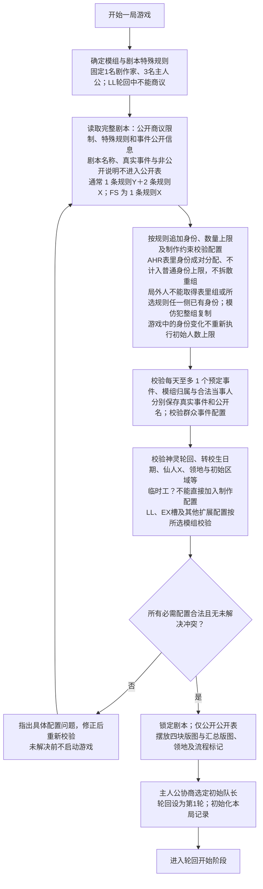

执行注：AHR纸本FAQ Q1～Q4：表里身份配置时豁免人数及身份制作限制（AI可为平民／杀人狂，妹妹可为关键人物／主谋），但必须保留规则指定的表里配对；局外人只能取得所选规则表里两侧均未包含的固定身份；模仿犯可以复制整组表里身份。LL纸本FAQ Q8：局外人只排除所选规则自带身份；捏造的秘密条件追加的身份按其例外处理。依据见规则盘点中的四张纸本FAQ照片。

## 轮回开始阶段

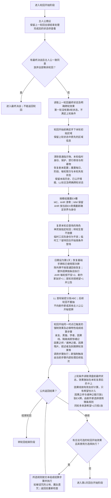

交接：此处清除本轮事件记录，不清除本局事件历史。上一轮结束时新放置的指示物、新公开的亲友身份，也参与本轮开始判定。

## 回合开始阶段

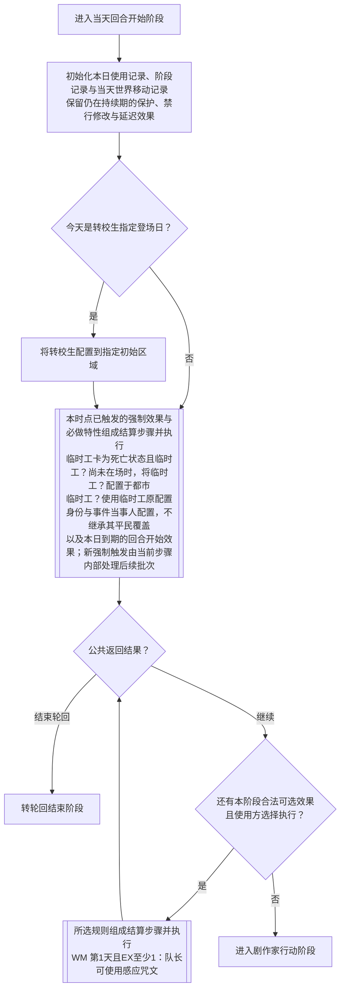

执行注：第 1 天转校生此时才登场，不能追溯参与此前的轮回开始效果。临时工？卡牌只有一张，临时工死亡状态且临时工？已在场上无法再次配置临时工？

## 剧作家行动阶段

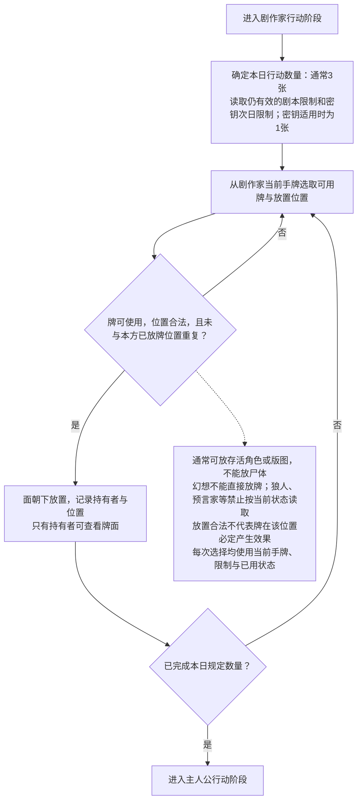

交接：这里只放牌，不执行移动或指示物效果。密钥限制读取的是同轮回指定日期，不将“次日”转移到下一轮回。

## 主人公行动阶段

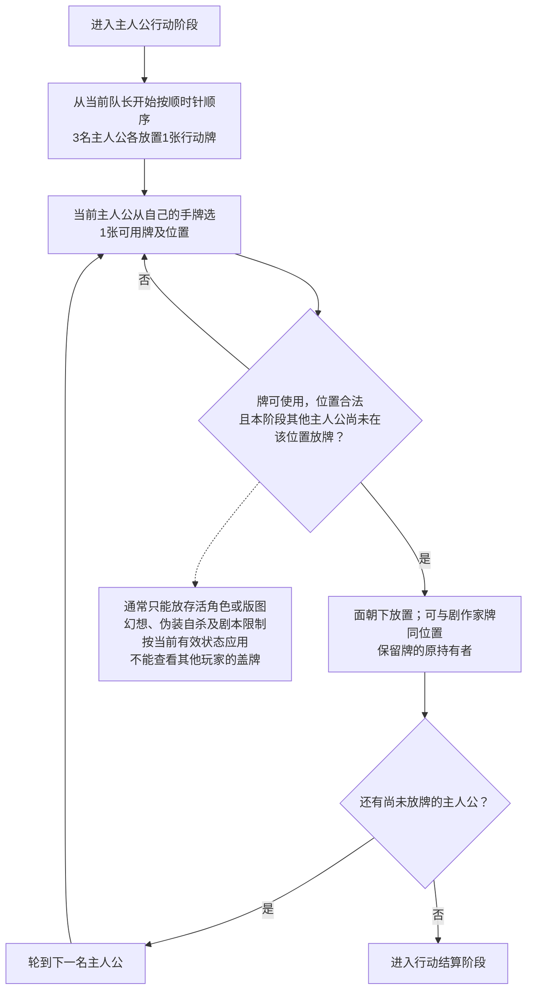

执行注：牌的归属保留供回收和班长能力读取。本流程只处理3名主人公各持一套手牌的标准4人游戏。

## 行动结算阶段

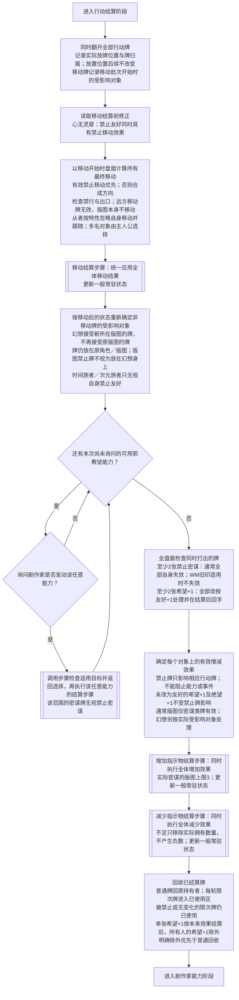

移动合成沿用正文：横＋横＝横，纵＋纵＝纵，横＋纵＝斜，斜＋横＝纵，斜＋纵＝横。每个目标先得到一个最终方向，不能将两张牌分成两次移动来触发中途效果。

执行注：当前收录规则没有在行动结算阶段导致轮回结束的途径，本图不设结束分支。希望牌除外范围采用附录 A 的“所有人的希望+1”，不是仅打出的那张。

## 剧作家能力阶段

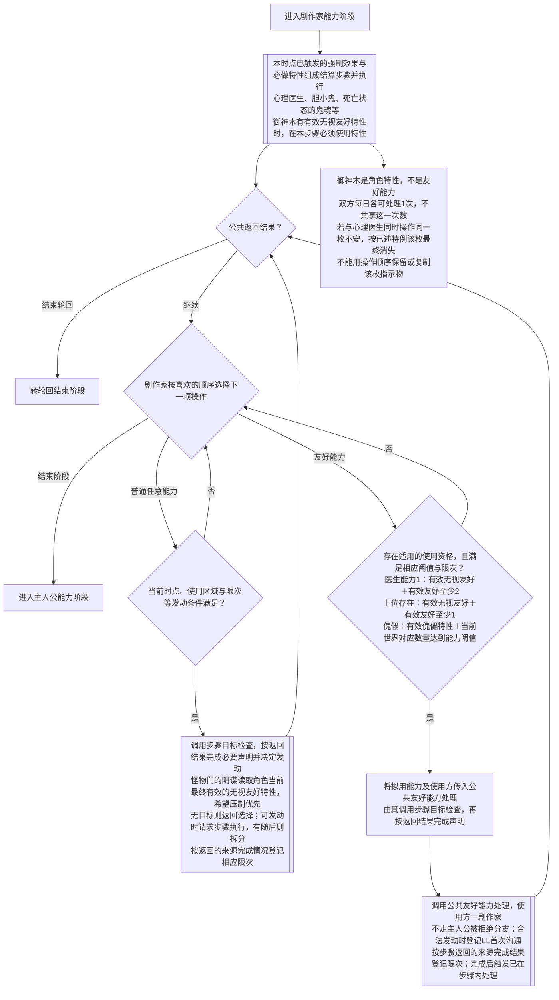

交接：阶段限次按使用方及阶段分别记录；同一卡牌的“每轮限 1 次”友好能力由双方共享。剧作家已完成该限次友好能力，主人公阶段不能再用；医生等没有每轮共享限次的能力可在后续合法阶段再使用。上位存在的剧作家特例为当前有效无视友好且有效友好至少1，不直接套用主人公能力的阈值3。

## 主人公能力阶段

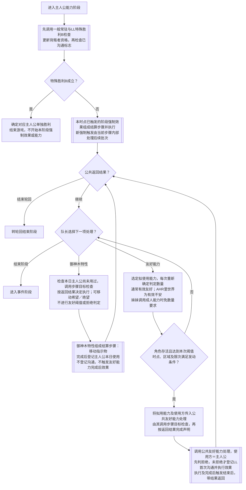

执行注：每个不同友好能力在该主人公能力阶段至多完成一次，明确追加使用除外。被拒绝不占阶段次数，也不消耗每轮限次；合法声明后无盘面变化仍可完成且向主人公公布。使用友好能力不扣除友好指示物。

## 事件阶段

本节沿用原样例标准图。公共处理的具体内容见后文；AI 入口由公共友好能力处理调用，返回原能力上下文，不进入每日事件阶段或队长交替。

```mermaid
flowchart TD
    START["进入事件阶段"] --> PLAN{"今天有预定事件？"}
    PLAN -->|无| STAGE["事件阶段结束：检查此时适用的效果<br/>廷达罗斯：本轮效果有效，且本阶段发生过<br/>其生效后的其他事件 → 主人公死亡"]
    PLAN -->|有| READ["读取真实事件、公开名及当前当事人配置<br/>双临时工分别按下列条件判定，汇总满足者<br/>均不满足才进入事件不发生出口"]
    READ --> TYPE{"群众事件？"}
    TYPE -->|否| ALIVE{"当事人当前在场且存活？"}
    ALIVE -->|否| NOEVENT["事件不发生"]
    ALIVE -->|是| BAN{"存在适用的禁止发生？<br/>手下、预言家等"}
    BAN -->|是| NOEVENT
    BAN -->|否| FORCE{"存在适用的必定发生？<br/>强迫症、侦探、监视者、次元转换等"}
    FORCE -->|是| RECORD["登记事件已发生：真实事件、公开名、当事人、轮回、日期和顺序<br/>双临时工均满足也只登记已发生，不另计次数<br/>公告事件发生时仅公告公开名，不公开当事人"]
    FORCE -->|否| COUNT["确定判定数量：通常有效不安，AHR 里世界通常有效友好<br/>视为增加计数资格，改用替换计数种类；同一枚不重复计算<br/>使用不安判定时 AI 全部指示物各计一次<br/>士的宁毒液／祭品按需计入密谋"]
    COUNT --> LIMIT["确定门槛：默认当事人不安限度<br/>前兆／送葬／冲动杀人－1，猎奇杀人＋1；灭亡讴歌按条件－1<br/>有效教主特性：事件文本中的门槛修正应用两次，其他来源修正按自身规则<br/>教主：前兆／冲动杀人＝1，猎奇杀人＝5"]
    LIMIT --> COMPARE{"判定数量 ≥ 修正后门槛？"}
    COMPARE -->|是| RECORD
    COMPARE -->|否| NOEVENT
    TYPE -->|是| CORPSES["计算指定版图尸体数，含牺牲者"]
    CORPSES --> CROWD{"尸体数 ≥ 必要尸体数？"}
    CROWD -->|是| RECORD
    CROWD -->|否| NOEVENT
    NOEVENT --> STAGE
    RECORD --> INIT["记录包含剧本事件条目ID（含预定日期）<br/>本次执行＝第1次；同名不同日期各自计算首次<br/>双临时工均满足：两者对应效果按明确同时规则组成结算步骤<br/>全部处理后再进入阶段结束"]
    INIT --> CAT

    AI["AI 友好能力调用事件效果"] --> AILOOKUP["从公开信息表选择事件<br/>按公开名查找当前模组的对应事件效果"]
    AILOOKUP --> AIFOUND{"有对应事件效果？"}
    AIFOUND -->|否| AINONE["不产生事件效果"]
    AINONE --> RETURN
    AIFOUND -->|是| AIPREP["不判定、不登记发生，任何时候调用均不满足首次发生<br/>灭绝之火不触发首次效果；表世界奇点只进行世界移动<br/>普通事件当事人按 AI；群众事件按都市群众处理<br/>原剧作家选择交给队长"]
    AIPREP --> CAT

    subgraph EXEC["执行完整效果"]
        CAT{"当事人是黑猫？"}
        CAT -->|是| CATEX[["黑猫替换后的来源也调用步骤结算并提供完成条件<br/>MC 中 EX＋1；不应用猎奇杀人／银色子弹的专属 EX修正<br/>不执行被替换的事件文本；适用完成后触发在步骤内处理"]]
        CATEX --> NOTICE["公告效果无现象"]
        CAT -->|否| EX["结算本次发生带来的模组效果<br/>MC：通常 EX＋1，猎奇杀人合计＋2，银色子弹＋0<br/>AI 调用不执行发生时增量；教主第二次不回到这里"]
        EX --> PREP["读取真实事件文本；AI 按入口查得的效果<br/>将必要选择交步骤检查并返回声明记录<br/>执行时及随后步骤的目标复查、补选由步骤处理<br/>读取所在区域才应用双胞胎／仙人；初始区域不以当前区域替代"]
        PREP --> RUN[["本次事件文本组成结算步骤，逐步调用统一执行流程<br/>同批效果同时处理；变化触发及来源完成后触发均在步骤内部处理<br/>随后拆步；已有结束要求则不开始原文本下一步<br/>计数、移动、死亡替代／保护按公共规则处理<br/>按步骤返回的目标情况处理；无合法目标部分不生效<br/>无目标跳过不算结束截断，不撤销事件发生<br/>全部规定步骤执行完毕才算本次完成；银色子弹在此登记结束要求<br/>传入来源完成条件：教主两次效果均完成才算整个事件完成<br/>返回：目标情况、本次及来源是否完成、结果与结束要求"]]
        RUN -.-> STATE["执行注：仅在文本要求的时点读取／保留状态<br/>本事件首次按剧本事件条目ID读取本次之前的历史，不把本次记录算作此前<br/>AI调用不写事件条目记录；廷达罗斯生效时保留时点<br/>延迟效果保留对象及期限；疯狂之夜使用发生时丧尸数量，不在日末重算"]
    end
    RUN --> COMPLETE{"本次效果完整执行完毕？"}
    COMPLETE -->|否，因结束要求截断| CUTAI{"是否由 AI 友好能力调用？"}
    CUTAI -->|是| RETURN
    CUTAI -->|否| END["保留死亡／失败及结束要求<br/>最外层收尾完成后转轮回结束<br/>结束轮回本身不等于失败"]
    COMPLETE -->|是| AICALL{"是否由 AI 友好能力调用？"}

    AICALL -->|是| RETURN["将完成情况、结果及结束要求返回 AI 友好能力上下文<br/>由当前外层步骤处理适用完成后触发，收尾后统一返回所属阶段"]

    AICALL -->|否| REPEAT{"当事人是教主<br/>且刚完成第1次？"}
    REPEAT -->|是| STOP{"已有结束轮回要求？"}
    STOP -->|是| END
    STOP -->|否| AGAIN["设为第2次执行<br/>由步骤重新检查和选择目标，可以与第一次不同<br/>无合法目标则由步骤返回无变化"]
    AGAIN --> PREP
    REPEAT -->|否| CHANGE{"整个事件文本效果曾引起盘面变化？<br/>教主合并检查两次效果"}
    CHANGE -->|否| NOTICE
    CHANGE -->|是| FINISH["汇总步骤返回的事件完成情况<br/>采用未被黑猫替换的银色子弹等已记录结束要求"]
    NOTICE --> FINISH
    FINISH --> AFTER["采用步骤返回的事件完成及后续结果<br/>愚者等完成后触发已在步骤内部处理，不再触发"]
    AFTER --> FINEND{"已有结束轮回要求？"}
    FINEND -->|是| END
    FINEND -->|否| STAGE

    STAGE --> STAGERUN[["有适用效果时组成结算步骤，调用统一执行流程<br/>无效果或处理结束后继续"]]
    STAGERUN --> STAGEEND{"已有结束轮回要求？"}
    STAGEEND -->|是| END
    STAGEEND -->|否| NEXT["进入队长交替阶段"]
```

交接：本次事件是否发生、是否完整结算、是否产生盘面变化分别保存。教主重复的是效果，AI 调用的是效果；两者都不能额外制造“事件已发生”的记录。

## 队长交替阶段

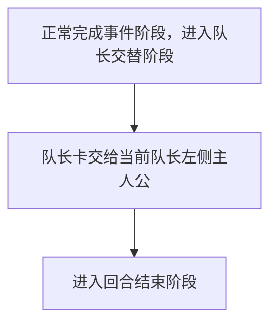

交接：在事件阶段或更早阶段转入轮回结束，不经过本阶段，队长不补交。正常交替后，回合结束阶段要求“队长”选择时使用新队长；下轮也不自动重选初始队长。

## 回合结束阶段

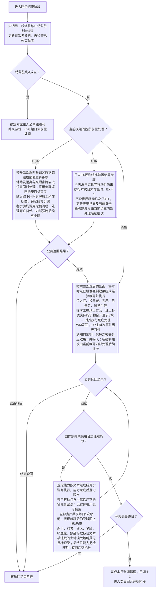

执行注：地缚灵本次刚附身，不在同一次诅咒处理里继续杀人；原本附身的牌本次落地，也不立即再附身。丧尸的强制杀人与任意移动分别按文本检查“所有丧尸合计每日限 1 次”。

临时工按实际枚数合计，不按种类数或有效数量换算：1友好＋1不安＋1绝望＝3枚，绝望只计一次；LL标志与EX牌不计入。死亡仍经过适用的保护与替代处理。

交接：疯狂之夜读取事件发生时保存的条件结果，不按日末丧尸数重算；狼人读取“今天确实发生过疯狂之夜”。UP主读取本轮第一次真实事件的日期，AI 调用不使其满足。

## 轮回结束阶段

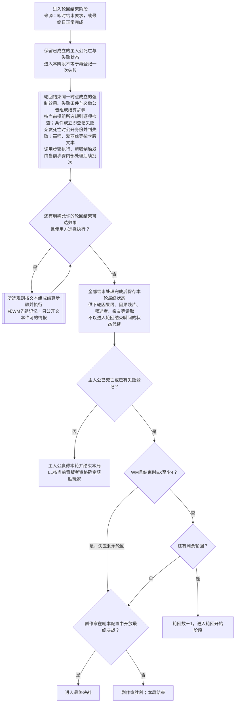

执行注：本阶段已有结束要求是进入原因，不能使轮回结束处理再次跳回自身，或跳过尚未执行的结束时判定。仅银色子弹要求结束时，仍须检查轮回结束失败条件；没有死亡和失败才获胜。

卡牌范围按已确认意见处理：“和我签订契约吧！”“叛逆的世界”等指定卡牌条件不因死亡自动失效；不能由此将所有写“角色”的条件扩展至尸体。普通统计不算已移除卡，LL 累计标志统计是明确例外。

## 最终决战

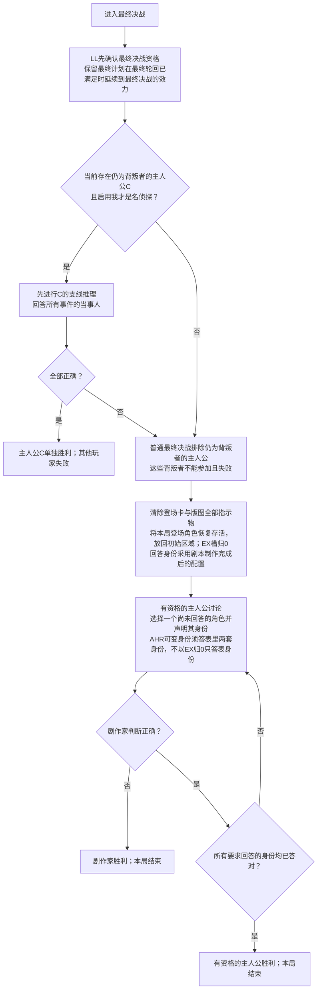

执行注：复原不是新轮回，不触发黑猫、亲友等轮回开始效果，也不重新发手牌。局外人必须回答；模仿犯等制作特性造成的身份属于答案，轮回内临时身份变化不属于答案。神灵等仅按本局实际登场范围纳入。

## 公共处理

### 一般常驻与阶段常驻胜利判定

一般常驻在适用期间持续生效；相关状态改变后更新身份、特性、计数及资格，不作为一项能力反复发动。LL特殊胜利A、B只在各自指定阶段常驻，进入阶段时即检查，阶段内相关状态变化后继续检查；C仍由最终决战专门流程处理。

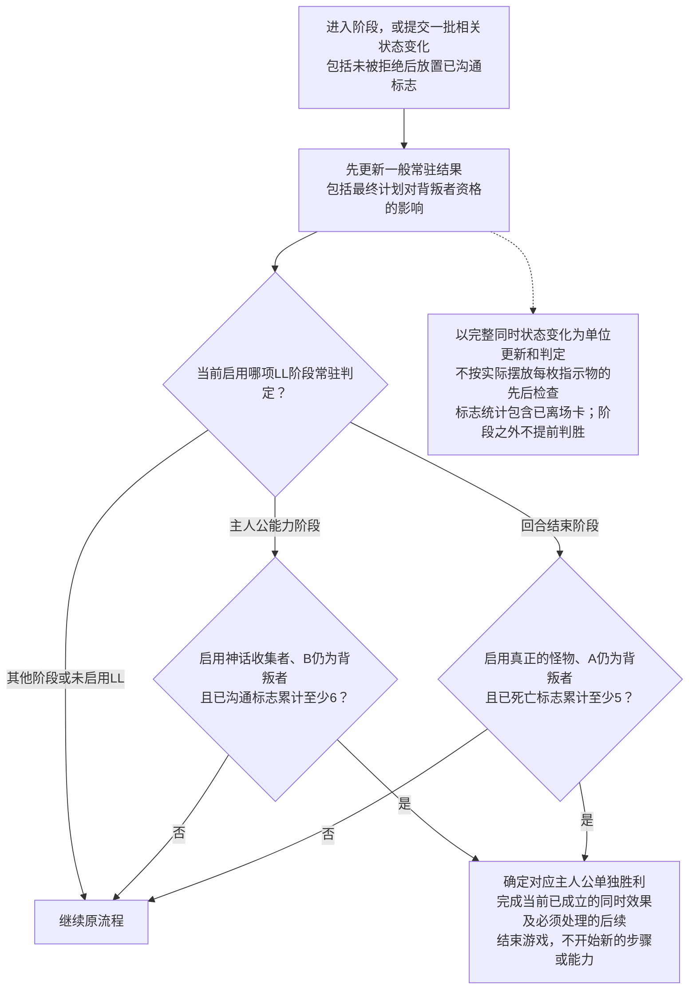

本图是持续适用的公共规则，不是每日额外阶段，也不需要在主图每一步后重复绘制。没有相关变化时不反复检查；一旦确定特殊胜利，普通流程不得继续推进或改用轮回胜负覆盖结果。合法友好能力未被拒绝后登记第6枚已沟通时，B可能在该能力效果开始前获胜，此时不再开始其效果。

### 结算步骤的组成与执行

#### 标准流程

本节仅负责阶段与定稿步骤流程的衔接，不另行实现步骤内部逻辑。下方范围统计用于整理调用资料，结果计算与死亡保护说明供步骤内按批次引用。

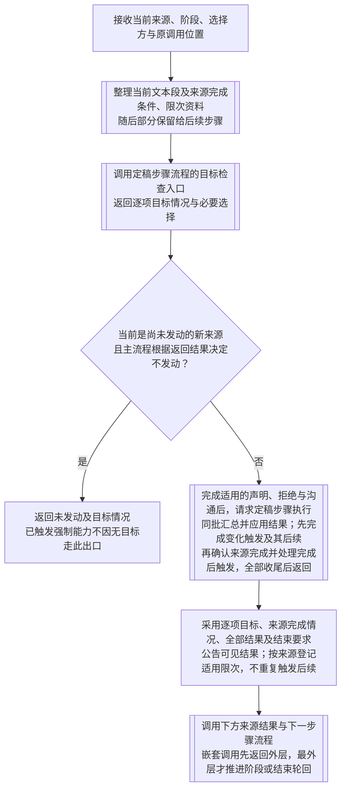

#### ① 范围与效果统计

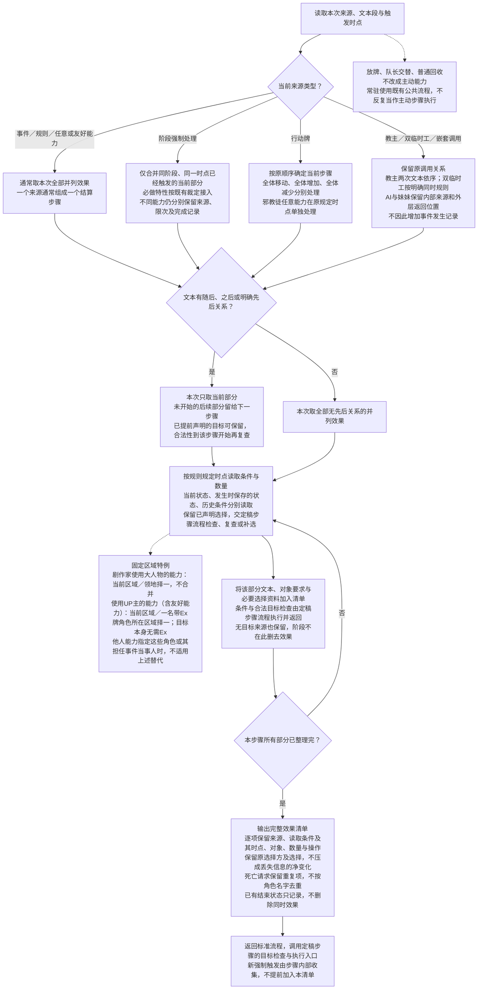

#### ② 计算实际结果

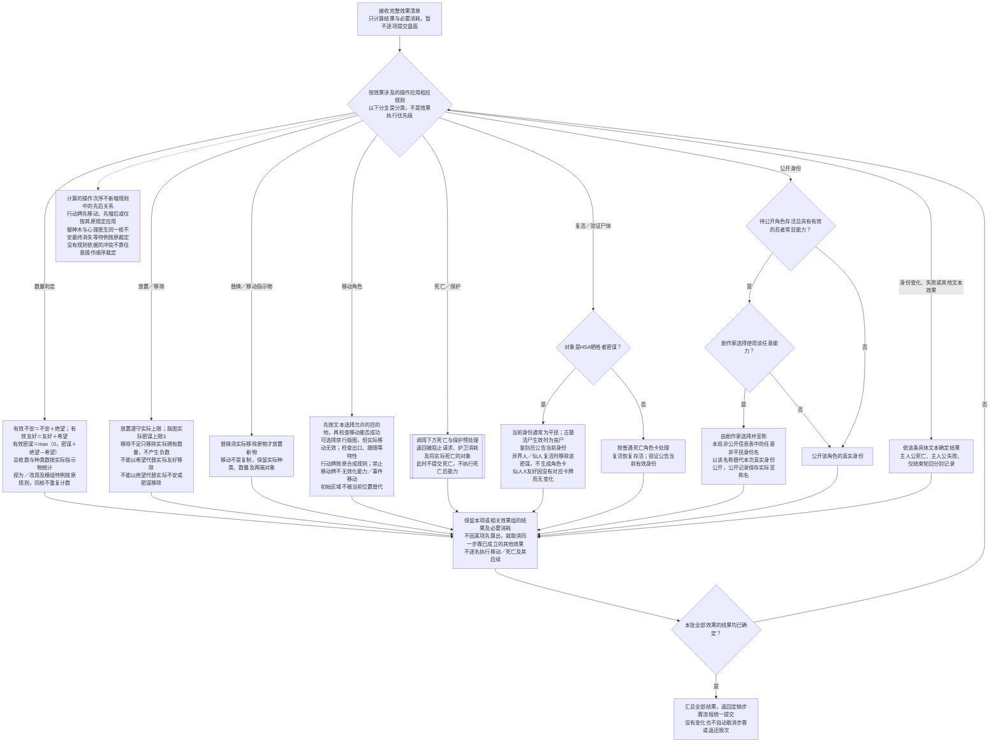

#### ③ 统一提交、常驻与强制后续

直接引用[定稿步骤结算总流程](<F:/轮回/步骤结算流程（独立稿）.md#步骤结算总流程>)：统一应用当前批次结果，更新常驻及适用特殊胜利，完整处理变化触发及其即时强制后续，再确认来源完成并处理完成后触发。新触发不并入原同时批次；所有必须后续均留在当前最外层步骤内，阶段收到最终返回后不再重复处理。强制来源内部到达“随后，可以……”等可选后续时，调用同稿的[可选后续接口](<F:/轮回/步骤结算流程（独立稿）.md#强制来源内的可选后续>)，只询问该部分是否执行，不重新判断整个强制来源是否触发。

#### ④ 来源结果与下一步骤

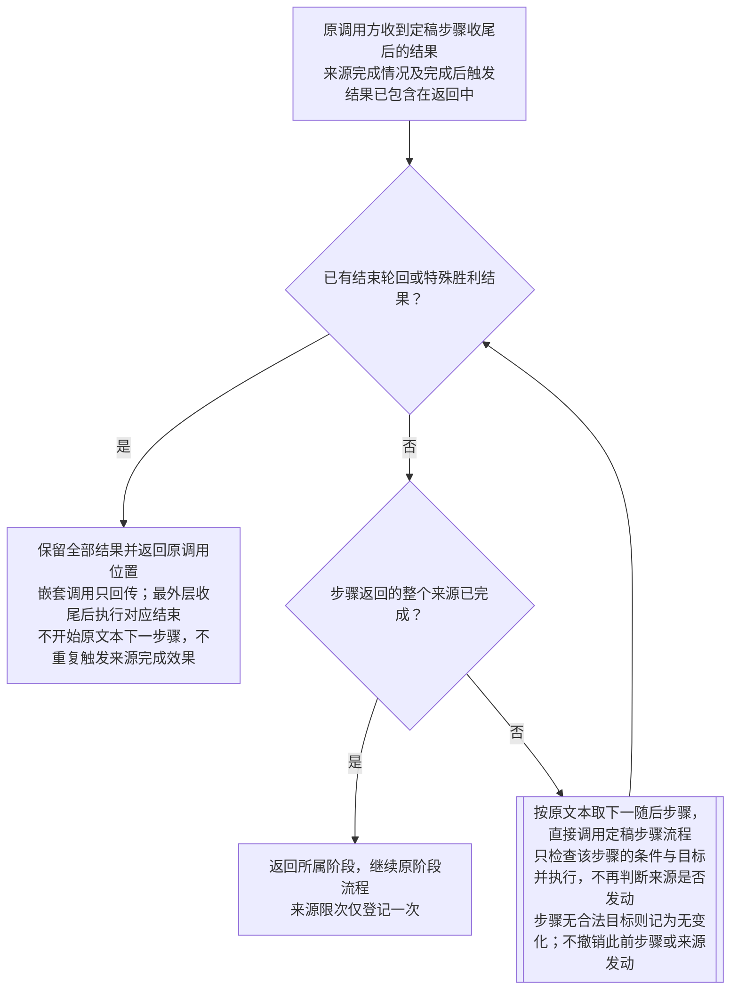

### 死亡与保护：本批的结果预处理

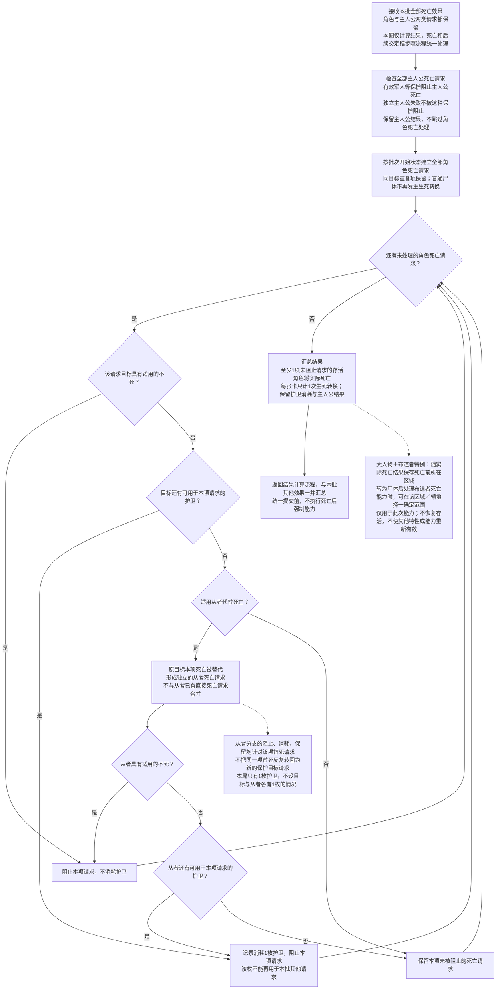

#### 规则案例：效果统计到最终输出

```mermaid
flowchart TD
    subgraph HOSPITAL["医院事故｜正文§4.1.2、§4.1.3"]
        HSTART["医院密谋至少2；医院有关键人物及当事人愚者<br/>无保护改变本例结果"] --> HLIST["统计同一步骤的两项效果<br/>医院所有角色死亡＋主人公死亡"]
        HLIST --> HAPPLY["全部结果确定后统一提交死亡<br/>不能因主人公或关键人物先被操作为死亡而跳走"]
        HAPPLY --> HFORCE["步骤内部处理关键人物死亡能力的后续批次<br/>登记失败及结束要求"]
        HFORCE --> HDONE["医院事故全部文本已执行，登记事件完成<br/>步骤内部处理愚者完成后能力，清空其不安"]
        HDONE --> HOUT["输出：医院无保护角色及主人公死亡<br/>医院事故完整完成，愚者不安清空<br/>必须后续处理完才结束轮回"]
    end
    subgraph GORE["猎奇杀人｜正文§4.1.3"]
        GSTART["前半连续杀人杀死关键人物"] --> GLIST["当前仅统计连续杀人效果<br/>后半不安扩散不加入本步骤"]
        GLIST --> GAPPLY["统一提交前半死亡<br/>步骤内部处理关键人物强制能力，登记失败及结束要求"]
        GAPPLY --> GOUT["输出：连续杀人步骤完成，猎奇杀人整体未完成<br/>不执行不安扩散<br/>即使当事人为愚者，也不触发其事件完成后能力"]
    end
    subgraph KILLERS["双杀人狂｜正文§4.1.2"]
        KSTART["A与B是同一区域仅有的两名角色<br/>无保护改变本例结果"] --> KLIST["同一时点统计两项成立效果<br/>A杀B＋B杀A，合为同一步骤"]
        KLIST --> KAPPLY["两项死亡结果全部确定并统一提交<br/>再处理适用的死亡后续"]
        KAPPLY --> KOUT["输出：A、B都死亡<br/>不能先操作A杀B，再取消B已成立的效果"]
    end
    subgraph SERVANTCASE["从者直接死亡并替死｜正文§6.7"]
        SSTART["从者既替保护目标死亡，又被直接指定死亡<br/>从者持有唯一1枚护卫，无其他保护改变结果"] --> SLIST["统计保护目标与从者的直接死亡请求<br/>替死另形成1项从者请求，不与直接请求合并"]
        SLIST --> SPLAN["从者两项请求分别处理<br/>护卫阻止其中1项，另1项未被阻止<br/>统一提交实际死亡"]
        SPLAN --> SOUT["输出：保护目标的该项死亡被替代<br/>护卫消耗，从者死亡<br/>只登记1次实际死亡、1次死亡触发<br/>没有护卫时仍只转换1次"]
    end
```

依据：[结算步骤与同时结算](<F:/轮回/tragedy_loop_game_rules(3)(1).md:184>) · [中断案例](<F:/轮回/tragedy_loop_game_rules(3)(1).md:255>) · [死亡与替代](<F:/轮回/tragedy_loop_game_rules(3)(1).md:643>)。

### 友好能力调用、拒绝与完成后触发

```mermaid
flowchart TD
    CALL["收到已通过发动资格检查的友好能力调用<br/>保留能力角色、使用方与嵌套调用关系"] --> TARGET[["调用定稿步骤目标检查，取得目标情况与必要选择"]]
    TARGET --> LEGAL{"返回首步骤有合法目标或不需要目标？"}
    LEGAL -->|否| NONE["返回无合法目标、未发动，不进入拒绝及沟通"]
    NONE --> RETURN
    LEGAL -->|是| DECLARE["按返回的目标及必要选择完成声明"]
    DECLARE --> REFUSE{"此调用允许进行主人公能力拒绝判定？"}
    REFUSE -->|否| COMM
    REFUSE -->|是| TRAIT["读取角色当前有效特性<br/>希望压制整个无视友好大类<br/>无有效特性不得拒绝；必定无视友好必须拒绝<br/>普通／傀儡无视友好由剧作家选择"]
    TRAIT --> REJECT{"拒绝？"}
    REJECT -->|是| DENY[["公告被拒绝，不公告隐藏原因；不放置已沟通<br/>不消耗阶段或每轮限次；WM的EX＋1<br/>处理EX变化产生的适用后续"]]
    DENY --> RETURN["返回原调用方及公共结果"]
    REJECT -->|否| COMM["LL：首次合法发动且未被拒绝时，放置已沟通标志<br/>不论由谁发动；位于效果执行前<br/>状态变化交一般常驻与当前阶段适用的LL特殊胜利检查"]
    COMM --> COMMRESULT{"公共常驻返回特殊胜利结果？"}
    COMMRESULT -->|是| GAME["确定对应主人公单独胜利<br/>能力未执行、未完成；结束游戏"]
    COMMRESULT -->|否| EFFECT[["按能力文本逐步调用定稿步骤执行，提供来源完成条件；有随后则拆分<br/>AI：调用事件图的AI入口，不登记事件发生<br/>妹妹：成人能力嵌套调用，免阈值且不能拒绝，但检查限次<br/>成人无合法对象不阻止妹妹自身发动、沟通与完成；成人自身仍检查目标<br/>仙人：移动与随后复活为两个步骤；无合法尸体部分跳过"]]
    EFFECT --> COMPLETE{"本能力所有步骤已完成？"}
    COMPLETE -->|否| CUT["返回未完成及结束要求<br/>不触发本能力完成后效果"]
    CUT --> RETURN
    COMPLETE -->|是| RECORD["登记本能力完成、是否变化与限次<br/>每轮限次由双方共享；无变化不返还<br/>嵌套能力分别登记，不把成人完成当成妹妹已完成"]
    RECORD --> AFTER["汇总步骤内已处理的完成后触发，不再次执行<br/>巫师、密钥、提线木偶、童谣、爱丽丝、网络名流等<br/>包括AHR每轮限1次友好能力完成后的世界移动<br/>按步骤返回记录身份能力限次，明确共享者除外"]
    AFTER --> RETURN
```

执行注：妹妹自己的能力仍按正常入口判断合法性和拒绝；只有被其调用的成人能力享受免阈值与不能拒绝。御神木不进入本图。爱丽丝在 EX＝0 时不会因本次世界移动立即触发 EX≥1 的后续；EX≥1 时其强制身份能力即使没有其他角色可放希望，也完成并消耗身份能力自身的每轮限次。

LL已沟通不要求能力完成或产生盘面变化；登记后的能力即使被轮回结束截断，也不撤销标志。本口径覆盖此前“拒绝判定前登记”的旧写法。

## 阶段间交互

### 整局路线

```mermaid
flowchart TD
    SETUP["开局"] --> LOOP["轮回开始"]
    LOOP --> DAY["回合开始"]
    DAY --> MA["剧作家行动"]
    MA --> PA["主人公行动"]
    PA --> ACTION["行动结算"]
    ACTION --> MS["剧作家能力"]
    MS --> PS["主人公能力"]
    PS --> EVENT["事件"]
    EVENT --> LEADER["队长交替"]
    LEADER --> NIGHT["回合结束"]
    NIGHT -->|非最终日，正常完成| DAY
    NIGHT -->|最终日，正常完成| END["轮回结束"]
    LOOP -->|一致放弃剩余轮回且允许最终决战| FINAL["最终决战"]
    INTERRUPT[["任一实际到达时点提出结束要求<br/>完成当前结算步骤、强制后续及适用特殊胜利检查"]] --> END
    RESIDENT[["公共常驻流程：LL阶段特殊胜利成立"]] --> GAME["本局结束"]
    END -->|未死亡且无失败| GAME
    END -->|本轮失败且仍有轮回，无跳转例外| LOOP
    END -->|失败且需最终决战| FINAL
    END -->|最终轮失败且无最终决战| GAME
    FINAL --> GAME
    INTERRUPT -.-> NOTE["公共中断入口适用于所有执行效果的阶段<br/>不是每日额外执行的阶段<br/>轮回结束自身不因既有结束要求重入"]
```

### 记录由谁写入、由谁读取

| 状态或记录 | 写入时点 | 读取时点与作用 | 生命周期／边界 |
| --- | --- | --- | --- |
| 当前位置、指示物、存活与身份 | 步骤结算每批提交状态时 | 后续能力合法性、事件判定、日末条件、轮回结束条件 | 后续步骤读更新后的状态；同批已锁定的效果不被操作顺序撤销 |
| 主人公死亡、失败、结束要求 | 对应效果实际成立时分别登记 | 公共出口决定中断；轮回结束决定是否失败 | 当前轮回保留；仅结束要求不能充当失败 |
| 行动牌归属、已使用与除外状态 | 放牌、结算及明确回收／除外时 | 阶段选牌；班长收回队长自己的已使用限次牌；下轮发牌 | 除外与本轮已使用分开；被禁止的限次牌仍已使用 |
| 阶段／每日／每轮及共享限次 | 按文本在使用或完成时登记 | 每次合法性检查和强制触发检查 | 各自到期重置；同卡每轮限次友好能力双方共享，御神木双方每日各一次 |
| 临时禁行与主人公保护 | 医生、小女孩、军人等能力完成相应效果时 | 后续移动或主人公死亡请求 | 本轮持续，不能追溯修改已经发生的移动或死亡 |
| 事件禁止、强制发生及门槛修正 | 能力或规则使状态生效时 | 每日事件阶段发生判定 | 按实际持续期；禁止优先必定发生；AI调用不执行发生判定 |
| 本轮事件记录与本局历史 | 预定事件通过发生判定时 | 刑警、UP主、狼人、改变未来、次元融合计划、奇点、灭绝之火等 | 同时保存剧本事件条目ID（含日期）、真实事件、公开名和当事人；条目ID用于跨轮首次判断，同名不同日期独立；AI不写入 |
| 本轮第一次事件日期 | 第一次真实事件发生时由历史确定 | UP主在该日回合结束阶段读取 | 若提前结束未进入日末，不补执行；AI不占首次 |
| 疯狂之夜的发生时条件 | 事件效果要求读取发生时丧尸数时 | 当日回合结束强制步骤 | 保存当时是否达标；日末数量减少不撤销已成立的延迟效果 |
| 廷达罗斯生效时点 | 廷达罗斯之嗅效果实际生效时 | 事件阶段结束，查询该时点之后的其他事件记录 | 无预定事件也到达正常阶段结束；中途跳出不补跑；按需查询，不给每个后续事件另建死亡任务 |
| 世界移动发生记录 | AHR明确世界移动或限次友好能力完成时 | 当天回合结束的前置处理 | 当下不加EX；日末开始最多因此＋1，次日重新记录 |
| EX槽及本轮是否增加过 | 每次实际增减槽位时 | WM旧印／发狂、MC事件和身份、AHR世界、黄衣之王等 | EX是当前值，“曾增加”是历史；后来减少不抹去增加历史 |
| 密钥公开产生的期限 | 第1或第2轮中其身份公开时 | 非最终日：同轮次日剧作家行动限1张，且次日日末死亡；最终日：当日日末死亡 | 不跨轮；军人可阻止死亡，不阻止行动数量限制 |
| 遗言等明确跨轮效果 | 对应文本效果执行时 | 下一轮回开始 | 只有明确“下轮”的效果跨轮；没有下一轮就不补执行 |
| 诅咒牌与无目标事实 | 放置诅咒时；日末前置处理时 | 日末诅咒处理；被诅咒的土地的本阶段任意能力 | 本轮状态；是否无目标读取前置处理时事实，不以稍后盘面覆盖 |
| 已公开身份与其他公开情报 | 文本要求公开时 | 亲友下轮效果、绝密报告等历史条件、推理 | 本局已公开情报保留；公开忍者身份按其特例，不自动暴露真实配置 |
| LL已沟通／已死亡标志 | 首次合法发动友好能力且未被拒绝后、效果执行前／首次实际死亡 | B在主人公能力阶段常驻检查≥6；A在回合结束阶段常驻检查≥5，均先检查背叛者资格 | 本局累计，每卡每类至多1；离场仍计数；被拒绝不登记沟通；不提前跨阶段宣布胜利 |
| LL背叛者资格与秘密编号 | 首轮分牌及所选规则；最终计划的常驻条件 | 特殊胜利、通常主人公胜利、最终决战资格及C支线 | 编号不重抽；最终轮满足最终计划的延续效力不能被决战清盘误删 |
| 上一轮回最终状态 | 全部轮回结束处理完成后、清盘前 | 下轮因果线、因果之绊、诸神之骰、叙述者、因果残片等 | 只读已完成轮回的最终状态；首轮不能虚构上轮；先保存再复原 |

### 三种出口不可混用

| 当前结果 | 接下来做什么 | 不做什么 |
| --- | --- | --- |
| 正常完成阶段 | 处理实际到达的阶段结束时点，进入顺序下一阶段 | 不重新触发本阶段已经处理过的开始效果 |
| 要求立即结束轮回 | 完成当前结算步骤、强制后续、实际到达的完成后触发及当前阶段特殊胜利检查，然后进入轮回结束 | 不补执行尚未开始的随后步骤、事件阶段结束、队长交替或日末任务 |
| 游戏已由特殊胜利结束 | 采用获胜玩家集合，停止普通阶段推进 | 不再通过通常轮回胜负或最终决战覆盖已确定的特殊胜利 |

### 连续交互样例

1. **医生→行动与事件。**剧作家能力阶段的医生先按当前有效无视友好检查资格；主人公阶段再合法使用医生解除住院患者禁行。这不能重做当天已完成的移动牌，但当天稍后的能力／事件移动以及次日移动会读取新禁行状态。医生调整不安的能力则直接影响当天稍后的事件判定。
2. **AHR限次友好→事件→日末。**EX＝0 时完成每轮限一次友好能力，先登记世界移动，EX仍为0；爱丽丝的 EX≥1 后续不成立。若没有其他EX修改，当天事件仍按表世界判定；日末前置EX＋1后才以里世界身份建立日末强制步骤。
3. **密钥→行动限制→保护。**第1轮第2天公开密钥且该日非最终日，登记第3天剧作家限1张及第3日日末主人公死亡。若第3天主人公阶段已获得军人保护，到期死亡被阻止；行动限制已经执行，不被追溯撤销。若第2天轮回提前结束，期限不转移到第2轮。
4. **死亡步骤→LL标志→跳转。**事件中实际死亡使已死亡累计达到5，但尚未到回合结束阶段，A不在此时胜利。若关键人物死亡导致跳转，本轮不补做日末；标志跨轮保留，在以后真正进入回合结束阶段时按A当时的资格检查。
5. **友好被拒绝→两类后续。**LL中合法声明被拒绝不放置已沟通；未被拒绝才在效果执行前登记首次沟通，若达到B条件，由主人公能力阶段常驻判定处理，可能在效果开始前结束游戏。另一个独立的WM场景中，拒绝使EX＋1、限次不消耗；不能把LL与WM当成默认同时启用。
6. **银色子弹→轮回结束→胜负。**非黑猫替换的银色子弹完整结算并处理完成后触发，随后进入轮回结束；不交替队长、不执行日末。轮回结束失败条件仍判定，没有死亡或失败才获胜。黑猫替换时不执行银弹原文本，按事件样例走无现象出口。
7. **因果线→清盘→新轮。**某卡上轮结束处理完成后仅有1枚希望，即使该卡是尸体或已移除，也进入因果线对象集合。新轮先通常复原，再给该卡放2枚不安；不能在清盘后才寻找上轮友好对象。
8. **妹妹→成人→外层完成。**妹妹能力调用成人能力时，成人独立检查限次、登记沟通和完成后触发。成人能力及其强制后续令轮回结束时，不启动妹妹尚未开始的后续步骤；外层是否完成仍按自身剩余文本判断，不能因成人完成就一并宣告完成。

## 依据与口径

依据：[原事件样例](<F:/轮回/事件阶段逻辑样例.md>)、[规则正文](<F:/轮回/tragedy_loop_game_rules(3)(1).md>)、[附录](<F:/轮回/tragedy_loop_appendix(3)(1).md>)、[用户处理意见与FAQ整理](<F:/轮回/轮回术语修改计划(1).md>)，以及根目录官方 FAQ 第10～17页图片。在线[《惨剧轮回QA 至纯版》](https://docs.qq.com/sheet/DQWN4bEZ6UnF3b3BR?tab=000001)已确认可匿名只读，并交叉核验了 LL“在适用阶段不断判定”的条目；腾讯文档画布不支持稳定整表导出，因此其余项目以同版官方图片逐条核查。

| 本稿部分 | 主要依据 |
| --- | --- |
| 开局与轮回开始 | 正文§2、§3；附录各模组轮回开始条目、角色表；处理意见FAQ-R01、FAQ-R15及因果之绊／诸神之骰裁定 |
| 每日九阶段 | 正文§4.2～§4.10；附录A、各模组和角色表；原事件样例 |
| 公共处理与中断 | 正文§4.1、§6.3～§6.8；处理意见关于提前声明、同时处理、御神木与次数的裁定 |
| 轮回结束与最终决战 | 正文§5；LL、WM、AHR、FS模组专门条目 |
| 跨阶段记录 | 正文对应触发时点；处理意见FAQ-R04、R06～R08、R11～R14、R16及第七节 |

已明确采用的口径：因果线计入希望；御神木在剧作家阶段并入强制步骤、双方每日分别一次；提前完整声明后逐步复查目标；密钥仅取同轮次日或最终日当日；银色子弹在完整结算时结束轮回；同卡每轮限次双方共享，同名身份的不同卡牌分别记录，只有明确“合计”的能力才共享。

不阻塞当前执行的资料边界：

- **AHR日末入口之后才发生世界移动。**本图只执行一次阶段入口检查；之后的新世界移动当日不追加EX，也不结转次日。
- **行动牌位置／手牌不足。**标准合法配置继续要求放足规定数量；若自制剧本造成不足，由该剧本另行规定。
- **因果线。**正文已统一为有效友好，只有希望也满足；与纸本FAQ一致。
- **AHR剧本制作。**表里配对、人数上限豁免、局外人排除与模仿犯整组复制，均在开局ID框校验；已有对应组合回归测试。
- **新剧本明确混用模组或创造并列特殊胜利。**原资料按当前启用模组处理，没有提供所有跨模组冲突及多个个人胜利同时成立的通用裁决。只有实际配置引入这类情况时，才需要为该剧本补充规则，不将互斥模组的假想组合塞入正常流程。
