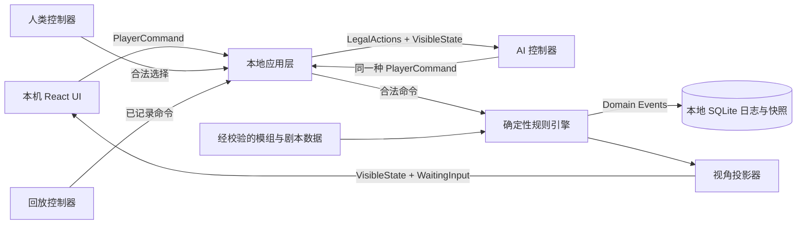

# 《惨剧轮回》电子版开发框架：工具选型

配套设计：[规则引擎模板](开发框架-02-规则引擎模板.md)、[开发流程与验收](开发框架-03-开发流程.md)。工程边界、网络预留及执行细节以这两份后续设计为准。

状态：已按单机训练目标完成选型，等待进入工程初始化  
适用范围：标准 4 人规则、本地单机、任意阵营由人类或 AI 控制、支持 AI 对 AI 观战

## 1. 结论

采用 **TypeScript 全栈、本地权威结算、浏览器界面优先** 的方案。首版是只在本机运行的训练工具，不建设联网服务：

| 范围 | 采用工具 | 用途 |
| --- | --- | --- |
| 语言 | TypeScript（严格模式） | 规则引擎、本地应用、前端和 AI 协议共用类型 |
| 运行时与包管理 | Node.js 当前 LTS + pnpm | 构建、测试和本地运行 |
| 单仓库 | pnpm workspace | 管理 engine、app、web、ai、content 等包；首版不引入 Turborepo |
| 规则引擎 | 自研纯 TypeScript 内核 | 阶段机、步骤结算、批次、强制后续、结束要求 |
| 本地应用层 | Fastify（仅监听 localhost） | 承接本机 UI、规则引擎、AI 调用与存档，不提供公网服务 |
| 前端 | React + Vite | 版图、手牌、选择对话框、日志和剧本编辑器 |
| 前端状态 | Zustand + TanStack Query | 界面交互态与本地权威状态分离 |
| 拖放与动效 | dnd-kit + Motion | 放置行动牌、移动反馈；不参与规则判断 |
| 数据契约 | Zod + JSON Schema | 输入、存档、规则数据和 AI 输出校验 |
| 本地存储 | SQLite + Drizzle ORM | 对局、快照、决策点、完整日志和训练复盘 |
| AI 接入 | OpenAI Responses API | AI 主人公、AI 剧作家的结构化决策与复盘说明 |
| 单元/集成测试 | Vitest + fast-check | 规则案例、性质测试、确定性与回放测试 |
| 端到端测试 | Playwright | 三种对战模式、隐藏信息和完整对局流程 |
| 代码质量 | ESLint + Prettier + TypeScript 编译检查 | 统一代码风格与静态检查 |
| 自动化 | GitHub Actions | 提交时执行 lint、类型检查和测试 |
| 可选桌面封装 | Tauri | 本地 Web 版稳定后再封装；不阻塞首个可玩版本 |

不在第一阶段引入公网服务、联机大厅、账号系统、云数据库、Unity、Unreal、Godot、微服务、Redis、Kubernetes 或专用向量数据库。

首版必须支持三种模式：

1. **主人公训练**：你控制主人公方，AI 控制剧作家；
2. **剧作家训练**：你控制剧作家，AI 控制主人公方；
3. **AI 对战观战**：双方均由 AI 控制，你可以暂停、单步推进并查看复盘。

## 2. 为什么选 TypeScript 全栈

本项目的主要难点不是 3D 渲染，而是：

- 九阶段流程和阶段间出口不能串线；
- 一个步骤内包含同时效果、统一提交、常驻更新和多批强制后续；
- “来源完成”“步骤收尾完成”“轮回立即结束”是不同信号；
- 同一状态必须按剧作家、主人公和复盘观察者视角裁剪；
- AI 只能从合法选项中作决定，不能自行解释并改写规则；
- 每次结算需要可回放、可测试、可追责。

TypeScript 能让浏览器、本地应用层、AI 工具协议和测试共用同一套类型。相比 Python + PySide6，Web UI 更适合多视角切换、训练复盘、响应式布局和后续发布；相比游戏引擎，React 更适合卡牌、表格、日志、剧本编辑器和大量选择界面。

## 3. 总体结构



关键原则：

1. **规则引擎是唯一裁判。** UI、AI 和本地应用层都不能直接修改 `GameState`。
2. **命令与事件分离。** 玩家提交命令，引擎校验后产生领域事件，再由归约器统一更新状态。
3. **先完整状态，后视角投影。** 即使是单机，也只把当前所选阵营应见的信息交给玩家或 AI，避免训练时意外泄题。
4. **控制器可以替换。** `WaitingInput` 给出合法选项，人类、AI 或回放控制器都返回同一种命令，并再次由引擎验证。
5. **所有随机性可复现。** 随机种子和随机结果进入日志；回放时不重新抽取。

### 3.1 席位控制器

首版不把“人类”和“AI”写死在阵营上，而是定义统一接口：

```text
SeatController
  observe(visibleState, waitingInput)
  decide(legalActions) -> PlayerCommand
```

提供三个实现：

- `HumanController`：等待界面操作；
- `AIController`：调用模型并返回结构化命令；
- `ReplayController`：按历史记录重放命令。

剧作家是一个席位；主人公方内部仍保留三个行动份额、队长和必要的玩家归属。首版可以由一个 AI 策略器统一控制主人公团队，但协议不得把三份行动牌和秘密编号合并掉，以免以后无法模拟多个主人公玩家。

## 4. 规则引擎实现工具边界

### 4.1 使用自研阶段机，不让通用状态机库承载规则语义

阶段机只负责：开局、轮回开始、九阶段、轮回结束、最终决战之间的合法迁移。步骤结算使用单独的解析器，不把批次、触发队列和“随后”边界挤进 UI 状态机。

核心对象预定为：

- `GameState`：权威完整状态；
- `PhaseMachine`：主阶段迁移；
- `ResolutionStep`：一个结算步骤；
- `EffectBatch`：同批、同时确定并统一提交的效果；
- `ResolutionQueue`：当前步骤内已到时点的强制后续；
- `EndRequest`：只记录结束要求，不提前吞掉必须后续；
- `WaitingInput`：目标、选择、允许/拒绝、Pass 等待；
- `DomainEvent`：状态变化和审计事实；
- `VisibleState`：按观察者生成的安全投影。

### 4.2 内容数据采用“易编辑源文件 + 编译后 JSON”

角色、身份、事件、模组和剧本可用 YAML 编写，但进入游戏前必须：

1. 通过 JSON Schema/Zod 校验；
2. 转为稳定 ID 和规范枚举；
3. 检查模组命名空间、引用和人数限制；
4. 编译成只读 JSON 构建产物；
5. 生成内容版本哈希，写入存档和回放。

复杂能力不采用任意脚本文本执行。第一阶段使用受限的声明式效果节点；无法安全表达的少数能力，用带稳定 ID 的 TypeScript handler 实现。

## 5. AI 对战与训练方案

AI 层不绑定阵营，分为三个互不混淆的职责：

- **主人公决策器**：根据主人公可见信息、跨轮记忆和合法选项行动；
- **剧作家决策器**：根据完整剧本、盘面和合法选项行动；
- **复盘教练**：只读取已完成的决策记录，分析可选行动、风险和暴露的信息，不产生游戏事实。

建议通过 OpenAI Responses API 的 Structured Outputs 与 function calling 对接。AI 只允许调用窄工具，例如：

- `place_action_card(card_id, target_id)`；
- `choose_option(waiting_input_id, option_id)`；
- `choose_targets(waiting_input_id, target_ids)`；
- `allow_or_refuse(waiting_input_id, decision)`；
- `pass(waiting_input_id)`。

任何 AI 返回都经过以下闸门：

```text
模型输出
→ JSON Schema 校验
→ waiting_input_id 与会话版本校验
→ 当前合法选项校验
→ 引擎执行
→ 领域事件落盘
```

超时、格式错误或非法选择不得让模型重写状态；按配置重试，仍失败则交给确定性的保底策略或真人接管。API 密钥仅由本地应用进程读取。

单机版中的“服务端”仅指本机应用进程。密钥保存在本机环境变量或系统凭据中，不写入存档、日志或前端构建文件。

### 5.1 AI 对 AI 的观战能力

观战模式必须提供：

- 自动运行、暂停、单步执行和调速；
- 当前阶段、等待输入、合法选项和最终选择；
- 默认不显示双方隐藏思考，避免界面混乱；
- 可在设置中开启“全知调试视角”；
- 对局结束后显示双方决策时间线和关键转折；
- 使用同一随机种子和同一剧本重新运行，便于比较不同 AI 策略。

## 6. 测试工具如何对应现有规则

| 规则风险 | 测试方式 |
| --- | --- |
| 同批效果被操作顺序污染 | Vitest 表驱动案例 + 随机排列验证 |
| 死亡请求被错误去重 | 每个 `death_attempt` 独立断言 |
| 必须后续被立即结束吞掉 | 完整事件序列快照测试 |
| 隐藏身份或来源泄露 | 多观察者 `VisibleState` 契约测试 |
| 跨轮快照时点错误 | 回放测试，对比清盘前后快照 |
| 触发器重复入队 | fast-check 性质测试与触发实例 ID 断言 |
| AI 产生非法操作 | 契约测试 + 模糊命令输入 |
| 三种控制组合走到不同流程 | Playwright 参数化完整对局测试 |

测试断言以结构化状态和领域事件为准，不以 UI 文案为准。

## 7. 备选方案结论

| 方案 | 结论 | 原因 |
| --- | --- | --- |
| Python + PySide6 | 不作为正式客户端主栈 | 适合规则原型，但多视角、联机、Web 发布和 UI 迭代成本更高 |
| Godot 4 | 暂不采用 | 适合强动画/场景型游戏；本项目主要是规则、卡牌、日志和表单交互 |
| Unity | 不采用 | 工程和发布负担超出当前需求，核心规则测试体验也不占优 |
| Electron | 暂不采用 | 首版直接运行本地 Web 应用；需要一键安装包时再比较 Electron 与 Tauri |
| Python AI 微服务 | 首版不拆 | Node 官方 SDK 已能满足 Responses API；先避免跨语言部署和协议重复 |
| 纯浏览器静态应用 | 不采用 | API 密钥不能安全放入浏览器构建，SQLite 和本地文件管理也更麻烦 |
| 公网客户端/服务端 | 首版不采用 | 个人训练不需要部署、账号、断线重连和联机同步 |

## 8. 版本与依赖策略

- 初始化时锁定 Node.js 的当前 LTS 版本，并提交版本文件与 `pnpm-lock.yaml`；
- 生产依赖使用精确版本，升级由自动化 PR 单独完成；
- 对局存档包含 `engine_version`、`content_version`、`schema_version`；
- 引擎升级不得静默改变旧回放结果；必要时保留迁移器或旧版回放器；
- AI 模型 ID、提示词版本和策略版本进入 AI 决策审计记录，但不混入规则状态哈希。

## 9. 下一步实施顺序

工具选型确认后，按以下顺序建立框架：

1. 初始化 workspace、质量工具和 CI；
2. 定义共享契约、稳定 ID、命令、事件和可见状态；
3. 实现最小阶段机与 `WaitingInput`；
4. 实现步骤结算器的批次、统一提交、强制后续和结束要求；
5. 用现有规则案例建立首批回归测试；
6. 建立仅监听 localhost 的单会话应用层和简易调试 UI；
7. 实现人类、AI、回放三类 `SeatController`；
8. 依次接入 AI 主人公、AI 剧作家和复盘教练；
9. 完成三种模式切换、本地存档和观战控制；
10. 单机版稳定后，再单独评估桌面封装、联网和云端功能。

首个可运行里程碑不追求完整卡面：它应能用调试界面完整跑通一个最小剧本，允许任意一方切换人类或 AI 控制，并准确展示每个结算批次、等待输入、强制后续和视角裁剪结果。
