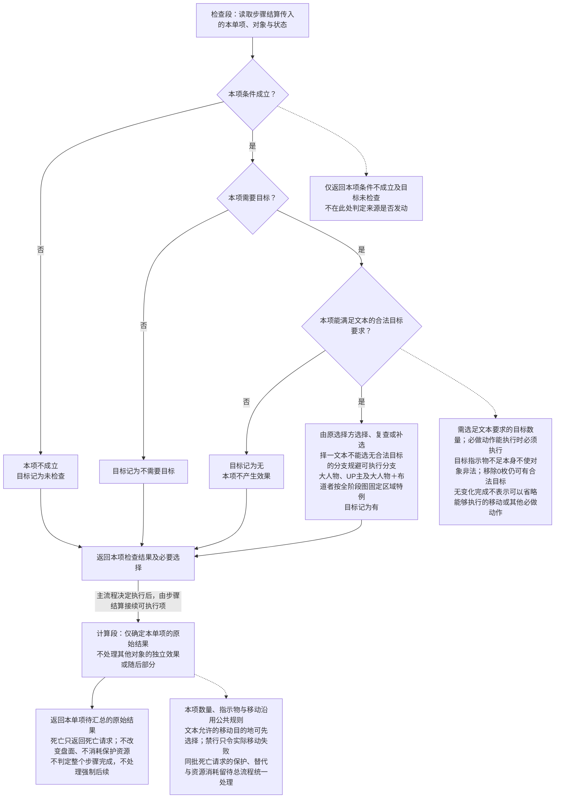
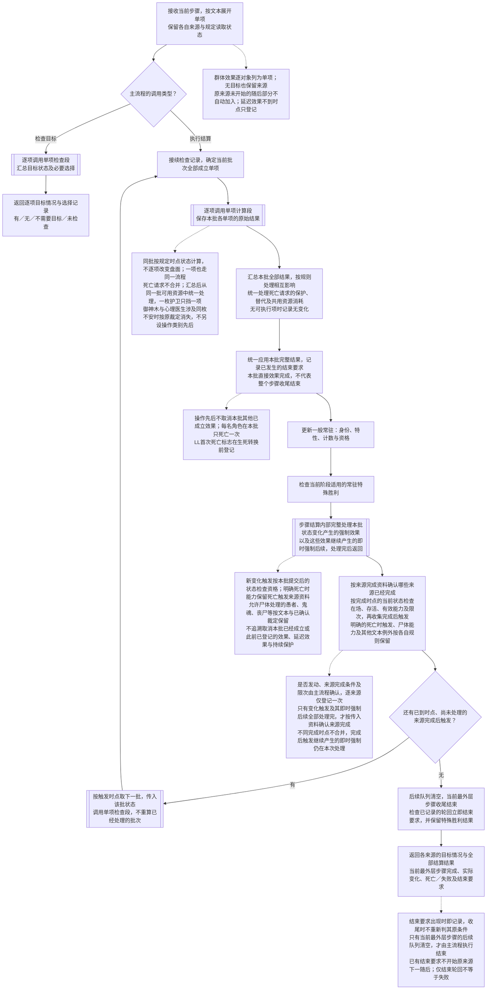
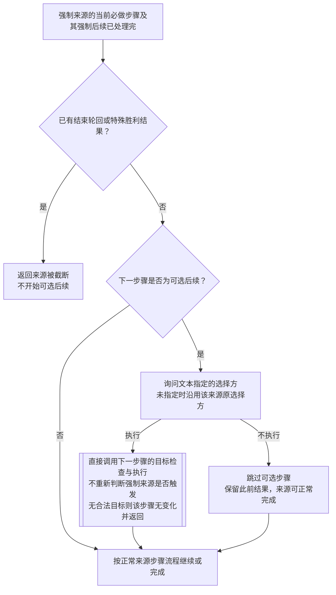

# 步骤结算流程（独立稿）

仅适用于标准4人游戏。主流程负责判定是否发动；步骤结算负责检查目标、执行直接效果及其引发且已到处理时点的强制后续，收尾完成后返回目标情况、结算结果与结束要求。事件发生判定、友好拒绝与沟通、来源完成条件与限次仍由主流程确认并作为结算资料提供。

双边框表示引用流程并返回；虚线为执行注。只应用当前模组及剧本启用的规则。

## 单项效果处理流程

单项是具体效果的处理单位，不是结算步骤。步骤结算分别引用单项的检查段和计算段。单项只返回自身结果；是否发动由主流程决定，整个步骤的结果由步骤结算统一应用。

## 步骤结算总流程

一个结算步骤包含原有直接效果，以及它引发、已到处理时点的后续强制效果。直接效果与后续按批次处理；新触发不并入原来的同时效果。每批引用同一单项流程，全部必须后续处理完毕才结束本步骤。

主流程仍先请求目标检查，再决定发动并请求执行。仅检查目标时不执行效果或后续。

## 强制来源内的可选后续

这不是新的阶段入口，也不重新判断整个强制来源是否触发；只处理强制来源已经执行到的“随后，可以……”等可选步骤。

例如：布道者死亡时先放置绝望，再询问是否世界移动；巫师友好能力完成后先公开身份，再由队长决定是否增加 EX。选择不执行或可选步骤无合法目标，都不撤销已经完成的前段。

## 主流程调用约定

主流程先核实资格、判定数量、阈值、时点与限次，再请求目标检查。主动能力首步骤无合法目标时，主流程判为不能发动；已触发强制能力无目标时，仍可请求执行，得到“步骤完成、无变化”。不需要目标的效果照常执行；指示物不足本身不等于无合法目标。

友好能力由主流程完成合法声明、拒绝及沟通处理。LL已沟通在合法声明且未被拒绝后、效果执行前登记；若因此已确定特殊胜利，就不发出执行请求。已发动来源的随后步骤不重复发动、拒绝或登记沟通。

主流程发出执行请求时，一并提供来源完成条件与限次等结算资料。步骤执行期间，每批结果应用后由步骤结算内部处理新触发的强制效果及其即时强制后续；这些变化触发全部处理完毕后，再按所提供资料确认各来源是否到达完成时点，并将该完成时点产生的强制效果纳入当前步骤。来源的全部效果文本处理完毕，即可到达“来源完成”时点，其完成后强制能力纳入步骤收尾；不能等收尾结束后才触发。已发动来源无目标或无变化不因此失去完成资格；条件未触发的来源不登记发动或完成。

主流程收到最终返回后，根据已经记录的结束要求结束轮回；有特殊胜利时按对应游戏结束结果处理。没有结束要求才继续原来源下一步骤。内部后续子步骤返回时不立即推进阶段或结束外层处理。延迟效果只登记到期时点，不因纳入后续链就提前执行。

## 案例核对

以下沿用原规则条件；死亡案例假定没有额外保护改变结果。来源完成由步骤结算按主流程提供的资料在步骤收尾期间确认，限次仍由主流程登记；最终返回后不重复登记或触发。

| 情况 | 步骤结算返回 | 主流程据此处理 |
|---|---|---|
| 鉴别员需要另外2名角色，但只有1名合法候选 | 首步骤目标无 | 不能发动，不发出执行请求，不进入拒绝及沟通。 |
| 合法目标上没有可移除的不安 | 目标有；执行后步骤完成、无变化 | 来源文本全部处理完后登记完成及适用限次。 |
| 仙人移动后没有可复活的尸体 | 随后部分目标无；该步无直接变化，完成适用后续后返回 | 不撤销移动；没有中断时整个能力完成。 |
| 爱丽丝强制身份能力已触发，但没有其他同区域角色 | 目标无；收到执行请求后，步骤完成、无变化 | 收尾时仍按已发动确认完成，消耗自身每轮限次。 |
| 关键人物与心上人同时死亡，求爱者存活 | 统一应用死亡后，处理失败及求爱者增加6枚不安；最后返回结束要求 | 不因关键人物的结束要求省略放置不安；收尾后结束轮回。 |
| 医院事故同时杀死关键人物、当事人愚者及主人公 | 三个死亡单项统一应用；处理关键人物后续，确认事件完成后处理愚者移除不安；最后返回结束要求 | 完成与触发已在收尾处理，直接进入轮回结束，不再重复触发愚者。 |
| 猎奇杀人的连续杀人杀死关键人物 | 连续杀人直接效果及关键人物强制后续均处理完；返回结束要求 | 不开始不安扩散，整个事件未完成，不触发愚者。 |
| 两个杀人狂单独同处一区域 | 两个死亡单项统一应用，两者均死亡；处理适用强制后续后返回 | 不能取消已成立的另一项杀人。 |
| 从者同时被直接杀害并替死，持有唯一1枚护卫 | 两项死亡请求分别处理；护卫挡一项，从者仍死亡，本批只转换一次并处理一次适用死亡触发 | 使用已返回的实际结果，不重复触发。 |
| 密钥在第1或2轮的非最终日死亡 | 死亡后公开身份，再登记公开身份产生的延迟效果 | 次日效果到时执行，不在当前步骤提前使主人公死亡。 |
| LL第6枚已沟通使特殊胜利B成立 | 已返回目标检查结果；未收到执行请求，无执行结果 | 保留已沟通，能力未完成，不执行能力效果。 |
| 未被黑猫替换的银色子弹 | 不需要目标；主流程在事件文本完成时登记结束要求，步骤处理完适用后续后返回 | 进入轮回结束；仅结束轮回本身不等于失败。 |

依据：[结算步骤与同时结算](<F:/轮回/tragedy_loop_game_rules(3)(1).md:184>) · [中断与案例](<F:/轮回/tragedy_loop_game_rules(3)(1).md:258>) · [友好能力](<F:/轮回/tragedy_loop_game_rules(3)(1).md:426>) · [死亡与替代](<F:/轮回/tragedy_loop_game_rules(3)(1).md:646>) · [关键人物与心上人同时死亡的原例](<F:/轮回/主人公之书(3)(1).txt:1006>) · [密钥的延迟效果](<F:/轮回/tragedy_loop_appendix(3)(1).md:597>)。
